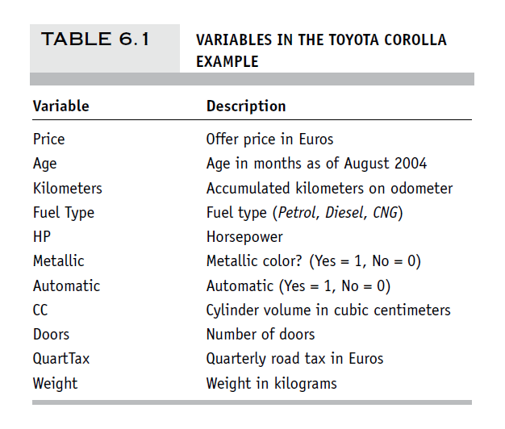

<style type="text/css">
  body{
  font-size: 8pt;
}
</style>

```{r setup, include=FALSE}

knitr::opts_chunk$set(echo = TRUE, warning=FALSE, comment=FALSE, message=FALSE)

```


# <span style="color: #1c6155;">Quick Start</span> 

> Most of the plots are interactive, you can click or zoom to get more details ! Also don't hesitate to click on plots, they will zoom automatically ! 

## Loading Packages

```{r loading packages}

library(data.table) # Efficient Dataframe 
library(lubridate) # For Dates 
library(tidyverse) # Multiple Package for Useful Data wrangling
library(esquisse) # Intuitive plotting
library(plyr) # Data splitting
library(dplyr) # Data Wrangling
library(ggplot2) # Plot Graphs
library(naniar) # for NA exploration in Dataframe
library(plotly) # Make ggplot2 Dynamic
library(gridExtra) # Multiple Plot at once
library(RColorBrewer) # For Color Palette
library(rmdformats) # Theme of HTML
library(flextable) # Show Table
library(class) # K-NN
library(summarytools) # Beautiful and Efficient Summary for Dataset
library(pivottabler) # Pivot Table
library(naivebayes) # Naive Bayes Function
library(caret) # Confusion Matrix
library(leaps) # Exhaustive Search

```


# <span style="color: #1c6155;">Dataset Preparation</span> 

```{r clean environment, include=FALSE}

# Clean Environment
rm(list = ls()) 

```

## Loading the dataset called "ToyotaCorolla.csv"

```{r loading dataset}

# Load the Dataset with Fread()
ToyotaDT <- fread("DATA/ToyotaCorolla.csv")

```


<center>



</center>

## Quick Preview

```{r preview of dataset}

# Preview of the Dataset
flextable(head(ToyotaDT,2)) %>% fontsize(size = 8, part = "all")

```


> Dataset Description: The file ToyotaCorolla.csv contains data on used cars on sale during late summer of 2004 in the Netherlands. It has 1436 records containing detail on 38 attributes, including Price, Age, Kilometers, HP (Horse Power), and other specifications.


```{r summary of dataset,results="asis"}

dfSummary(ToyotaDT, 
          plain.ascii  = FALSE, 
          style        = "grid", 
          graph.magnif = 0.75, 
          valid.col    = FALSE,
          tmp.img.dir  = "/tmp")

```

## Missing Variables Plot

<center>

```{r missing variable plot}

# Missing Variables Plot for the Dataset
gg_miss_var(ToyotaDT, show_pct = TRUE)

```

</center>


> We can see that there is no missing values in our dataset ToyotaCorolla.csv


# <span style="color: #1c6155;">Ex 6.4</span> 

## Predicting Prices of Used Cars

Split the data into training (50%), validation (30%), and test (20%) datasets.

```{r splitting dataset, results='asis'}

# Setting Seed
set.seed(1)

# Splitting Training and Validation and Test
splitting <- sample(1:3,size=nrow(ToyotaDT),replace=TRUE,prob=c(0.5,0.3,0.2))
Training <- ToyotaDT[splitting==1,]
Validation <- ToyotaDT[splitting==2,]
Test <- ToyotaDT[splitting==3,]

# Checking if proportions are right
Prop_Training <- (nrow(Training)/nrow(ToyotaDT))*100
Prop_Validation <- (nrow(Validation)/nrow(ToyotaDT))*100
Prop_Test <- (nrow(Test)/nrow(ToyotaDT))*100

# Print Proportion
paste("The Proportions are:", round(Prop_Training,2),"% In Training,",round(Prop_Validation,2),"% In Validation, and ",round(Prop_Test,2),"% In Test")


```

<br />

### Run a multiple linear regression 

with the outcome variable **Price** and predictor variables **Age_08**, **KM**, **Fuel_Type**, **HP**, **Automatic**, **Doors**, **Quarterly_Tax**, **Mfr_Guarantee**, **Guarantee_Period**, **Airco**, **Automatic_airco**, **CD_Player**, **Powered_Windows**, **Sport_Model**, and **Tow_Bar**. 

<br />

### Outcome Variable

> **Numerical**: Price

<br />

### Explanatory Variables

> **Numerical**: Age_08, KM, HP, Doors, Quarterly_Tax, Quarantee_Period

> **Categorical/Dummy**: Fuel Type, Automatic, Mfr_Guarantee, Airco, Automatic_airco, CD_Player, Powered Windows, Sport_Model, Tow_Bar

<br />

### Running the Linear Regression

```{r regression model}

# Linear OLS Regression on Training 
Regression_Price <- lm(Price ~ Age_08_04 + KM + Fuel_Type + HP + Automatic + Doors + Quarterly_Tax + Mfr_Guarantee + Guarantee_Period + Airco + Automatic_airco + CD_Player + Powered_Windows + Sport_Model + Tow_Bar, data = Training)

# Scientific Notation
options(scipen = 999)

summary(Regression_Price)

```


> Taking into account all the requested variables in our linear regression without further analysis or variable selection, we can observe a fairly high Multiple R-squared, close to 0.8915 and a fit of 0.8891. We have a very significant F-statistic, close to 0 which means that this model is already quite complex and better than a naive model including only the intercept. The most significant variables are the **Age** of the car, the number of kilometres (**KM**) and the automatic air conditioning (**Automatic_airco**), since all have the smallest p-value.

<br />

### 1. Exhaustive Search

```{r exhaustive search}

# use regsubsets() in package leaps to run an exhaustive search.
library(leaps)

# Duplicate the Dataset Training for Modification of Dummy
Training_Search <- Training

# create dummies for fuel type
Fuel_Type <- as.data.frame(model.matrix(~ 0 + Fuel_Type, data=Training_Search))

# replace Fuel_Type column with 2 dummies
Training_Search <- cbind(Training_Search[,-8], Fuel_Type[,])

# Search
search <- regsubsets(Price ~ Age_08_04 + KM + Fuel_TypeCNG + Fuel_TypeDiesel + Fuel_TypePetrol + HP + Automatic + Doors + Quarterly_Tax + Mfr_Guarantee + Guarantee_Period + Airco + Automatic_airco + CD_Player + Powered_Windows + Sport_Model + Tow_Bar, data = Training_Search, nbest = 1, nvmax = dim(Training_Search)[2],
method = "exhaustive")
sum <- summary(search)

```

<br />

### Show Models

```{r sum, warning=FALSE}
# show models
sum$which
```

<br />

### R-Squared

```{r R-squared, warning=FALSE}
# show metrics
sum$rsq
```

<br />

### Adjusted R-Squared

```{r adjusted R-squared, warning=FALSE}
sum$adjr2
```

<br />

### Cp

```{r Cp, warning=FALSE}
sum$cp
```

<br />

>  

### 2. Popular Subset Selection Algorithms

#### 2.1 Forward Selection

#### 2.2 Backward Elimination

#### 2.3 Stepwise Regression


### a. What appear to be the three or four most important car specifications for predicting the car's price?


### b. Using metrics you consider usefull, assess the performance of the model in predicting prices. 

# <span style="color: #1c6155;">Ex 9.3</span> 

# <span style="color: #1c6155;">Ex 11.3</span> 


# <span style="color: #1c6155;">References</span>

[Github Repo for this Homework 3](https://github.com/LiamPhan17/DATA_MINING_HW3)

[Data Mining for Business Analytics: Concepts, Techniques, and Applications in R](https://www.wiley.com/en-us/Data+Mining+for+Business+Analytics:+Concepts,+Techniques,+and+Applications+in+R-p-9781118879368)

[Summarytools in R Markdown Documents](https://cran.r-project.org/web/packages/summarytools/vignettes/rmarkdown.html)

