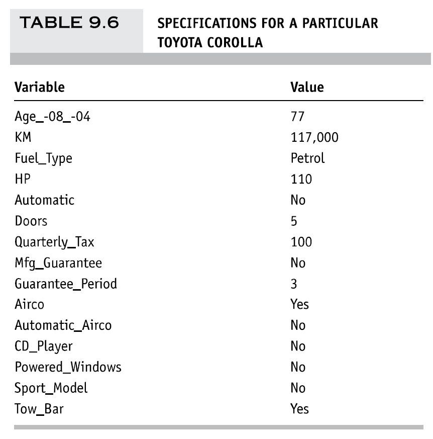

<style type="text/css">
  body{
  font-size: 8pt;
}
</style>

```{r setup, include=FALSE}

knitr::opts_chunk$set(echo = TRUE, warning=FALSE, comment=FALSE, message=FALSE, error = FALSE)

```

# <span style="color: #1c6155;">Loading Packages</span> 

## Loading Packages

```{r loading packages}

library(data.table) # Efficient Dataframe 
library(lubridate) # For Dates 
library(tidyverse) # Multiple Package for Useful Data wrangling
library(esquisse) # Intuitive plotting
library(plyr) # Data splitting
library(dplyr) # Data Wrangling
library(ggplot2) # Plot Graphs
library(naniar) # for NA exploration in Dataframe
library(plotly) # Make ggplot2 Dynamic
library(gridExtra) # Multiple Plot at once
library(RColorBrewer) # For Color Palette
library(rmdformats) # Theme of HTML
library(flextable) # Show Table
library(class) # K-NN
library(summarytools) # Beautiful and Efficient Summary for Dataset
library(pivottabler) # Pivot Table
library(naivebayes) # Naive Bayes Function
library(caret) # Confusion Matrix
library(leaps) # Exhaustive Search
library(forecast) # Predictions
library(neuralnet) # Neural Network
library(nnet) # Neural Network

```


# <span style="color: #1c6155;">Dataset Preparation</span> 

```{r clean environment, include=FALSE}

# Clean Environment
rm(list = ls()) 

```

## Loading the dataset called "ToyotaCorolla.csv"

```{r loading dataset}

# Load the Dataset with Fread()
ToyotaDT <- fread("DATA/ToyotaCorolla.csv")

```


<center>


</center>

## Quick Preview

```{r preview of dataset}

# Preview of the Dataset
flextable(head(ToyotaDT,2)) %>% fontsize(size = 8, part = "all")

```


> Dataset Description: The file ToyotaCorolla.csv contains data on used cars on sale during late summer of 2004 in the Netherlands. It has 1436 records containing detail on 38 attributes, including Price, Age, Kilometers, HP (Horse Power), and other specifications.


```{r summary of dataset,results="asis"}

dfSummary(ToyotaDT, 
          plain.ascii  = FALSE, 
          style        = "grid", 
          graph.magnif = 0.75, 
          valid.col    = FALSE,
          tmp.img.dir  = "/tmp")

```

## Missing Variables Plot

<center>

```{r missing variable plot}

# Missing Variables Plot for the Dataset
gg_miss_var(ToyotaDT, show_pct = TRUE)

```

</center>


> We can see that there is no missing values in our dataset ToyotaCorolla.csv


# <span style="color: #1c6155;">Ex 6.4</span> 

## Predicting Prices of Used Cars

Split the data into training (50%), validation (30%), and test (20%) datasets.

```{r splitting dataset, results='asis'}

# Setting Seed
set.seed(1)

# Splitting Training and Validation and Test
splitting <- sample(1:3,size=nrow(ToyotaDT),replace=TRUE,prob=c(0.5,0.3,0.2))
Training <- ToyotaDT[splitting==1,]
Validation <- ToyotaDT[splitting==2,]
Test <- ToyotaDT[splitting==3,]

# Checking if proportions are right
Prop_Training <- (nrow(Training)/nrow(ToyotaDT))*100
Prop_Validation <- (nrow(Validation)/nrow(ToyotaDT))*100
Prop_Test <- (nrow(Test)/nrow(ToyotaDT))*100

# Print Proportion
paste("The Proportions are:", round(Prop_Training,2),"% In Training,",round(Prop_Validation,2),"% In Validation, and ",round(Prop_Test,2),"% In Test")


```

<br />

### Run a multiple linear regression 

with the outcome variable **Price** and predictor variables **Age_08**, **KM**, **Fuel_Type**, **HP**, **Automatic**, **Doors**, **Quarterly_Tax**, **Mfr_Guarantee**, **Guarantee_Period**, **Airco**, **Automatic_airco**, **CD_Player**, **Powered_Windows**, **Sport_Model**, and **Tow_Bar**. 

<br />

### Outcome Variable

> **Numerical**: Price

<br />

### Explanatory Variables

> **Numerical**: Age_08, KM, HP, Doors, Quarterly_Tax, Quarantee_Period

> **Categorical/Dummy**: Fuel Type, Automatic, Mfr_Guarantee, Airco, Automatic_airco, CD_Player, Powered Windows, Sport_Model, Tow_Bar

<br />

### Running the Linear Regression

```{r regression model}

# Linear OLS Regression on Training 
Regression_Price <- lm(Price ~ Age_08_04 + KM + Fuel_Type + HP + Automatic + Doors + Quarterly_Tax + Mfr_Guarantee + Guarantee_Period + Airco + Automatic_airco + CD_Player + Powered_Windows + Sport_Model + Tow_Bar, data = Training)

# Scientific Notation
options(scipen = 999)

summary(Regression_Price)

```


> Taking into account all the requested variables in our linear regression without further analysis or variable selection, we can observe a fairly high Multiple R-squared, close to 0.8915 and a fit of 0.8891. We have a very significant F-statistic, close to 0 which means that this model is already quite complex and better than a naive model including only the intercept. The most significant variables are the **Age** of the car, the number of kilometres (**KM**) and the automatic air conditioning (**Automatic_airco**), since all have the smallest p-value.

<br />

### 1. Exhaustive Search

```{r exhaustive search}

# use regsubsets() in package leaps to run an exhaustive search.
library(leaps)

# Duplicate the Dataset Training for Modification of Dummy
Training_Search <- Training

# create dummies for fuel type
Fuel_Type <- as.data.frame(model.matrix(~ 0 + Fuel_Type, data=Training_Search))

# replace Fuel_Type column with 2 dummies
Training_Search <- cbind(Training_Search[,-8], Fuel_Type[,])

# Search
search <- regsubsets(Price ~ Age_08_04 + KM + Fuel_TypeCNG + Fuel_TypeDiesel + Fuel_TypePetrol + HP + Automatic + Doors + Quarterly_Tax + Mfr_Guarantee + Guarantee_Period + Airco + Automatic_airco + CD_Player + Powered_Windows + Sport_Model + Tow_Bar, data = Training_Search, nbest = 1, nvmax = dim(Training_Search)[2],
method = "exhaustive")
sum <- summary(search)

```

<br />

### Show Models

```{r sum, warning=FALSE}
# show models
sum$which
```

<br />

### R-Squared

```{r R-squared, warning=FALSE}
# show metrics
sum$rsq
```

> R-Squared keep increasing when we add more and more variables to the model, which is already expected since it doesn't account for the number of parameter (no penalty)

<br />

### Adjusted R-Squared

```{r adjusted R-squared, warning=FALSE}
sum$adjr2
```

> Adjusted R-Squared keep increasing until the 15th value, 0.8890985 which is slight higher than the last one (16th).

<br />

### Cp

```{r Cp, warning=FALSE}
sum$cp
```

<br />

>  The closest Cp to predictors+1 is the last one (16th value) which is 16, close to 17 = p+1 = 16+1.

### 2. Popular Subset Selection Algorithms

#### 2.1 Forward Selection

```{r forward, warning=FALSE}

# Setting Forward Selection
Regression_Price_Forward <- step(Regression_Price, direction = "forward")

summary(Regression_Price_Forward) 

```

#### 2.2 Backward Elimination


```{r backward, warning=FALSE}

# Setting Backward Selection
Regression_Price_Backward <- step(Regression_Price, direction = "backward")

summary(Regression_Price_Backward) 

```

#### 2.3 Stepwise Regression


```{r stepwise, warning=FALSE}

# Setting Backward Selection
Regression_Price_Backward <- step(Regression_Price, direction = "both")

summary(Regression_Price_Backward)

```


> We can see that in both, Backward and Stepwise, only **Mfr_Guarantee** is dropped. Forward Selection keep all variables. 

### a. What appear to be the three or four most important car specifications for predicting the car's price?


> After the Exhaustive Search and Popular Subset Selection Algorithms, we should have those 3-4 most important variable for predicting car's price: **Age**, **KM**, **Automatic_airco** and **Quarterly_Tax**. Depending if we decided to drop the variable **Mfr_Guarante**, we might get slight different results in predictions, but the most important variables for predictions should stay the same. The Following Performance Assessment keep the same full model.


### b. Using metrics you consider usefull, assess the performance of the model in predicting prices. 


### Computing Prediction with the Regression Model on Validation - Accuracy

```{r performance of the model}

library(forecast)
# use predict() to make predictions on a new set.
car.lm.pred <- predict(Regression_Price, Validation)
options(scipen=999, digits = 0)
some.residuals <- Validation$Price[1:20] - car.lm.pred[1:20]
data.frame("Predicted" = car.lm.pred[1:20], "Actual" = Validation$Price[1:20],
"Residual" = some.residuals)
options(scipen=999, digits = 3)
# use accuracy() to compute common accuracy measures.
accuracy(car.lm.pred, Validation$Price)

```
> Here the resulting metrics for our predictions errors. The closest to 0 the better. 

### Histogram of Validation Errors

<center>

```{r validation errors histogram}

library(forecast)
car.lm.pred <- predict(Regression_Price, Validation)
all.residuals <- Validation$Price - car.lm.pred
length(all.residuals[which(all.residuals > -1406 & all.residuals < 1406)])/400
hist(all.residuals, breaks = 25, xlab = "Residuals", main = "", col = "#1c6155")

```

</center>

> We can the residuals of our predictions on the validation set. The Spread is clearly visible, between -2000 and 2000 and normally distributed. Some extremes values for our residuals appear on the far right,.


# <span style="color: #1c6155;">Ex 9.3</span> 

```{r clean environment 1.1, include=FALSE}

# Clean Environment
rm(list = ls()) 

```

## Predicting Prices of Used Cars (Regression Trees). 

## Data Preprocessing - 60% Training and 40% Validation 

```{r Data Preprocessing}

# Set Seed 
set.seed(1)

ToyotaDT_TREE <- fread("DATA/ToyotaCorolla.csv")

# Input Cutting Ratio
Prob_Train <- 0.6
Prob_Validation <- 1 - Prob_Train

# Training and Validation Set Splitting
sample <- sample(c(TRUE, FALSE), nrow(ToyotaDT_TREE), replace=TRUE, prob=c(Prob_Train,Prob_Validation))
Training_TREE  <- ToyotaDT_TREE[sample, ]
Validation_TREE   <- ToyotaDT_TREE[!sample, ]

# Proportions Check
Prop_Train <- nrow(Training_TREE)/nrow(ToyotaDT_TREE)*100
Prop_Valid <- nrow(Validation_TREE)/nrow(ToyotaDT_TREE)*100

# Printing Proportions for double checking
print(paste(round(Prop_Train,2),"% In Training", round(Prop_Valid,2),"% In Validation"))

```

## a. Run a Regression Tree 

with CP=0.001 and "ANOVA" Method

```{r Regression Tree}

# Set Seed
set.seed(1)

# Regression Tree Packages
library(rpart)
library(rpart.plot)

# As Factor Fuel_Type
#ToyotaDT_TREE$Fuel_Type <- as.factor(ToyotaDT_TREE$Fuel_Type)

# Regression Tree Parameters
cp_1 = 0.001
method = "anova"
minbucket = 1
maxdepth = 30 #30 maximum

# Running Regression Tree
Tree_1 <- rpart(Price ~ Age_08_04+KM+Fuel_Type+HP+Automatic+Doors+Quarterly_Tax+Mfr_Guarantee+Guarantee_Period+Airco+Automatic+CD_Player+Powered_Windows+Sport_Model+Tow_Bar, data = Training_TREE, control = rpart.control(maxdepth = maxdepth, cp=cp_1,minbucket = minbucket, method=method))

# Plotting Regression Tree
prp(Tree_1,type = 1, extra = 1, under = TRUE, split.font = 1, varlen = -10,box.col=ifelse(Tree_1$frame$var == "<leaf>", 'gray', 'white'))

# Number of Leafs
Length_Tree_1 = length(Tree_1$frame$var[Tree_1$frame$var == "<leaf>"])

print(paste("There is", Length_Tree_1,"Number of Leaves"))

```


### CP Plot

```{r size of tree 1}

# Tree Size
plotcp(Tree_1)

```

> With small CP, Our Regression Tree can go until 31 Leaves... But we see that the relative error seems to already be small enough between 9 and 13 Leaves. 

### i. Which appear to be the three or four most important car specifications for predicting the car's price? 

```{r Specifications for Predictions}

# Most 3 or 4 specifications for predictions in car's price
Tree_1

Tree_1_Importance <- as.data.frame(Tree_1$variable.importance)

DT::datatable(Tree_1_Importance)

```

> Using our Regression Tree output, we can see that the first 4 split are based on Age only. Then the 4 most important variables are **Age_08_04**, **KM**, **Quarterly_Tax** and **HP**.


### ii. RMS Error between Training and Validation

```{r RMS Error Training and Validation}

# Predictions of Training and Validation
Training_Predictions <- predict(Tree_1,Training_TREE)
Validation_Predictions <- predict(Tree_1, Validation_TREE)

# RMSE  ------------------------------------------------------------------------

# Training RMSE
RMSE_Training <- RMSE(Training_Predictions,Training_TREE$Price)

# Validation RMSE 
RMSE_Validation <- RMSE(Validation_Predictions, Validation_TREE$Price)

# All RMSE
BIND_Training_Validation <- cbind(RMSE_Training,RMSE_Validation)
RMSE_Dataframe <- as.data.frame(BIND_Training_Validation)

flextable(RMSE_Dataframe) %>% set_header_labels(RMSE_Dataframe, values = list(RMSE_Training="RMSE Training",RMSE_Validation="RMSE Validation")
  )

```

### Computing Residuals Boxplots

```{r residuals Tree 1}
# Computing Residuals --------------------------------------------------------------
Residuals_Training_Tree_1 <- Training_TREE$Price - Training_Predictions
Residuals_Validation_Tree_1 <- Validation_TREE$Price - Validation_Predictions

Residuals_Training_Tree_1 <- as.data.frame(Residuals_Training_Tree_1)
Residuals_Validation_Tree_1 <- as.data.frame(Residuals_Validation_Tree_1)

# Boxplots -------------------------------------------------------------------------

library(ggplot2)

# Boxplot Training
box1 <- ggplot(Residuals_Training_Tree_1) +
 aes(x = "", y = Residuals_Training_Tree_1) +
 geom_boxplot(fill = "#1c6155") +
 labs(x = "", y = "Price Residuals", title = "Residuals Between Training and Predicted", subtitle = "Boxplot", 
 caption = "") +
 theme_minimal() + ylim(-10000, 10000) + theme(text = element_text(size = 8))    

# Boxplot Validation
box2 <- ggplot(Residuals_Validation_Tree_1) +
 aes(x = "", y = Residuals_Validation_Tree_1) +
 geom_boxplot(fill = "#1c6155") +
 labs(x = "", y = "Price Residuals", title = "Residuals Between Validation and Predicted", subtitle = "Boxplot", 
 caption = "") +
 theme_minimal() + ylim(-10000, 10000) + theme(text = element_text(size = 8))    

# Combine them
grid.arrange(box1,box2, ncol=2)

```


### iii. How can we achieve predictions for the training set that are not equal to the actual prices? 


### iv. Prune the full tree using the cross-validation error. Compared to the full tree, what is the predictive performance for the validation set?


```{r pruning full tree}


```


## b. Price Variable into Categorical Variable

### i. Compare CT and RT. Are they different? Structure, Top Predictors, Size of tree, etc.) Why? 

### ii. Predict the price, using the RT and the CT, of a used Toyota Corolla with the following specifications. 

<center>


</center>

### iii. 


# <span style="color: #1c6155;">Ex 11.3</span> 

```{r clean environment 2, include=FALSE}

# Clean Environment
rm(list = ls()) 

```

## Car Sales 

The Goal is to predict the price of a used Toyota Corolla based on its specifications.

### a. Fit a neural network model to the data. Use a single hidden layer with 2 nodes. 

Use predictors **Age_08_04**, **KM**, **Fuel_Type**, **HP**, **Automatic**, **Doors**, **Quarterly_Tax**, **Mfr_Guarantee**, **Guarantee_Period**, **Airco**, **Automatic_airco**, **CD_Player**, **Powered_Windows**, **Sport_Model**, and **Tow_Bar**.


### Splitting Training and Validation Set - 60% VS 40%

```{r neural network}

# Reproducible Results
set.seed(1)

# required Packages
library(neuralnet)
library(nnet)
library(caret)

# Load the Dataset with Fread()
ToyotaDT_NN <- fread("DATA/ToyotaCorolla.csv")

# Select the 15 variables 
ToyotaDT_NN <- ToyotaDT_NN[,c("Price","Age_08_04","KM","Fuel_Type","HP","Automatic","Doors","Quarterly_Tax","Mfr_Guarantee","Guarantee_Period","Airco","Automatic_airco","CD_Player","Powered_Windows","Sport_Model","Tow_Bar")]

# Input Cutting Ratio
probability_train <- 0.6
probability_test <- 1 - probability_train

# Training and Validation Set Splitting
sample <- sample(c(TRUE, FALSE), nrow(ToyotaDT_NN), replace=TRUE, prob=c(probability_train,probability_test))
Train_NN  <- ToyotaDT_NN[sample, ]
Test_NN   <- ToyotaDT_NN[!sample, ]

# Proportions Check
Prop_Training <- nrow(Train_NN)/nrow(ToyotaDT_NN)*100
Prop_Validation <- nrow(Test_NN)/nrow(ToyotaDT_NN)*100

# Preprocess Variables - 8 Dummies - Fuel Type to Dummy - 7 Numerical

## create dummies for fuel type
Fuel_Type <- as.data.frame(model.matrix(~ 0 + Fuel_Type, data=Train_NN))

## replace Fuel_Type column with 2 dummies
Train_NN <- cbind(Train_NN[,-c("Fuel_Type")], Fuel_Type[,])

## replace Fuel_Type column with 2 dummies
Test_NN <- cbind(Test_NN[,-c("Fuel_Type")], Fuel_Type[,])

## Numerical Processing with Training Set
preProcValues <- preProcess(Train_NN[,c("Price","Age_08_04","KM","HP","Doors","Quarterly_Tax","Guarantee_Period")], method = "range")

## Preprocess the Training Set
Train_NN_Preprocess <- predict(preProcValues, Train_NN)

## Preprocess the Test Set
Test_NN_Preprocess <- predict(preProcValues, Test_NN)

# Print Proportions

print(paste(round(Prop_Training,2),"% In Training", round(Prop_Validation,2),"% In Validation"))

```


### Neural Network A - 1 Hidden Layers with 2 Nodes 


<center>

```{r neural plot A}

# Reproducible Results
set.seed(1)

nn_1 <- neuralnet(Price ~ ., data = Train_NN_Preprocess, linear.output = T, hidden = 2)

plot(nn_1, rep="best")

```

</center>


### Weights of the Neural Network A

```{r neural weights A}

# display weights
nn_1$weights

```

### Neural Network B - 1 Hidden Layers with 5 Nodes 

<center>

```{r neural plot B}

# Reproducible Results
set.seed(1)

nn_2 <- neuralnet(Price ~ ., data = Train_NN_Preprocess, linear.output = T, hidden = 5)

plot(nn_2, rep="best")

```

</center>

### Weights of the Neural Network B

```{r neural weights B}

# display weights
nn_2$weights

```

### Neural Network C - 2 Hidden Layers with 5 Nodes in each

<center>

```{r neural plot C}

# Reproducible Results
set.seed(1)

nn_3 <- neuralnet(Price ~ ., data = Train_NN_Preprocess, linear.output = T, hidden = c(5,5))

plot(nn_3, rep="best")

```
</center>


### Weights of the Neural Network C

```{r neural weights C}

# display weights
nn_3$weights

```


### Predictions and RMSE

#### RMSE For Training Set

<center>

```{r predictions and RMSE for Training Set}

# Preprocess Scale - Range Method ----------------------------

# Predictions for Training -----------------------------------

# Predictions with nn
Train_Prediction_nn_1 <- predict(nn_1,Train_NN_Preprocess)

# Predictions with nn_2
Train_Prediction_nn_2 <- predict(nn_2,Train_NN_Preprocess)

# Predictions with nn_3
Train_Prediction_nn_3 <- predict(nn_3,Train_NN_Preprocess)

# Back transform to Original Scale ---------------------------

# Predictions with nn
Train_Prediction_nn_1 <- Train_Prediction_nn_1*(max(Train_NN$Price)-min(Train_NN$Price))+min(Train_NN$Price)

# Predictions with nn_2
Train_Prediction_nn_2 <- Train_Prediction_nn_2*(max(Train_NN$Price)-min(Train_NN$Price))+min(Train_NN$Price)

# Predictions with nn_3
Train_Prediction_nn_3 <- Train_Prediction_nn_3*(max(Train_NN$Price)-min(Train_NN$Price))+min(Train_NN$Price)

# RMSE for Train  -------------------------------------------------------

RMSE_Train_Prediction_nn_1 <- RMSE(Train_Prediction_nn_1,Train_NN$Price)
RMSE_Train_Prediction_nn_2 <- RMSE(Train_Prediction_nn_2,Train_NN$Price)
RMSE_Train_Prediction_nn_3 <- RMSE(Train_Prediction_nn_3,Train_NN$Price)

RMSE <- c(RMSE_Train_Prediction_nn_1,RMSE_Train_Prediction_nn_2,RMSE_Train_Prediction_nn_3)

# Rounding RMSE
RMSE <- round(RMSE,2)

# Adding Name to Model
Model <- c("Neural A: 1 Hidden Layer, 2 Nodes","Neural B: 1 Hidden Layer, 5 Nodes", "Neural C: 2 Hidden Layer, 5 Nodes")

Frame_RMSE <- cbind(Model,RMSE)
Frame_RMSE <- as.data.frame(Frame_RMSE)

RMSE_DATA <- flextable(Frame_RMSE) %>% fontsize(size = 8, part = "all")

(RMSE_DATA)

```

</center>

#### RMSE For Validation Set

<center>

```{r predictions and RMSE for Validation Set}

# Predictions for Validation --------------------------------

# Predictions with nn
Validation_Prediction_nn_1 <- predict(nn_1,Test_NN_Preprocess)

# Predictions with nn_2
Validation_Prediction_nn_2 <- predict(nn_2,Test_NN_Preprocess)

# Predictions with nn_3
Validation_Prediction_nn_3 <- predict(nn_3,Test_NN_Preprocess)

# Back transform to Original Scale ---------------------------

# Predictions with nn
Validation_Prediction_nn_1 <- Validation_Prediction_nn_1*(max(Train_NN$Price)-min(Train_NN$Price))+min(Train_NN$Price)

# Predictions with nn_2
Validation_Prediction_nn_2 <- Validation_Prediction_nn_2*(max(Train_NN$Price)-min(Train_NN$Price))+min(Train_NN$Price)

# Predictions with nn_3
Validation_Prediction_nn_3 <- Validation_Prediction_nn_3*(max(Train_NN$Price)-min(Train_NN$Price))+min(Train_NN$Price)

# RMSE for Validation  -------------------------------------------------------

RMSE_Validation_Prediction_1 <- RMSE(Validation_Prediction_nn_1, Test_NN$Price)
RMSE_Validation_Prediction_2 <- RMSE(Validation_Prediction_nn_2, Test_NN$Price)
RMSE_Validation_Prediction_3 <- RMSE(Validation_Prediction_nn_3, Test_NN$Price)

RMSE_Validation <- c(RMSE_Validation_Prediction_1,RMSE_Validation_Prediction_2,RMSE_Validation_Prediction_3)

# Rounding RMSE
RMSE_Validation <- round(RMSE_Validation,2)

# Adding Name to Model
Model <- c("Neural A: 1 Hidden Layer, 2 Nodes","Neural B: 1 Hidden Layer, 5 Nodes", "Neural C: 2 Hidden Layer, 5 Nodes")

Frame_RMSE_Validation <- cbind(Model,RMSE_Validation)
Frame_RMSE_Validation <- as.data.frame(Frame_RMSE_Validation)

RMSE_VALIDATION_DATA <- flextable(Frame_RMSE_Validation) %>% fontsize(size = 8, part = "all")
RMSE_VALIDATION_DATA <- set_header_labels(RMSE_VALIDATION_DATA, RMSE_Validation = "RMSE")

(RMSE_VALIDATION_DATA)

```

</center>

#### i. What happens to the RMS error for the training data as the number of layers and nodes increases ?

> RMSE tend to decrease the more when complexify our neural network (Model C in that case). This indicates we are overfitting more and more our model to the training dataset. 

#### ii. What happens to the RMS error for the validation data?

> The RMSE for the Validation Data is lower for the Neural Model B, and then it increases with the model C. 

#### iii. Comment on the appropriate number of layers and nodes for this application. 

> Model A and B are close, but Model A is not in a overfitting situation, we should decide wether we prefer good predictions with Model B and more overfitting to the training dataset, or Model A which give less accurate result but with more stability in future predictions since it is not overfitting such as Model C. In this case, I would prefer the Model B giving more accurate results but more prone to instability, thus choosing 1 Hidden Layers with 5 Nodes. 


# <span style="color: #1c6155;">References</span>

[Github Repo for this Homework 3](https://github.com/LiamPhan17/DATA_MINING_HW3)

[Data Mining for Business Analytics: Concepts, Techniques, and Applications in R](https://www.wiley.com/en-us/Data+Mining+for+Business+Analytics:+Concepts,+Techniques,+and+Applications+in+R-p-9781118879368)

[Summarytools in R Markdown Documents](https://cran.r-project.org/web/packages/summarytools/vignettes/rmarkdown.html)

[Data Science Plus - Fitting Neural Network in R](https://datascienceplus.com/fitting-neural-network-in-r/)

[Backtransform with the Caret Package and Preprocess() Function](https://www.tradersinsight.news/ibkr-quant-news/r-code-back-transform-from-carets-preprocess/)

[Regression Trees Github Tutorial]()
