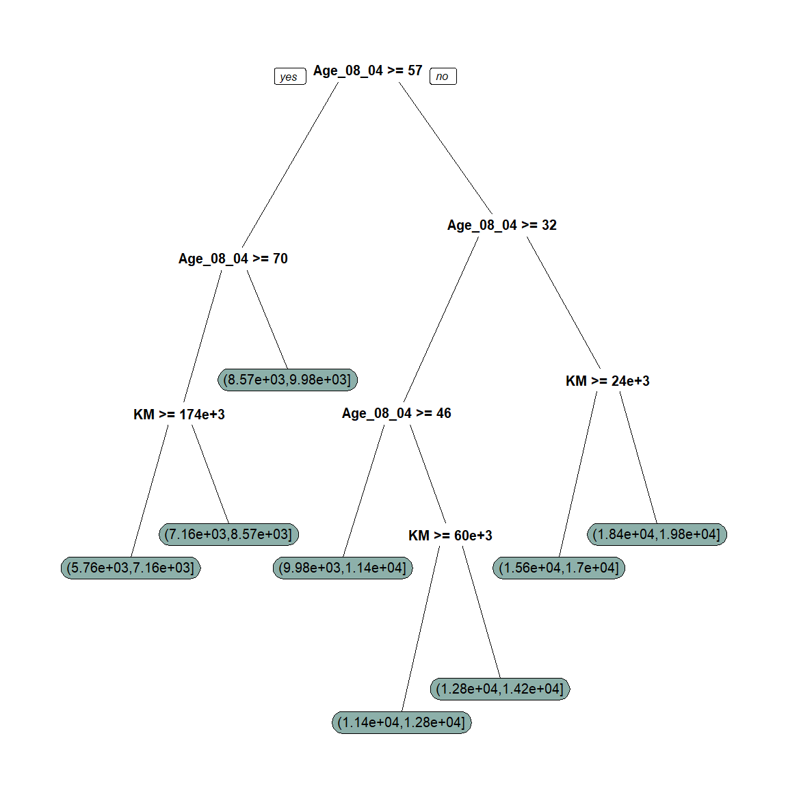
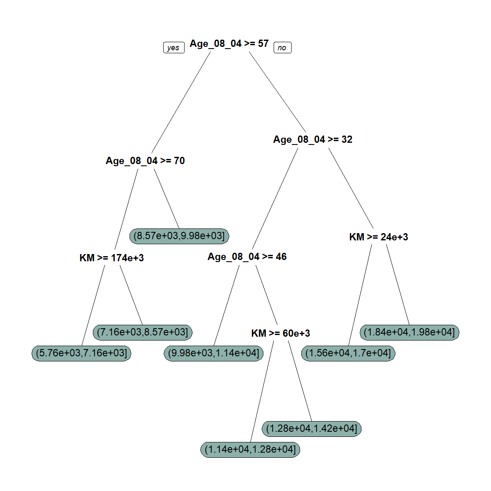

<style type="text/css">
  body{
  font-size: 8pt;
}
</style>


# <span style="color: #1c6155;">Loading Packages</span> 


```r
library(data.table) # Efficient Dataframe 
library(lubridate) # For Dates 
library(tidyverse) # Multiple Package for Useful Data wrangling
library(esquisse) # Intuitive plotting
library(plyr) # Data splitting
library(dplyr) # Data Wrangling
library(ggplot2) # Plot Graphs
library(naniar) # for NA exploration in Dataframe
library(plotly) # Make ggplot2 Dynamic
library(gridExtra) # Multiple Plot at once
library(RColorBrewer) # For Color Palette
library(rmdformats) # Theme of HTML
library(flextable) # Show Table
library(class) # K-NN
library(summarytools) # Beautiful and Efficient Summary for Dataset
library(pivottabler) # Pivot Table
library(naivebayes) # Naive Bayes Function
library(caret) # Confusion Matrix
library(leaps) # Exhaustive Search
library(forecast) # Predictions
library(neuralnet) # Neural Network
library(nnet) # Neural Network
library(manipulateWidget) # Plotly Combiner
library(rpart) # Regression Tree
library(rpart.plot) # Plotting Regression Tree
```


# <span style="color: #1c6155;">Dataset Preparation</span> 


## Loading the dataset called "ToyotaCorolla.csv"


```r
# Load the Dataset with Fread()
ToyotaDT <- fread("DATA/ToyotaCorolla.csv")
```


<center>


</center>

## Quick Preview


```r
# Preview of the Dataset
DT::datatable(head(ToyotaDT,2))
```

```{=html}
<div id="htmlwidget-552755e12f6943498676" style="width:100%;height:auto;" class="datatables html-widget"></div>
<script type="application/json" data-for="htmlwidget-552755e12f6943498676">{"x":{"filter":"none","vertical":false,"data":[["1","2"],[1,2],["TOYOTA Corolla 2.0 D4D HATCHB TERRA 2/3-Doors","TOYOTA Corolla 2.0 D4D HATCHB TERRA 2/3-Doors"],[13500,13750],[23,23],[10,10],[2002,2002],[46986,72937],["Diesel","Diesel"],[90,90],[1,1],["Blue","Silver"],[0,0],[2000,2000],[3,3],[4,4],[5,5],[210,210],[1165,1165],[0,0],[1,1],[3,3],[1,1],[1,1],[1,1],[0,1],[0,0],[1,1],[0,1],[1,1],[1,0],[1,1],[0,0],[0,0],[0,0],[1,1],[0,0],[0,0],[0,0],[0,0]],"container":"<table class=\"display\">\n  <thead>\n    <tr>\n      <th> <\/th>\n      <th>Id<\/th>\n      <th>Model<\/th>\n      <th>Price<\/th>\n      <th>Age_08_04<\/th>\n      <th>Mfg_Month<\/th>\n      <th>Mfg_Year<\/th>\n      <th>KM<\/th>\n      <th>Fuel_Type<\/th>\n      <th>HP<\/th>\n      <th>Met_Color<\/th>\n      <th>Color<\/th>\n      <th>Automatic<\/th>\n      <th>CC<\/th>\n      <th>Doors<\/th>\n      <th>Cylinders<\/th>\n      <th>Gears<\/th>\n      <th>Quarterly_Tax<\/th>\n      <th>Weight<\/th>\n      <th>Mfr_Guarantee<\/th>\n      <th>BOVAG_Guarantee<\/th>\n      <th>Guarantee_Period<\/th>\n      <th>ABS<\/th>\n      <th>Airbag_1<\/th>\n      <th>Airbag_2<\/th>\n      <th>Airco<\/th>\n      <th>Automatic_airco<\/th>\n      <th>Boardcomputer<\/th>\n      <th>CD_Player<\/th>\n      <th>Central_Lock<\/th>\n      <th>Powered_Windows<\/th>\n      <th>Power_Steering<\/th>\n      <th>Radio<\/th>\n      <th>Mistlamps<\/th>\n      <th>Sport_Model<\/th>\n      <th>Backseat_Divider<\/th>\n      <th>Metallic_Rim<\/th>\n      <th>Radio_cassette<\/th>\n      <th>Parking_Assistant<\/th>\n      <th>Tow_Bar<\/th>\n    <\/tr>\n  <\/thead>\n<\/table>","options":{"columnDefs":[{"className":"dt-right","targets":[1,3,4,5,6,7,9,10,12,13,14,15,16,17,18,19,20,21,22,23,24,25,26,27,28,29,30,31,32,33,34,35,36,37,38,39]},{"orderable":false,"targets":0}],"order":[],"autoWidth":false,"orderClasses":false}},"evals":[],"jsHooks":[]}</script>
```


> Dataset Description: The file ToyotaCorolla.csv contains data on used cars on sale during late summer of 2004 in the Netherlands. It has 1436 records containing detail on 38 attributes, including Price, Age, Kilometers, HP (Horse Power), and other specifications.


```r
dfSummary(ToyotaDT, 
          plain.ascii  = FALSE, 
          style        = "grid", 
          graph.magnif = 0.75, 
          valid.col    = FALSE,
          tmp.img.dir  = "/tmp")
```

### Data Frame Summary  
#### ToyotaDT  
**Dimensions:** 1436 x 39  
**Duplicates:** 0  

+----+--------------------+---------------------------------+----------------------+----------------------+---------+
| No | Variable           | Stats / Values                  | Freqs (% of Valid)   | Graph                | Missing |
+====+====================+=================================+======================+======================+=========+
| 1  | Id\                | Mean (sd) : 721.6 (416.5)\      | 1436 distinct values |  | 0\      |
|    | [integer]          | min < med < max:\               |                      |                      | (0.0%)  |
|    |                    | 1 < 721.5 < 1442\               |                      |                      |         |
|    |                    | IQR (CV) : 719.5 (0.6)          |                      |                      |         |
+----+--------------------+---------------------------------+----------------------+----------------------+---------+
| 2  | Model\             | 1\. TOYOTA Corolla 1.6 16V HA\  | 107 ( 7.5%)\         |  | 0\      |
|    | [character]        | 2\. TOYOTA Corolla 1.3 16V HA\  | 83 ( 5.8%)\          |                      | (0.0%)  |
|    |                    | 3\. TOYOTA Corolla 1.6 16V LI\  | 79 ( 5.5%)\          |                      |         |
|    |                    | 4\. TOYOTA Corolla 1.6 16V LI\  | 70 ( 4.9%)\          |                      |         |
|    |                    | 5\. TOYOTA Corolla 1.6 16V SE\  | 43 ( 3.0%)\          |                      |         |
|    |                    | 6\. TOYOTA Corolla 1.4 16V VV\  | 42 ( 2.9%)\          |                      |         |
|    |                    | 7\. TOYOTA Corolla 1.3 16V LI\  | 35 ( 2.4%)\          |                      |         |
|    |                    | 8\. TOYOTA Corolla 1.6 16V VV\  | 31 ( 2.2%)\          |                      |         |
|    |                    | 9\. TOYOTA Corolla 1.6 16V WA\  | 28 ( 1.9%)\          |                      |         |
|    |                    | 10\. TOYOTA Corolla 1.6 16V VV\ | 27 ( 1.9%)\          |                      |         |
|    |                    | [ 362 others ]                  | 891 (62.0%)          |                      |         |
+----+--------------------+---------------------------------+----------------------+----------------------+---------+
| 3  | Price\             | Mean (sd) : 10730.8 (3627)\     | 236 distinct values  |  | 0\      |
|    | [integer]          | min < med < max:\               |                      |                      | (0.0%)  |
|    |                    | 4350 < 9900 < 32500\            |                      |                      |         |
|    |                    | IQR (CV) : 3500 (0.3)           |                      |                      |         |
+----+--------------------+---------------------------------+----------------------+----------------------+---------+
| 4  | Age_08_04\         | Mean (sd) : 55.9 (18.6)\        | 77 distinct values   |  | 0\      |
|    | [integer]          | min < med < max:\               |                      |                      | (0.0%)  |
|    |                    | 1 < 61 < 80\                    |                      |                      |         |
|    |                    | IQR (CV) : 26 (0.3)             |                      |                      |         |
+----+--------------------+---------------------------------+----------------------+----------------------+---------+
| 5  | Mfg_Month\         | Mean (sd) : 5.5 (3.4)\          | 12 distinct values   |  | 0\      |
|    | [integer]          | min < med < max:\               |                      |                      | (0.0%)  |
|    |                    | 1 < 5 < 12\                     |                      |                      |         |
|    |                    | IQR (CV) : 5 (0.6)              |                      |                      |         |
+----+--------------------+---------------------------------+----------------------+----------------------+---------+
| 6  | Mfg_Year\          | Mean (sd) : 1999.6 (1.5)\       | 1998 : 392 (27.3%)\  |  | 0\      |
|    | [integer]          | min < med < max:\               | 1999 : 441 (30.7%)\  |                      | (0.0%)  |
|    |                    | 1998 < 1999 < 2004\             | 2000 : 225 (15.7%)\  |                      |         |
|    |                    | IQR (CV) : 3 (0)                | 2001 : 192 (13.4%)\  |                      |         |
|    |                    |                                 | 2002 :  87 ( 6.1%)\  |                      |         |
|    |                    |                                 | 2003 :  75 ( 5.2%)\  |                      |         |
|    |                    |                                 | 2004 :  24 ( 1.7%)   |                      |         |
+----+--------------------+---------------------------------+----------------------+----------------------+---------+
| 7  | KM\                | Mean (sd) : 68533.3 (37506.4)\  | 1263 distinct values |  | 0\      |
|    | [integer]          | min < med < max:\               |                      |                      | (0.0%)  |
|    |                    | 1 < 63389.5 < 243000\           |                      |                      |         |
|    |                    | IQR (CV) : 44020.8 (0.5)        |                      |                      |         |
+----+--------------------+---------------------------------+----------------------+----------------------+---------+
| 8  | Fuel_Type\         | 1\. CNG\                        | 17 ( 1.2%)\          |  | 0\      |
|    | [character]        | 2\. Diesel\                     | 155 (10.8%)\         |                      | (0.0%)  |
|    |                    | 3\. Petrol                      | 1264 (88.0%)         |                      |         |
+----+--------------------+---------------------------------+----------------------+----------------------+---------+
| 9  | HP\                | Mean (sd) : 101.5 (15)\         | 12 distinct values   |  | 0\      |
|    | [integer]          | min < med < max:\               |                      |                      | (0.0%)  |
|    |                    | 69 < 110 < 192\                 |                      |                      |         |
|    |                    | IQR (CV) : 20 (0.1)             |                      |                      |         |
+----+--------------------+---------------------------------+----------------------+----------------------+---------+
| 10 | Met_Color\         | Min  : 0\                       | 0 : 467 (32.5%)\     |  | 0\      |
|    | [integer]          | Mean : 0.7\                     | 1 : 969 (67.5%)      |                      | (0.0%)  |
|    |                    | Max  : 1                        |                      |                      |         |
+----+--------------------+---------------------------------+----------------------+----------------------+---------+
| 11 | Color\             | 1\. Beige\                      | 3 ( 0.2%)\           |  | 0\      |
|    | [character]        | 2\. Black\                      | 191 (13.3%)\         |                      | (0.0%)  |
|    |                    | 3\. Blue\                       | 283 (19.7%)\         |                      |         |
|    |                    | 4\. Green\                      | 220 (15.3%)\         |                      |         |
|    |                    | 5\. Grey\                       | 301 (21.0%)\         |                      |         |
|    |                    | 6\. Red\                        | 278 (19.4%)\         |                      |         |
|    |                    | 7\. Silver\                     | 122 ( 8.5%)\         |                      |         |
|    |                    | 8\. Violet\                     | 4 ( 0.3%)\           |                      |         |
|    |                    | 9\. White\                      | 31 ( 2.2%)\          |                      |         |
|    |                    | 10\. Yellow                     | 3 ( 0.2%)            |                      |         |
+----+--------------------+---------------------------------+----------------------+----------------------+---------+
| 12 | Automatic\         | Min  : 0\                       | 0 : 1356 (94.4%)\    |  | 0\      |
|    | [integer]          | Mean : 0.1\                     | 1 :   80 ( 5.6%)     |                      | (0.0%)  |
|    |                    | Max  : 1                        |                      |                      |         |
+----+--------------------+---------------------------------+----------------------+----------------------+---------+
| 13 | CC\                | Mean (sd) : 1576.9 (424.4)\     | 13 distinct values   |  | 0\      |
|    | [integer]          | min < med < max:\               |                      |                      | (0.0%)  |
|    |                    | 1300 < 1600 < 16000\            |                      |                      |         |
|    |                    | IQR (CV) : 200 (0.3)            |                      |                      |         |
+----+--------------------+---------------------------------+----------------------+----------------------+---------+
| 14 | Doors\             | Mean (sd) : 4 (1)\              | 2 :   2 ( 0.1%)\     |  | 0\      |
|    | [integer]          | min < med < max:\               | 3 : 622 (43.3%)\     |                      | (0.0%)  |
|    |                    | 2 < 4 < 5\                      | 4 : 138 ( 9.6%)\     |                      |         |
|    |                    | IQR (CV) : 2 (0.2)              | 5 : 674 (46.9%)      |                      |         |
+----+--------------------+---------------------------------+----------------------+----------------------+---------+
| 15 | Cylinders\         | 1 distinct value                | 4 : 1436 (100.0%)    |  | 0\      |
|    | [integer]          |                                 |                      |                      | (0.0%)  |
+----+--------------------+---------------------------------+----------------------+----------------------+---------+
| 16 | Gears\             | Mean (sd) : 5 (0.2)\            | 3 :    2 ( 0.1%)\    |  | 0\      |
|    | [integer]          | min < med < max:\               | 4 :    1 ( 0.1%)\    |                      | (0.0%)  |
|    |                    | 3 < 5 < 6\                      | 5 : 1390 (96.8%)\    |                      |         |
|    |                    | IQR (CV) : 0 (0)                | 6 :   43 ( 3.0%)     |                      |         |
+----+--------------------+---------------------------------+----------------------+----------------------+---------+
| 17 | Quarterly_Tax\     | Mean (sd) : 87.1 (41.1)\        | 13 distinct values   |  | 0\      |
|    | [integer]          | min < med < max:\               |                      |                      | (0.0%)  |
|    |                    | 19 < 85 < 283\                  |                      |                      |         |
|    |                    | IQR (CV) : 16 (0.5)             |                      |                      |         |
+----+--------------------+---------------------------------+----------------------+----------------------+---------+
| 18 | Weight\            | Mean (sd) : 1072.5 (52.6)\      | 59 distinct values   |  | 0\      |
|    | [integer]          | min < med < max:\               |                      |                      | (0.0%)  |
|    |                    | 1000 < 1070 < 1615\             |                      |                      |         |
|    |                    | IQR (CV) : 45 (0)               |                      |                      |         |
+----+--------------------+---------------------------------+----------------------+----------------------+---------+
| 19 | Mfr_Guarantee\     | Min  : 0\                       | 0 : 848 (59.1%)\     |  | 0\      |
|    | [integer]          | Mean : 0.4\                     | 1 : 588 (40.9%)      |                      | (0.0%)  |
|    |                    | Max  : 1                        |                      |                      |         |
+----+--------------------+---------------------------------+----------------------+----------------------+---------+
| 20 | BOVAG_Guarantee\   | Min  : 0\                       | 0 :  150 (10.4%)\    |  | 0\      |
|    | [integer]          | Mean : 0.9\                     | 1 : 1286 (89.6%)     |                      | (0.0%)  |
|    |                    | Max  : 1                        |                      |                      |         |
+----+--------------------+---------------------------------+----------------------+----------------------+---------+
| 21 | Guarantee_Period\  | Mean (sd) : 3.8 (3)\            | 3 : 1274 (88.7%)\    |  | 0\      |
|    | [integer]          | min < med < max:\               | 6 :   77 ( 5.4%)\    |                      | (0.0%)  |
|    |                    | 3 < 3 < 36\                     | 12 :   73 ( 5.1%)\   |                      |         |
|    |                    | IQR (CV) : 0 (0.8)              | 13 :    1 ( 0.1%)\   |                      |         |
|    |                    |                                 | 18 :    1 ( 0.1%)\   |                      |         |
|    |                    |                                 | 20 :    1 ( 0.1%)\   |                      |         |
|    |                    |                                 | 24 :    4 ( 0.3%)\   |                      |         |
|    |                    |                                 | 28 :    1 ( 0.1%)\   |                      |         |
|    |                    |                                 | 36 :    4 ( 0.3%)    |                      |         |
+----+--------------------+---------------------------------+----------------------+----------------------+---------+
| 22 | ABS\               | Min  : 0\                       | 0 :  268 (18.7%)\    |  | 0\      |
|    | [integer]          | Mean : 0.8\                     | 1 : 1168 (81.3%)     |                      | (0.0%)  |
|    |                    | Max  : 1                        |                      |                      |         |
+----+--------------------+---------------------------------+----------------------+----------------------+---------+
| 23 | Airbag_1\          | Min  : 0\                       | 0 :   42 ( 2.9%)\    |  | 0\      |
|    | [integer]          | Mean : 1\                       | 1 : 1394 (97.1%)     |                      | (0.0%)  |
|    |                    | Max  : 1                        |                      |                      |         |
+----+--------------------+---------------------------------+----------------------+----------------------+---------+
| 24 | Airbag_2\          | Min  : 0\                       | 0 :  398 (27.7%)\    |  | 0\      |
|    | [integer]          | Mean : 0.7\                     | 1 : 1038 (72.3%)     |                      | (0.0%)  |
|    |                    | Max  : 1                        |                      |                      |         |
+----+--------------------+---------------------------------+----------------------+----------------------+---------+
| 25 | Airco\             | Min  : 0\                       | 0 : 706 (49.2%)\     |  | 0\      |
|    | [integer]          | Mean : 0.5\                     | 1 : 730 (50.8%)      |                      | (0.0%)  |
|    |                    | Max  : 1                        |                      |                      |         |
+----+--------------------+---------------------------------+----------------------+----------------------+---------+
| 26 | Automatic_airco\   | Min  : 0\                       | 0 : 1355 (94.4%)\    |  | 0\      |
|    | [integer]          | Mean : 0.1\                     | 1 :   81 ( 5.6%)     |                      | (0.0%)  |
|    |                    | Max  : 1                        |                      |                      |         |
+----+--------------------+---------------------------------+----------------------+----------------------+---------+
| 27 | Boardcomputer\     | Min  : 0\                       | 0 : 1013 (70.5%)\    |  | 0\      |
|    | [integer]          | Mean : 0.3\                     | 1 :  423 (29.5%)     |                      | (0.0%)  |
|    |                    | Max  : 1                        |                      |                      |         |
+----+--------------------+---------------------------------+----------------------+----------------------+---------+
| 28 | CD_Player\         | Min  : 0\                       | 0 : 1122 (78.1%)\    |  | 0\      |
|    | [integer]          | Mean : 0.2\                     | 1 :  314 (21.9%)     |                      | (0.0%)  |
|    |                    | Max  : 1                        |                      |                      |         |
+----+--------------------+---------------------------------+----------------------+----------------------+---------+
| 29 | Central_Lock\      | Min  : 0\                       | 0 : 603 (42.0%)\     |  | 0\      |
|    | [integer]          | Mean : 0.6\                     | 1 : 833 (58.0%)      |                      | (0.0%)  |
|    |                    | Max  : 1                        |                      |                      |         |
+----+--------------------+---------------------------------+----------------------+----------------------+---------+
| 30 | Powered_Windows\   | Min  : 0\                       | 0 : 629 (43.8%)\     |  | 0\      |
|    | [integer]          | Mean : 0.6\                     | 1 : 807 (56.2%)      |                      | (0.0%)  |
|    |                    | Max  : 1                        |                      |                      |         |
+----+--------------------+---------------------------------+----------------------+----------------------+---------+
| 31 | Power_Steering\    | Min  : 0\                       | 0 :   32 ( 2.2%)\    |  | 0\      |
|    | [integer]          | Mean : 1\                       | 1 : 1404 (97.8%)     |                      | (0.0%)  |
|    |                    | Max  : 1                        |                      |                      |         |
+----+--------------------+---------------------------------+----------------------+----------------------+---------+
| 32 | Radio\             | Min  : 0\                       | 0 : 1226 (85.4%)\    |  | 0\      |
|    | [integer]          | Mean : 0.1\                     | 1 :  210 (14.6%)     |                      | (0.0%)  |
|    |                    | Max  : 1                        |                      |                      |         |
+----+--------------------+---------------------------------+----------------------+----------------------+---------+
| 33 | Mistlamps\         | Min  : 0\                       | 0 : 1067 (74.3%)\    |  | 0\      |
|    | [integer]          | Mean : 0.3\                     | 1 :  369 (25.7%)     |                      | (0.0%)  |
|    |                    | Max  : 1                        |                      |                      |         |
+----+--------------------+---------------------------------+----------------------+----------------------+---------+
| 34 | Sport_Model\       | Min  : 0\                       | 0 : 1005 (70.0%)\    |  | 0\      |
|    | [integer]          | Mean : 0.3\                     | 1 :  431 (30.0%)     |                      | (0.0%)  |
|    |                    | Max  : 1                        |                      |                      |         |
+----+--------------------+---------------------------------+----------------------+----------------------+---------+
| 35 | Backseat_Divider\  | Min  : 0\                       | 0 :  330 (23.0%)\    |  | 0\      |
|    | [integer]          | Mean : 0.8\                     | 1 : 1106 (77.0%)     |                      | (0.0%)  |
|    |                    | Max  : 1                        |                      |                      |         |
+----+--------------------+---------------------------------+----------------------+----------------------+---------+
| 36 | Metallic_Rim\      | Min  : 0\                       | 0 : 1142 (79.5%)\    |  | 0\      |
|    | [integer]          | Mean : 0.2\                     | 1 :  294 (20.5%)     |                      | (0.0%)  |
|    |                    | Max  : 1                        |                      |                      |         |
+----+--------------------+---------------------------------+----------------------+----------------------+---------+
| 37 | Radio_cassette\    | Min  : 0\                       | 0 : 1227 (85.4%)\    |  | 0\      |
|    | [integer]          | Mean : 0.1\                     | 1 :  209 (14.6%)     |                      | (0.0%)  |
|    |                    | Max  : 1                        |                      |                      |         |
+----+--------------------+---------------------------------+----------------------+----------------------+---------+
| 38 | Parking_Assistant\ | Min  : 0\                       | 0 : 1432 (99.7%)\    |  | 0\      |
|    | [integer]          | Mean : 0\                       | 1 :    4 ( 0.3%)     |                      | (0.0%)  |
|    |                    | Max  : 1                        |                      |                      |         |
+----+--------------------+---------------------------------+----------------------+----------------------+---------+
| 39 | Tow_Bar\           | Min  : 0\                       | 0 : 1037 (72.2%)\    |  | 0\      |
|    | [integer]          | Mean : 0.3\                     | 1 :  399 (27.8%)     |                      | (0.0%)  |
|    |                    | Max  : 1                        |                      |                      |         |
+----+--------------------+---------------------------------+----------------------+----------------------+---------+

## Missing Variables Plot

<center>


```r
# Missing Variables Plot for the Dataset
gg_miss_var(ToyotaDT, show_pct = TRUE)
```


</center>


> We can see that there is no missing values in our dataset ToyotaCorolla.csv


# <span style="color: #1c6155;">Ex 6.4</span> 

## Predicting Prices of Used Cars

Split the data into training (50%), validation (30%), and test (20%) datasets.


```r
# Setting Seed
set.seed(1)

# Splitting Training and Validation and Test
splitting <- sample(1:3,size=nrow(ToyotaDT),replace=TRUE,prob=c(0.5,0.3,0.2))
Training <- ToyotaDT[splitting==1,]
Validation <- ToyotaDT[splitting==2,]
Test <- ToyotaDT[splitting==3,]

# Checking if proportions are right
Prop_Training <- (nrow(Training)/nrow(ToyotaDT))*100
Prop_Validation <- (nrow(Validation)/nrow(ToyotaDT))*100
Prop_Test <- (nrow(Test)/nrow(ToyotaDT))*100

# Print Proportion
paste("The Proportions are:", round(Prop_Training,2),"% In Training,",round(Prop_Validation,2),"% In Validation, and ",round(Prop_Test,2),"% In Test")
```

[1] "The Proportions are: 52.58 % In Training, 27.79 % In Validation, and  19.64 % In Test"

<br />

### Run a multiple linear regression 

with the outcome variable **Price** and predictor variables **Age_08**, **KM**, **Fuel_Type**, **HP**, **Automatic**, **Doors**, **Quarterly_Tax**, **Mfr_Guarantee**, **Guarantee_Period**, **Airco**, **Automatic_airco**, **CD_Player**, **Powered_Windows**, **Sport_Model**, and **Tow_Bar**. 

<br />

### Outcome Variable

> **Numerical**: Price

<br />

### Explanatory Variables

> **Numerical**: Age_08, KM, HP, Doors, Quarterly_Tax, Quarantee_Period

> **Categorical/Dummy**: Fuel Type, Automatic, Mfr_Guarantee, Airco, Automatic_airco, CD_Player, Powered Windows, Sport_Model, Tow_Bar

<br />

### Running the Linear Regression


```r
# Linear OLS Regression on Training 
Regression_Price <- lm(Price ~ Age_08_04 + KM + Fuel_Type + HP + Automatic + Doors + Quarterly_Tax + Mfr_Guarantee + Guarantee_Period + Airco + Automatic_airco + CD_Player + Powered_Windows + Sport_Model + Tow_Bar, data = Training)

# Scientific Notation
options(scipen = 999)

summary(Regression_Price)
```

```
FALSE 
FALSE Call:
FALSE lm(formula = Price ~ Age_08_04 + KM + Fuel_Type + HP + Automatic + 
FALSE     Doors + Quarterly_Tax + Mfr_Guarantee + Guarantee_Period + 
FALSE     Airco + Automatic_airco + CD_Player + Powered_Windows + Sport_Model + 
FALSE     Tow_Bar, data = Training)
FALSE 
FALSE Residuals:
FALSE     Min      1Q  Median      3Q     Max 
FALSE -4605.0  -725.0    26.5   655.5  5567.0 
FALSE 
FALSE Coefficients:
FALSE                      Estimate   Std. Error t value             Pr(>|t|)    
FALSE (Intercept)      10149.303878   753.570928  13.468 < 0.0000000000000002 ***
FALSE Age_08_04         -106.254953     3.648627 -29.122 < 0.0000000000000002 ***
FALSE KM                  -0.018110     0.001693 -10.697 < 0.0000000000000002 ***
FALSE Fuel_TypeDiesel   1775.761977   509.701393   3.484             0.000523 ***
FALSE Fuel_TypePetrol   2087.180327   530.110397   3.937   0.0000902216317796 ***
FALSE HP                  26.355347     3.846774   6.851   0.0000000000154436 ***
FALSE Automatic          605.249517   178.506754   3.391             0.000734 ***
FALSE Doors              153.627129    46.146978   3.329             0.000915 ***
FALSE Quarterly_Tax       16.814925     2.081831   8.077   0.0000000000000027 ***
FALSE Mfr_Guarantee      125.684485    91.024994   1.381             0.167768    
FALSE Guarantee_Period    72.439768    15.661721   4.625   0.0000044171894508 ***
FALSE Airco              175.868563   106.848246   1.646             0.100197    
FALSE Automatic_airco   3178.052845   209.461203  15.173 < 0.0000000000000002 ***
FALSE CD_Player          247.920668   120.057343   2.065             0.039270 *  
FALSE Powered_Windows    426.529261   103.224416   4.132   0.0000400718888028 ***
FALSE Sport_Model        268.489425    98.070812   2.738             0.006336 ** 
FALSE Tow_Bar           -250.505084    97.621305  -2.566             0.010481 *  
FALSE ---
FALSE Signif. codes:  0 '***' 0.001 '**' 0.01 '*' 0.05 '.' 0.1 ' ' 1
FALSE 
FALSE Residual standard error: 1155 on 738 degrees of freedom
FALSE Multiple R-squared:  0.8915,	Adjusted R-squared:  0.8891 
FALSE F-statistic: 378.8 on 16 and 738 DF,  p-value: < 0.00000000000000022
```


> Taking into account all the requested variables in our linear regression without further analysis or variable selection, we can observe a fairly high Multiple R-squared, close to 0.8915 and a fit of 0.8891. We have a very significant F-statistic, close to 0 which means that this model is already quite complex and better than a naive model including only the intercept. The most significant variables are the **Age** of the car, the number of kilometres (**KM**) and the automatic air conditioning (**Automatic_airco**), since all have the smallest p-value.

<br />

### 1. Exhaustive Search


```r
# use regsubsets() in package leaps to run an exhaustive search.
library(leaps)

# Duplicate the Dataset Training for Modification of Dummy
Training_Search <- Training

# create dummies for fuel type
Fuel_Type <- as.data.frame(model.matrix(~ 0 + Fuel_Type, data=Training_Search))

# replace Fuel_Type column with 2 dummies
Training_Search <- cbind(Training_Search[,-8], Fuel_Type[,])

# Search
search <- regsubsets(Price ~ Age_08_04 + KM + Fuel_TypeCNG + Fuel_TypeDiesel + Fuel_TypePetrol + HP + Automatic + Doors + Quarterly_Tax + Mfr_Guarantee + Guarantee_Period + Airco + Automatic_airco + CD_Player + Powered_Windows + Sport_Model + Tow_Bar, data = Training_Search, nbest = 1, nvmax = dim(Training_Search)[2],
method = "exhaustive")
```

```
FALSE Reordering variables and trying again:
```

```r
sum <- summary(search)
```

<br />

### Show Models


```r
# show models
sum$which
```

```
FALSE    (Intercept) Age_08_04    KM Fuel_TypeCNG Fuel_TypeDiesel Fuel_TypePetrol
FALSE 1         TRUE      TRUE FALSE        FALSE           FALSE           FALSE
FALSE 2         TRUE      TRUE FALSE        FALSE           FALSE           FALSE
FALSE 3         TRUE      TRUE  TRUE        FALSE           FALSE           FALSE
FALSE 4         TRUE      TRUE  TRUE        FALSE           FALSE           FALSE
FALSE 5         TRUE      TRUE  TRUE        FALSE           FALSE           FALSE
FALSE 6         TRUE      TRUE  TRUE        FALSE           FALSE           FALSE
FALSE 7         TRUE      TRUE  TRUE        FALSE           FALSE           FALSE
FALSE 8         TRUE      TRUE  TRUE         TRUE           FALSE           FALSE
FALSE 9         TRUE      TRUE  TRUE         TRUE           FALSE           FALSE
FALSE 10        TRUE      TRUE  TRUE         TRUE           FALSE           FALSE
FALSE 11        TRUE      TRUE  TRUE         TRUE           FALSE           FALSE
FALSE 12        TRUE      TRUE  TRUE         TRUE           FALSE           FALSE
FALSE 13        TRUE      TRUE  TRUE         TRUE           FALSE           FALSE
FALSE 14        TRUE      TRUE  TRUE         TRUE           FALSE           FALSE
FALSE 15        TRUE      TRUE  TRUE         TRUE           FALSE           FALSE
FALSE 16        TRUE      TRUE  TRUE         TRUE            TRUE           FALSE
FALSE       HP Automatic Doors Quarterly_Tax Mfr_Guarantee Guarantee_Period Airco
FALSE 1  FALSE     FALSE FALSE         FALSE         FALSE            FALSE FALSE
FALSE 2  FALSE     FALSE FALSE         FALSE         FALSE            FALSE FALSE
FALSE 3  FALSE     FALSE FALSE         FALSE         FALSE            FALSE FALSE
FALSE 4  FALSE     FALSE FALSE          TRUE         FALSE            FALSE FALSE
FALSE 5   TRUE     FALSE FALSE          TRUE         FALSE            FALSE FALSE
FALSE 6   TRUE     FALSE FALSE          TRUE         FALSE            FALSE FALSE
FALSE 7   TRUE     FALSE FALSE          TRUE         FALSE             TRUE FALSE
FALSE 8   TRUE     FALSE FALSE          TRUE         FALSE             TRUE FALSE
FALSE 9   TRUE      TRUE FALSE          TRUE         FALSE             TRUE FALSE
FALSE 10  TRUE      TRUE  TRUE          TRUE         FALSE             TRUE FALSE
FALSE 11  TRUE      TRUE  TRUE          TRUE         FALSE             TRUE FALSE
FALSE 12  TRUE      TRUE  TRUE          TRUE         FALSE             TRUE FALSE
FALSE 13  TRUE      TRUE  TRUE          TRUE         FALSE             TRUE FALSE
FALSE 14  TRUE      TRUE  TRUE          TRUE         FALSE             TRUE  TRUE
FALSE 15  TRUE      TRUE  TRUE          TRUE          TRUE             TRUE  TRUE
FALSE 16  TRUE      TRUE  TRUE          TRUE          TRUE             TRUE  TRUE
FALSE    Automatic_airco CD_Player Powered_Windows Sport_Model Tow_Bar
FALSE 1            FALSE     FALSE           FALSE       FALSE   FALSE
FALSE 2             TRUE     FALSE           FALSE       FALSE   FALSE
FALSE 3             TRUE     FALSE           FALSE       FALSE   FALSE
FALSE 4             TRUE     FALSE           FALSE       FALSE   FALSE
FALSE 5             TRUE     FALSE           FALSE       FALSE   FALSE
FALSE 6             TRUE     FALSE            TRUE       FALSE   FALSE
FALSE 7             TRUE     FALSE            TRUE       FALSE   FALSE
FALSE 8             TRUE     FALSE            TRUE       FALSE   FALSE
FALSE 9             TRUE     FALSE            TRUE       FALSE   FALSE
FALSE 10            TRUE     FALSE            TRUE       FALSE   FALSE
FALSE 11            TRUE     FALSE            TRUE        TRUE   FALSE
FALSE 12            TRUE     FALSE            TRUE        TRUE    TRUE
FALSE 13            TRUE      TRUE            TRUE        TRUE    TRUE
FALSE 14            TRUE      TRUE            TRUE        TRUE    TRUE
FALSE 15            TRUE      TRUE            TRUE        TRUE    TRUE
FALSE 16            TRUE      TRUE            TRUE        TRUE    TRUE
```

<br />

### R-Squared


```r
# show metrics
sum$rsq
```

```
FALSE  [1] 0.7655313 0.8300988 0.8503445 0.8620935 0.8759748 0.8801229 0.8822341
FALSE  [8] 0.8844385 0.8861651 0.8874965 0.8888897 0.8897505 0.8905682 0.8909579
FALSE [15] 0.8913048 0.8914512
```

> R-Squared keep increasing when we add more and more variables to the model, which is already expected since it doesn't account for the number of parameter (no penalty)

<br />

### Adjusted R-Squared


```r
sum$adjr2
```

```
FALSE  [1] 0.7652199 0.8296470 0.8497467 0.8613580 0.8751469 0.8791614 0.8811305
FALSE  [8] 0.8831993 0.8847899 0.8859844 0.8872447 0.8879675 0.8886484 0.8888949
FALSE [15] 0.8890985 0.8890979
```

> Adjusted R-Squared keep increasing until the 15th value, 0.8890985 which is slight higher than the last one (16th).

<br />

### Cp


```r
sum$cp
```

```
FALSE  [1] 840.94284 404.55680 269.09689 191.32625  99.07820  72.91427  60.58056
FALSE  [8]  47.61333  37.89066  30.85073  23.39186  19.54705  15.99520  15.34962
FALSE [15]  14.99434  16.00000
```

<br />

>  The closest Cp to predictors+1 is the last one (16th value) which is 16, close to 17 = p+1 = 16+1.

### 2. Popular Subset Selection Algorithms

#### 2.1 Forward Selection


```r
# Setting Forward Selection
Regression_Price_Forward <- step(Regression_Price, direction = "forward")
```

```
FALSE Start:  AIC=10665.11
FALSE Price ~ Age_08_04 + KM + Fuel_Type + HP + Automatic + Doors + 
FALSE     Quarterly_Tax + Mfr_Guarantee + Guarantee_Period + Airco + 
FALSE     Automatic_airco + CD_Player + Powered_Windows + Sport_Model + 
FALSE     Tow_Bar
```

```r
summary(Regression_Price_Forward) 
```

```
FALSE 
FALSE Call:
FALSE lm(formula = Price ~ Age_08_04 + KM + Fuel_Type + HP + Automatic + 
FALSE     Doors + Quarterly_Tax + Mfr_Guarantee + Guarantee_Period + 
FALSE     Airco + Automatic_airco + CD_Player + Powered_Windows + Sport_Model + 
FALSE     Tow_Bar, data = Training)
FALSE 
FALSE Residuals:
FALSE     Min      1Q  Median      3Q     Max 
FALSE -4605.0  -725.0    26.5   655.5  5567.0 
FALSE 
FALSE Coefficients:
FALSE                      Estimate   Std. Error t value             Pr(>|t|)    
FALSE (Intercept)      10149.303878   753.570928  13.468 < 0.0000000000000002 ***
FALSE Age_08_04         -106.254953     3.648627 -29.122 < 0.0000000000000002 ***
FALSE KM                  -0.018110     0.001693 -10.697 < 0.0000000000000002 ***
FALSE Fuel_TypeDiesel   1775.761977   509.701393   3.484             0.000523 ***
FALSE Fuel_TypePetrol   2087.180327   530.110397   3.937   0.0000902216317796 ***
FALSE HP                  26.355347     3.846774   6.851   0.0000000000154436 ***
FALSE Automatic          605.249517   178.506754   3.391             0.000734 ***
FALSE Doors              153.627129    46.146978   3.329             0.000915 ***
FALSE Quarterly_Tax       16.814925     2.081831   8.077   0.0000000000000027 ***
FALSE Mfr_Guarantee      125.684485    91.024994   1.381             0.167768    
FALSE Guarantee_Period    72.439768    15.661721   4.625   0.0000044171894508 ***
FALSE Airco              175.868563   106.848246   1.646             0.100197    
FALSE Automatic_airco   3178.052845   209.461203  15.173 < 0.0000000000000002 ***
FALSE CD_Player          247.920668   120.057343   2.065             0.039270 *  
FALSE Powered_Windows    426.529261   103.224416   4.132   0.0000400718888028 ***
FALSE Sport_Model        268.489425    98.070812   2.738             0.006336 ** 
FALSE Tow_Bar           -250.505084    97.621305  -2.566             0.010481 *  
FALSE ---
FALSE Signif. codes:  0 '***' 0.001 '**' 0.01 '*' 0.05 '.' 0.1 ' ' 1
FALSE 
FALSE Residual standard error: 1155 on 738 degrees of freedom
FALSE Multiple R-squared:  0.8915,	Adjusted R-squared:  0.8891 
FALSE F-statistic: 378.8 on 16 and 738 DF,  p-value: < 0.00000000000000022
```

#### 2.2 Backward Elimination


```r
# Setting Backward Selection
Regression_Price_Backward <- step(Regression_Price, direction = "backward")
```

```
FALSE Start:  AIC=10665.11
FALSE Price ~ Age_08_04 + KM + Fuel_Type + HP + Automatic + Doors + 
FALSE     Quarterly_Tax + Mfr_Guarantee + Guarantee_Period + Airco + 
FALSE     Automatic_airco + CD_Player + Powered_Windows + Sport_Model + 
FALSE     Tow_Bar
FALSE 
FALSE                    Df  Sum of Sq        RSS   AIC
FALSE - Mfr_Guarantee     1    2543346  987052419 10665
FALSE <none>                            984509073 10665
FALSE - Airco             1    3614140  988123213 10666
FALSE - CD_Player         1    5688678  990197751 10668
FALSE - Tow_Bar           1    8784301  993293374 10670
FALSE - Sport_Model       1    9998577  994507650 10671
FALSE - Doors             1   14784705  999293778 10674
FALSE - Automatic         1   15336383  999845456 10675
FALSE - Fuel_Type         2   20941946 1005451019 10677
FALSE - Powered_Windows   1   22776981 1007286054 10680
FALSE - Guarantee_Period  1   28538984 1013048057 10685
FALSE - HP                1   62619200 1047128273 10710
FALSE - Quarterly_Tax     1   87028661 1071537733 10727
FALSE - KM                1  152653191 1137162264 10772
FALSE - Automatic_airco   1  307099000 1291608073 10868
FALSE - Age_08_04         1 1131365100 2115874173 11241
FALSE 
FALSE Step:  AIC=10665.05
FALSE Price ~ Age_08_04 + KM + Fuel_Type + HP + Automatic + Doors + 
FALSE     Quarterly_Tax + Guarantee_Period + Airco + Automatic_airco + 
FALSE     CD_Player + Powered_Windows + Sport_Model + Tow_Bar
FALSE 
FALSE                    Df  Sum of Sq        RSS   AIC
FALSE <none>                            987052419 10665
FALSE - Airco             1    3591518  990643937 10666
FALSE - CD_Player         1    6457971  993510389 10668
FALSE - Tow_Bar           1    8540281  995592700 10670
FALSE - Sport_Model       1    9978477  997030896 10671
FALSE - Doors             1   15120231 1002172650 10674
FALSE - Automatic         1   15145014 1002197433 10675
FALSE - Fuel_Type         2   22008962 1009061381 10678
FALSE - Powered_Windows   1   21946957 1008999375 10680
FALSE - Guarantee_Period  1   27250734 1014303152 10684
FALSE - HP                1   63791761 1050844179 10710
FALSE - Quarterly_Tax     1   91041143 1078093561 10730
FALSE - KM                1  154155059 1141207477 10773
FALSE - Automatic_airco   1  306222171 1293274589 10867
FALSE - Age_08_04         1 1146445473 2133497891 11245
```

```r
summary(Regression_Price_Backward) 
```

```
FALSE 
FALSE Call:
FALSE lm(formula = Price ~ Age_08_04 + KM + Fuel_Type + HP + Automatic + 
FALSE     Doors + Quarterly_Tax + Guarantee_Period + Airco + Automatic_airco + 
FALSE     CD_Player + Powered_Windows + Sport_Model + Tow_Bar, data = Training)
FALSE 
FALSE Residuals:
FALSE     Min      1Q  Median      3Q     Max 
FALSE -4582.7  -725.6    25.2   660.5  5528.3 
FALSE 
FALSE Coefficients:
FALSE                      Estimate   Std. Error t value             Pr(>|t|)    
FALSE (Intercept)      10131.277848   753.919822  13.438 < 0.0000000000000002 ***
FALSE Age_08_04         -106.642999     3.640018 -29.297 < 0.0000000000000002 ***
FALSE KM                  -0.018189     0.001693 -10.743 < 0.0000000000000002 ***
FALSE Fuel_TypeDiesel   1771.331629   510.003814   3.473             0.000544 ***
FALSE Fuel_TypePetrol   2143.129536   528.883581   4.052 0.000056116325460097 ***
FALSE HP                  26.577649     3.845760   6.911 0.000000000010411626 ***
FALSE Automatic          601.387645   178.594281   3.367             0.000798 ***
FALSE Doors              155.306593    46.159231   3.365             0.000806 ***
FALSE Quarterly_Tax       17.108350     2.072226   8.256 0.000000000000000692 ***
FALSE Guarantee_Period    70.500818    15.608204   4.517 0.000007302497428398 ***
FALSE Airco              175.316066   106.913011   1.640             0.101472    
FALSE Automatic_airco   3173.034931   209.558088  15.142 < 0.0000000000000002 ***
FALSE CD_Player          263.050250   119.629577   2.199             0.028196 *  
FALSE Powered_Windows    417.921196   103.099161   4.054 0.000055786711372138 ***
FALSE Sport_Model        268.218889    98.130749   2.733             0.006421 ** 
FALSE Tow_Bar           -246.913474    97.646480  -2.529             0.011657 *  
FALSE ---
FALSE Signif. codes:  0 '***' 0.001 '**' 0.01 '*' 0.05 '.' 0.1 ' ' 1
FALSE 
FALSE Residual standard error: 1156 on 739 degrees of freedom
FALSE Multiple R-squared:  0.8912,	Adjusted R-squared:  0.889 
FALSE F-statistic: 403.4 on 15 and 739 DF,  p-value: < 0.00000000000000022
```

#### 2.3 Stepwise Regression


```r
# Setting Backward Selection
Regression_Price_Backward <- step(Regression_Price, direction = "both")
```

```
FALSE Start:  AIC=10665.11
FALSE Price ~ Age_08_04 + KM + Fuel_Type + HP + Automatic + Doors + 
FALSE     Quarterly_Tax + Mfr_Guarantee + Guarantee_Period + Airco + 
FALSE     Automatic_airco + CD_Player + Powered_Windows + Sport_Model + 
FALSE     Tow_Bar
FALSE 
FALSE                    Df  Sum of Sq        RSS   AIC
FALSE - Mfr_Guarantee     1    2543346  987052419 10665
FALSE <none>                            984509073 10665
FALSE - Airco             1    3614140  988123213 10666
FALSE - CD_Player         1    5688678  990197751 10668
FALSE - Tow_Bar           1    8784301  993293374 10670
FALSE - Sport_Model       1    9998577  994507650 10671
FALSE - Doors             1   14784705  999293778 10674
FALSE - Automatic         1   15336383  999845456 10675
FALSE - Fuel_Type         2   20941946 1005451019 10677
FALSE - Powered_Windows   1   22776981 1007286054 10680
FALSE - Guarantee_Period  1   28538984 1013048057 10685
FALSE - HP                1   62619200 1047128273 10710
FALSE - Quarterly_Tax     1   87028661 1071537733 10727
FALSE - KM                1  152653191 1137162264 10772
FALSE - Automatic_airco   1  307099000 1291608073 10868
FALSE - Age_08_04         1 1131365100 2115874173 11241
FALSE 
FALSE Step:  AIC=10665.05
FALSE Price ~ Age_08_04 + KM + Fuel_Type + HP + Automatic + Doors + 
FALSE     Quarterly_Tax + Guarantee_Period + Airco + Automatic_airco + 
FALSE     CD_Player + Powered_Windows + Sport_Model + Tow_Bar
FALSE 
FALSE                    Df  Sum of Sq        RSS   AIC
FALSE <none>                            987052419 10665
FALSE + Mfr_Guarantee     1    2543346  984509073 10665
FALSE - Airco             1    3591518  990643937 10666
FALSE - CD_Player         1    6457971  993510389 10668
FALSE - Tow_Bar           1    8540281  995592700 10670
FALSE - Sport_Model       1    9978477  997030896 10671
FALSE - Doors             1   15120231 1002172650 10674
FALSE - Automatic         1   15145014 1002197433 10675
FALSE - Fuel_Type         2   22008962 1009061381 10678
FALSE - Powered_Windows   1   21946957 1008999375 10680
FALSE - Guarantee_Period  1   27250734 1014303152 10684
FALSE - HP                1   63791761 1050844179 10710
FALSE - Quarterly_Tax     1   91041143 1078093561 10730
FALSE - KM                1  154155059 1141207477 10773
FALSE - Automatic_airco   1  306222171 1293274589 10867
FALSE - Age_08_04         1 1146445473 2133497891 11245
```

```r
summary(Regression_Price_Backward)
```

```
FALSE 
FALSE Call:
FALSE lm(formula = Price ~ Age_08_04 + KM + Fuel_Type + HP + Automatic + 
FALSE     Doors + Quarterly_Tax + Guarantee_Period + Airco + Automatic_airco + 
FALSE     CD_Player + Powered_Windows + Sport_Model + Tow_Bar, data = Training)
FALSE 
FALSE Residuals:
FALSE     Min      1Q  Median      3Q     Max 
FALSE -4582.7  -725.6    25.2   660.5  5528.3 
FALSE 
FALSE Coefficients:
FALSE                      Estimate   Std. Error t value             Pr(>|t|)    
FALSE (Intercept)      10131.277848   753.919822  13.438 < 0.0000000000000002 ***
FALSE Age_08_04         -106.642999     3.640018 -29.297 < 0.0000000000000002 ***
FALSE KM                  -0.018189     0.001693 -10.743 < 0.0000000000000002 ***
FALSE Fuel_TypeDiesel   1771.331629   510.003814   3.473             0.000544 ***
FALSE Fuel_TypePetrol   2143.129536   528.883581   4.052 0.000056116325460097 ***
FALSE HP                  26.577649     3.845760   6.911 0.000000000010411626 ***
FALSE Automatic          601.387645   178.594281   3.367             0.000798 ***
FALSE Doors              155.306593    46.159231   3.365             0.000806 ***
FALSE Quarterly_Tax       17.108350     2.072226   8.256 0.000000000000000692 ***
FALSE Guarantee_Period    70.500818    15.608204   4.517 0.000007302497428398 ***
FALSE Airco              175.316066   106.913011   1.640             0.101472    
FALSE Automatic_airco   3173.034931   209.558088  15.142 < 0.0000000000000002 ***
FALSE CD_Player          263.050250   119.629577   2.199             0.028196 *  
FALSE Powered_Windows    417.921196   103.099161   4.054 0.000055786711372138 ***
FALSE Sport_Model        268.218889    98.130749   2.733             0.006421 ** 
FALSE Tow_Bar           -246.913474    97.646480  -2.529             0.011657 *  
FALSE ---
FALSE Signif. codes:  0 '***' 0.001 '**' 0.01 '*' 0.05 '.' 0.1 ' ' 1
FALSE 
FALSE Residual standard error: 1156 on 739 degrees of freedom
FALSE Multiple R-squared:  0.8912,	Adjusted R-squared:  0.889 
FALSE F-statistic: 403.4 on 15 and 739 DF,  p-value: < 0.00000000000000022
```


> We can see that in both, Backward and Stepwise, only **Mfr_Guarantee** is dropped. Forward Selection keep all variables. 

### a. What appear to be the three or four most important car specifications for predicting the car's price?


> After the Exhaustive Search and Popular Subset Selection Algorithms, we should have those 3-4 most important variable for predicting car's price: **Age**, **KM**, **Automatic_airco** and **Quarterly_Tax**. Depending if we decided to drop the variable **Mfr_Guarante**, we might get slight different results in predictions, but the most important variables for predictions should stay the same. The Following Performance Assessment keep the same full model.


### b. Using metrics you consider usefull, assess the performance of the model in predicting prices. 


### Computing Prediction with the Regression Model on Validation - Accuracy


```r
library(forecast)
# use predict() to make predictions on a new set.
car.lm.pred <- predict(Regression_Price, Validation)
options(scipen=999, digits = 0)
some.residuals <- Validation$Price[1:20] - car.lm.pred[1:20]
data.frame("Predicted" = car.lm.pred[1:20], "Actual" = Validation$Price[1:20],
"Residual" = some.residuals)
```

```
FALSE    Predicted Actual Residual
FALSE 1      15327  13950    -1377
FALSE 2      14920  18600     3680
FALSE 3      17033  21500     4467
FALSE 4      20592  19600     -992
FALSE 5      20061  22500     2439
FALSE 6      19881  22750     2869
FALSE 7      14134  16950     2816
FALSE 8      17294  15950    -1344
FALSE 9      14919  15750      831
FALSE 10     14604  15750     1146
FALSE 11     14910  15950     1040
FALSE 12     14286  15750     1464
FALSE 13     14478  16750     2272
FALSE 14     14107  13950     -157
FALSE 15     15345  16950     1605
FALSE 16     16061  16950      889
FALSE 17     19033  19000      -33
FALSE 18     16568  17950     1382
FALSE 19     19668  21950     2282
FALSE 20     14663  15250      587
```

```r
options(scipen=999, digits = 3)
# use accuracy() to compute common accuracy measures.
accuracy(car.lm.pred, Validation$Price)
```

```
FALSE          ME RMSE MAE    MPE MAPE
FALSE Test set 83 1319 948 -0.789 8.87
```
> Here the resulting metrics for our predictions errors. The closest to 0 the better. 

### Histogram of Validation Errors

<center>


```r
library(forecast)
car.lm.pred <- predict(Regression_Price, Validation)
all.residuals <- Validation$Price - car.lm.pred
length(all.residuals[which(all.residuals > -1406 & all.residuals < 1406)])/400
```

```
FALSE [1] 0.802
```

```r
hist(all.residuals, breaks = 25, xlab = "Residuals", main = "", col = "#1c6155")
```


</center>

> We can the residuals of our predictions on the validation set. The Spread is clearly visible, between -2000 and 2000 and normally distributed. Some extremes values for our residuals appear on the far right,.


# <span style="color: #1c6155;">Ex 9.3</span> 


## Predicting Prices of Used Cars (Regression Trees). 

## Data Preprocessing - 60% Training and 40% Validation 


```r
# Set Seed 
set.seed(1)

ToyotaDT_TREE <- fread("DATA/ToyotaCorolla.csv")

# Input Cutting Ratio
Prob_Train <- 0.6
Prob_Validation <- 1 - Prob_Train

# Training and Validation Set Splitting
sample <- sample(c(TRUE, FALSE), nrow(ToyotaDT_TREE), replace=TRUE, prob=c(Prob_Train,Prob_Validation))
Training_TREE  <- ToyotaDT_TREE[sample, ]
Validation_TREE   <- ToyotaDT_TREE[!sample, ]

# Proportions Check
Prop_Train <- nrow(Training_TREE)/nrow(ToyotaDT_TREE)*100
Prop_Valid <- nrow(Validation_TREE)/nrow(ToyotaDT_TREE)*100

# Printing Proportions for double checking
print(paste(round(Prop_Train,2),"% In Training", round(Prop_Valid,2),"% In Validation"))
```

```
FALSE [1] "61.42 % In Training 38.58 % In Validation"
```

## a. Run a Regression Tree 

with CP=0.001 and "ANOVA" Method

<center>


```r
# Set Seed
set.seed(1)

# Regression Tree Packages
library(rpart)
library(rpart.plot)

# As Factor Fuel_Type
#ToyotaDT_TREE$Fuel_Type <- as.factor(ToyotaDT_TREE$Fuel_Type)

# Regression Tree Parameters
cp_1 = 0.001
method = "anova"
minbucket = 1
maxdepth = 30 #30 maximum

# Running Regression Tree
Tree_1 <- rpart(Price ~ Age_08_04+KM+Fuel_Type+HP+Automatic+Doors+Quarterly_Tax+Mfr_Guarantee+Guarantee_Period+Airco+Automatic+CD_Player+Powered_Windows+Sport_Model+Tow_Bar, data = Training_TREE, control = rpart.control(maxdepth = maxdepth, cp=cp_1,minbucket = minbucket, method=method))

# Plotting Regression Tree
prp(Tree_1,type = 1, extra = 1, under = TRUE, split.font = 1, varlen = -10,box.col=ifelse(Tree_1$frame$var == "<leaf>", 'gray', 'white'))
```


```r
# Number of Leafs
Length_Tree_1 = length(Tree_1$frame$var[Tree_1$frame$var == "<leaf>"])

print(paste("There is", Length_Tree_1,"Number of Leaves"))
```

```
FALSE [1] "There is 31 Number of Leaves"
```

</center>


### CP Plot

<center>


```r
# Tree Size
plotcp(Tree_1)
```


</center>

> With small CP, Our Regression Tree can go until 31 Leaves... But we see that the relative error seems to already be small enough between 9 and 13 Leaves. 

### i. Which appear to be the three or four most important car specifications for predicting the car's price? 


```r
# Most 3 or 4 specifications for predictions in car's price
Tree_1
```

```
FALSE n= 882 
FALSE 
FALSE node), split, n, deviance, yval
FALSE       * denotes terminal node
FALSE 
FALSE   1) root 882 11000000000 10700  
FALSE     2) Age_08_04>=31.5 773  3070000000  9630  
FALSE       4) Age_08_04>=56.5 516   839000000  8670  
FALSE         8) Age_08_04>=68.5 248   283000000  7970  
FALSE          16) KM>=9.94e+04 71    91800000  7400  
FALSE            32) KM>=2e+05 5     3580000  5700 *
FALSE            33) KM< 2e+05 66    72600000  7530 *
FALSE          17) KM< 9.94e+04 177   160000000  8190 *
FALSE         9) Age_08_04< 68.5 268   316000000  9330  
FALSE          18) KM>=1.38e+05 11     9700000  7390 *
FALSE          19) KM< 1.38e+05 257   263000000  9410  
FALSE            38) Quarterly_Tax< 78.5 144   130000000  9070  
FALSE              76) KM>=4.23e+04 126   101000000  8940  
FALSE               152) Airco< 0.5 86    59000000  8730 *
FALSE               153) Airco>=0.5 40    30600000  9390 *
FALSE              77) KM< 4.23e+04 18    12700000  9950 *
FALSE            39) Quarterly_Tax>=78.5 113    94200000  9850  
FALSE              78) KM>=8.82e+04 34    17000000  9270 *
FALSE              79) KM< 8.82e+04 79    60600000 10100 *
FALSE       5) Age_08_04< 56.5 257   830000000 11500  
FALSE        10) KM>=1.28e+05 13    35200000  7040  
FALSE          20) Quarterly_Tax< 74.5 4     7930000  5320 *
FALSE          21) Quarterly_Tax>=74.5 9    10200000  7810 *
FALSE        11) KM< 1.28e+05 244   518000000 11800  
FALSE          22) Age_08_04>=44.5 119   210000000 11000  
FALSE            44) Airco< 0.5 57    56200000 10600  
FALSE              88) Mfr_Guarantee< 0.5 33    25500000 10200 *
FALSE              89) Mfr_Guarantee>=0.5 24    18300000 11100 *
FALSE            45) Airco>=0.5 62   132000000 11400  
FALSE              90) KM>=5.66e+04 41    35600000 11000 *
FALSE              91) KM< 5.66e+04 21    71700000 12300  
FALSE               182) Quarterly_Tax>=44 19    24300000 11900 *
FALSE               183) Quarterly_Tax< 44 2    18000000 16000 *
FALSE          23) Age_08_04< 44.5 125   172000000 12500  
FALSE            46) Powered_Windows< 0.5 49    58700000 12000 *
FALSE            47) Powered_Windows>=0.5 76    90100000 12800 *
FALSE     3) Age_08_04< 31.5 109   896000000 18200  
FALSE       6) HP< 113 100   506000000 17700  
FALSE        12) Age_08_04>=22.5 39   137000000 16400  
FALSE          24) HP< 104 17    30100000 14900  
FALSE            48) Sport_Model< 0.5 6      929000 13500 *
FALSE            49) Sport_Model>=0.5 11     9230000 15700 *
FALSE          25) HP>=104 22    40000000 17600 *
FALSE        13) Age_08_04< 22.5 61   261000000 18600  
FALSE          26) HP< 104 30   120000000 17600  
FALSE            52) Quarterly_Tax< 222 24    26000000 17000  
FALSE             104) Age_08_04>=14 19    11500000 16600 *
FALSE             105) Age_08_04< 14 5      740000 18500 *
FALSE            53) Quarterly_Tax>=222 6    43700000 20200  
FALSE             106) KM>=4.43e+04 4     5370000 18500 *
FALSE             107) KM< 4.43e+04 2     3750000 23600 *
FALSE          27) HP>=104 31    91800000 19500  
FALSE            54) Quarterly_Tax< 44 5     6780000 17000 *
FALSE            55) Quarterly_Tax>=44 26    48000000 19900  
FALSE             110) Airco< 0.5 1           0 16400 *
FALSE             111) Airco>=0.5 25    34700000 20100 *
FALSE       7) HP>=113 9   113000000 23500  
FALSE        14) Quarterly_Tax< 258 8    22600000 22400  
FALSE          28) Age_08_04>=15 5     2890000 21300 *
FALSE          29) Age_08_04< 15 3     2670000 24300 *
FALSE        15) Quarterly_Tax>=258 1           0 32500 *
```

```r
Tree_1_Importance <- as.data.frame(Tree_1$variable.importance)

DT::datatable(Tree_1_Importance)
```

```{=html}
<div id="htmlwidget-559ee313af267b080c60" style="width:100%;height:auto;" class="datatables html-widget"></div>
<script type="application/json" data-for="htmlwidget-559ee313af267b080c60">{"x":{"filter":"none","vertical":false,"data":[["Age_08_04","KM","Quarterly_Tax","HP","CD_Player","Guarantee_Period","Airco","Powered_Windows","Doors","Fuel_Type","Mfr_Guarantee","Sport_Model","Automatic"],[9024856661.53601,2801257379.7687,1412309892.89466,1105080253.17873,391630203.247382,352991855.151287,156444730.248451,101331868.452034,94966485.0271282,66448034.6173718,61630080.5749109,23863265.3587635,14367907.6557647]],"container":"<table class=\"display\">\n  <thead>\n    <tr>\n      <th> <\/th>\n      <th>Tree_1$variable.importance<\/th>\n    <\/tr>\n  <\/thead>\n<\/table>","options":{"columnDefs":[{"className":"dt-right","targets":1},{"orderable":false,"targets":0}],"order":[],"autoWidth":false,"orderClasses":false}},"evals":[],"jsHooks":[]}</script>
```


> Using our Regression Tree output, we can see that the first 4 split are based on Age only. Then the 4 most important variables are **Age_08_04**, **KM**, **Quarterly_Tax** and **HP**.


### ii. RMS Error between Training and Validation

<center>


```r
# Predictions of Training and Validation
Training_Predictions <- predict(Tree_1,Training_TREE)
Validation_Predictions <- predict(Tree_1, Validation_TREE)

# RMSE  ------------------------------------------------------------------------

# Training RMSE
RMSE_Training <- RMSE(Training_Predictions,Training_TREE$Price)

# Validation RMSE 
RMSE_Validation <- RMSE(Validation_Predictions, Validation_TREE$Price)

# All RMSE
BIND_Training_Validation <- cbind(RMSE_Training,RMSE_Validation)
RMSE_Dataframe <- as.data.frame(BIND_Training_Validation)

flextable(RMSE_Dataframe) %>% set_header_labels(RMSE_Dataframe, values = list(RMSE_Training="RMSE Training",RMSE_Validation="RMSE Validation")
  )
```

```{=html}
<template id="eccb3eac-d57e-41dd-b8eb-300b217ddae4"><style>
.tabwid table{
  border-spacing:0px !important;
  border-collapse:collapse;
  line-height:1;
  margin-left:auto;
  margin-right:auto;
  border-width: 0;
  border-color: transparent;
  caption-side: top;
}
.tabwid-caption-bottom table{
  caption-side: bottom;
}
.tabwid_left table{
  margin-left:0;
}
.tabwid_right table{
  margin-right:0;
}
.tabwid td, .tabwid th {
    padding: 0;
}
.tabwid a {
  text-decoration: none;
}
.tabwid thead {
    background-color: transparent;
}
.tabwid tfoot {
    background-color: transparent;
}
.tabwid table tr {
background-color: transparent;
}
.katex-display {
    margin: 0 0 !important;
}
</style><div class="tabwid"><style>.cl-89133fa8{}.cl-890b50ae{font-family:'Arial';font-size:11pt;font-weight:normal;font-style:normal;text-decoration:none;color:rgba(0, 0, 0, 1.00);background-color:transparent;}.cl-890e9048{margin:0;text-align:right;border-bottom: 0 solid rgba(0, 0, 0, 1.00);border-top: 0 solid rgba(0, 0, 0, 1.00);border-left: 0 solid rgba(0, 0, 0, 1.00);border-right: 0 solid rgba(0, 0, 0, 1.00);padding-bottom:5pt;padding-top:5pt;padding-left:5pt;padding-right:5pt;line-height: 1;background-color:transparent;}.cl-890eb762{width:0.75in;background-color:transparent;vertical-align: middle;border-bottom: 2pt solid rgba(102, 102, 102, 1.00);border-top: 2pt solid rgba(102, 102, 102, 1.00);border-left: 0 solid rgba(0, 0, 0, 1.00);border-right: 0 solid rgba(0, 0, 0, 1.00);margin-bottom:0;margin-top:0;margin-left:0;margin-right:0;}.cl-890eb763{width:0.75in;background-color:transparent;vertical-align: middle;border-bottom: 2pt solid rgba(102, 102, 102, 1.00);border-top: 0 solid rgba(0, 0, 0, 1.00);border-left: 0 solid rgba(0, 0, 0, 1.00);border-right: 0 solid rgba(0, 0, 0, 1.00);margin-bottom:0;margin-top:0;margin-left:0;margin-right:0;}</style><table class='cl-89133fa8'><thead><tr style="overflow-wrap:break-word;"><th class="cl-890eb762"><p class="cl-890e9048"><span class="cl-890b50ae">RMSE Training</span></p></th><th class="cl-890eb762"><p class="cl-890e9048"><span class="cl-890b50ae">RMSE Validation</span></p></th></tr></thead><tbody><tr style="overflow-wrap:break-word;"><td class="cl-890eb763"><p class="cl-890e9048"><span class="cl-890b50ae">972</span></p></td><td class="cl-890eb763"><p class="cl-890e9048"><span class="cl-890b50ae">1,318</span></p></td></tr></tbody></table></div></template>
<div class="flextable-shadow-host" id="051b763f-3eb3-4d8f-b5cc-cf0c4dc958d7"></div>
<script>
var dest = document.getElementById("051b763f-3eb3-4d8f-b5cc-cf0c4dc958d7");
var template = document.getElementById("eccb3eac-d57e-41dd-b8eb-300b217ddae4");
var fantome = dest.attachShadow({mode: 'open'});
var templateContent = template.content;
fantome.appendChild(templateContent);
</script>

```

</center>

### Computing Residuals Boxplots

<center>


```r
# Computing Residuals --------------------------------------------------------------
Residuals_Training_Tree_1 <- Training_TREE$Price - Training_Predictions
Residuals_Validation_Tree_1 <- Validation_TREE$Price - Validation_Predictions

Residuals_Training_Tree_1 <- as.data.frame(Residuals_Training_Tree_1)
Residuals_Validation_Tree_1 <- as.data.frame(Residuals_Validation_Tree_1)

# Boxplots -------------------------------------------------------------------------

library(ggplot2)

# Boxplot Training
box1 <- ggplotly(ggplot(Residuals_Training_Tree_1) +
 aes(x = "", y = Residuals_Training_Tree_1) +
 geom_boxplot(fill = "#1c6155") +
 labs(x = "with 882 observations", y = "Price Residuals", title = "Residuals Between Training and Predicted", subtitle = "Boxplot", 
 caption = "") +
 theme_minimal() + ylim(-10000, 10000) + theme(text = element_text(size = 8)))

# Boxplot Validation
box2 <- ggplotly(ggplot(Residuals_Validation_Tree_1) +
 aes(x = "", y = Residuals_Validation_Tree_1) +
 geom_boxplot(fill = "#1c6155") +
 labs(x = "with 554 observations", y = "Price Residuals", title = "Residuals Between Validation and Predicted", subtitle = "Boxplot", 
 caption = "") +
 theme_minimal() + ylim(-10000, 10000) + theme(text = element_text(size = 8)))

# Combine them
combineWidgets(box1,box2, ncol=2)
```

```{=html}
<div id="htmlwidget-6b24ce797c934e816ebc" style="width:576px;height:576px;" class="combineWidgets html-widget"></div>
<script type="application/json" data-for="htmlwidget-6b24ce797c934e816ebc">{"x":{"data":[{"data":[{"x":[1,1,1,1,1,1,1,1,1,1,1,1,1,1,1,1,1,1,1,1,1,1,1,1,1,1,1,1,1,1,1,1,1,1,1,1,1,1,1,1,1,1,1,1,1,1,1,1,1,1,1,1,1,1,1,1,1,1,1,1,1,1,1,1,1,1,1,1,1,1,1,1,1,1,1,1,1,1,1,1,1,1,1,1,1,1,1,1,1,1,1,1,1,1,1,1,1,1,1,1,1,1,1,1,1,1,1,1,1,1,1,1,1,1,1,1,1,1,1,1,1,1,1,1,1,1,1,1,1,1,1,1,1,1,1,1,1,1,1,1,1,1,1,1,1,1,1,1,1,1,1,1,1,1,1,1,1,1,1,1,1,1,1,1,1,1,1,1,1,1,1,1,1,1,1,1,1,1,1,1,1,1,1,1,1,1,1,1,1,1,1,1,1,1,1,1,1,1,1,1,1,1,1,1,1,1,1,1,1,1,1,1,1,1,1,1,1,1,1,1,1,1,1,1,1,1,1,1,1,1,1,1,1,1,1,1,1,1,1,1,1,1,1,1,1,1,1,1,1,1,1,1,1,1,1,1,1,1,1,1,1,1,1,1,1,1,1,1,1,1,1,1,1,1,1,1,1,1,1,1,1,1,1,1,1,1,1,1,1,1,1,1,1,1,1,1,1,1,1,1,1,1,1,1,1,1,1,1,1,1,1,1,1,1,1,1,1,1,1,1,1,1,1,1,1,1,1,1,1,1,1,1,1,1,1,1,1,1,1,1,1,1,1,1,1,1,1,1,1,1,1,1,1,1,1,1,1,1,1,1,1,1,1,1,1,1,1,1,1,1,1,1,1,1,1,1,1,1,1,1,1,1,1,1,1,1,1,1,1,1,1,1,1,1,1,1,1,1,1,1,1,1,1,1,1,1,1,1,1,1,1,1,1,1,1,1,1,1,1,1,1,1,1,1,1,1,1,1,1,1,1,1,1,1,1,1,1,1,1,1,1,1,1,1,1,1,1,1,1,1,1,1,1,1,1,1,1,1,1,1,1,1,1,1,1,1,1,1,1,1,1,1,1,1,1,1,1,1,1,1,1,1,1,1,1,1,1,1,1,1,1,1,1,1,1,1,1,1,1,1,1,1,1,1,1,1,1,1,1,1,1,1,1,1,1,1,1,1,1,1,1,1,1,1,1,1,1,1,1,1,1,1,1,1,1,1,1,1,1,1,1,1,1,1,1,1,1,1,1,1,1,1,1,1,1,1,1,1,1,1,1,1,1,1,1,1,1,1,1,1,1,1,1,1,1,1,1,1,1,1,1,1,1,1,1,1,1,1,1,1,1,1,1,1,1,1,1,1,1,1,1,1,1,1,1,1,1,1,1,1,1,1,1,1,1,1,1,1,1,1,1,1,1,1,1,1,1,1,1,1,1,1,1,1,1,1,1,1,1,1,1,1,1,1,1,1,1,1,1,1,1,1,1,1,1,1,1,1,1,1,1,1,1,1,1,1,1,1,1,1,1,1,1,1,1,1,1,1,1,1,1,1,1,1,1,1,1,1,1,1,1,1,1,1,1,1,1,1,1,1,1,1,1,1,1,1,1,1,1,1,1,1,1,1,1,1,1,1,1,1,1,1,1,1,1,1,1,1,1,1,1,1,1,1,1,1,1,1,1,1,1,1,1,1,1,1,1,1,1,1,1,1,1,1,1,1,1,1,1,1,1,1,1,1,1,1,1,1,1,1,1,1,1,1,1,1,1,1,1,1,1,1,1,1,1,1,1,1,1,1,1,1,1,1,1,1,1,1,1,1,1,1,1,1,1,1,1,1,1,1,1,1,1,1,1,1,1,1,1,1,1,1,1,1,1,1,1,1,1,1,1,1,1,1,1,1,1,1,1,1,1,1,1,1,1,1,1,1,1,1,1,1,1,1,1,1,1,1,1,1,1,1,1,1,1,1,1,1,1,1,1,1,1,1,1,1,1,1,1,1,1,1],"y":[25,275,475,275,-525,-320,-1320,230,730,-833.81818181818,-633.81818181818,-633.81818181818,-1333.81818181818,-1633.81818181818,-88.8181818181802,-1833.81818181818,366.18181818182,-525,-861.473684210527,209.09090909091,-790.90909090909,-790.90909090909,-990.90909090909,1209.09090909091,-1575,2209.09090909091,-811.473684210527,-575,2916.18181818182,680,-2083.81818181818,401.052631578947,-490.90909090909,-490.90909090909,-1584.81818181818,-1083.81818181818,1166.18181818182,366.18181818182,-633.81818181818,1366.18181818182,2176,209.09090909091,1366.18181818182,9.09090909090992,2366.18181818182,866.18181818182,1366.18181818182,-290.90909090909,366.18181818182,-133.81818181818,1338.52631578947,-661.473684210527,1876,-161.473684210527,-1370,-661.473684210527,-661.473684210527,-361.473684210527,21,338.526315789473,-1274,838.526315789473,0,666.666666666668,666.666666666668,-1333.33333333333,1370,-2174,725,1425,0,-1124,1676,-1009,-111.473684210527,1338.52631578947,-1109,-361.473684210527,-661.473684210527,-361.473684210527,-111.473684210527,1838.52631578947,-709,-174,-124,-1574,-161.473684210527,426,-624,-124,-29,-574,1676,256.526315789473,-574,-1174,-324,-324,-1124,-474,-124,-124,876,-684,471,1876,1541,221,1426,1286,-55.5555555555557,-975,-575,401.052631578947,-898.947368421053,-948.947368421053,-2020.81632653061,-475.816326530612,-720.816326530612,-2348.94736842105,-2398.94736842105,101.052631578947,-1348.94736842105,-348.947368421053,-1020.81632653061,-1398.94736842105,1901.05263157895,-1898.94736842105,101.052631578947,-20.8163265306121,-398.947368421053,-898.947368421053,2101.05263157895,979.183673469388,-20.8163265306121,-1158.94736842105,-398.947368421053,-45.8163265306121,101.052631578947,-898.947368421053,-70.8163265306121,1101.05263157895,1101.05263157895,-898.947368421053,-1020.81632653061,-398.947368421053,1529.18367346939,-1158.94736842105,651.052631578947,-20.8163265306121,51.0526315789466,1529.18367346939,-220.816326530612,-2030.81632653061,929.183673469388,651.052631578947,-220.816326530612,-20.8163265306121,-20.8163265306121,524.183673469388,651.052631578947,-898.947368421053,-353.947368421053,-1898.94736842105,1529.18367346939,979.183673469388,1529.18367346939,601.052631578947,1529.18367346939,-490.816326530612,601.052631578947,-475.816326530612,779.183673469388,101.052631578947,101.052631578947,1101.05263157895,-20.8163265306121,101.052631578947,-270.816326530612,-2020.81632653061,-75.8163265306121,979.183673469388,-348.947368421053,1026.05263157895,-553.947368421053,1101.05263157895,979.183673469388,1.0526315789466,1146.05263157895,-348.947368421053,1101.05263157895,-470.816326530612,1979.18367346939,-2020.81632653061,-1398.94736842105,-398.947368421053,101.052631578947,1146.05263157895,-2898.94736842105,1101.05263157895,101.052631578947,-1020.81632653061,-2098.94736842105,1101.05263157895,101.052631578947,1101.05263157895,-20.8163265306121,-448.947368421053,529.183673469388,51.0526315789466,-648.947368421053,-98.9473684210534,-20.8163265306121,2101.05263157895,-898.947368421053,2101.05263157895,601.052631578947,901.052631578947,979.183673469388,-75.8163265306121,-2020.81632653061,-348.947368421053,901.052631578947,2141.05263157895,2379.18367346939,979.183673469388,-470.816326530612,601.052631578947,51.0526315789466,-1020.81632653061,401.052631578947,-1720.81632653061,1146.05263157895,401.052631578947,101.052631578947,-1098.94736842105,-470.816326530612,-1305.55555555556,-1405.55555555556,-805.555555555556,-55.5555555555557,1144.44444444444,2094.44444444444,2425,-55.5555555555557,444.444444444444,-875,-215.90909090909,-1972.17073170732,2284.09090909091,-472.170731707318,-222.170731707318,-472.170731707318,784.09090909091,-1022.17073170732,-22.1707317073178,-1022.17073170732,-215.90909090909,-22.1707317073178,-472.170731707318,-1215.90909090909,527.829268292682,-415.90909090909,-1157.5,477.829268292682,-22.1707317073178,-22.1707317073178,182.5,-222.170731707318,-415.90909090909,84.0909090909099,977.829268292682,-222.170731707318,477.829268292682,777.829268292682,-157.5,977.829268292682,1284.09090909091,-2207.5,642.5,477.829268292682,1027.82926829268,842.5,-22.1707317073178,17.8292682926822,-665.90909090909,977.829268292682,-222.170731707318,-2222.17073170732,-1415.90909090909,977.829268292682,2977.82926829268,-72.1707317073178,977.829268292682,284.09090909091,-1215.90909090909,-1042.17073170732,-472.170731707318,527.829268292682,-665.90909090909,-472.170731707318,584.09090909091,-1215.90909090909,-1032.17073170732,-157.5,-1173.17073170732,1584.09090909091,977.829268292682,277.829268292682,777.829268292682,-22.1707317073178,-215.90909090909,-1272.17073170732,-690.90909090909,32.3684210526317,-207.5,-17.6315789473683,2032.36842105263,584.09090909091,-165.90909090909,-612.5,-2267.63157894737,3000,-467.631578947368,84.0909090909099,-1067.63157894737,787.5,1032.36842105263,32.3684210526317,-357.5,-615.90909090909,-157.5,784.09090909091,-207.5,1842.5,-157.5,-215.90909090909,-1167.63157894737,-357.5,-3000,142.5,32.3684210526317,1832.36842105263,584.09090909091,-1215.90909090909,-922.631578947368,784.09090909091,1842.5,392.5,-157.5,-207.631578947368,1142.5,32.3684210526317,12.3684210526317,-657.5,-607.5,1032.36842105263,-1967.63157894737,982.368421052632,784.09090909091,784.09090909091,284.09090909091,434.09090909091,-657.5,1032.36842105263,-1215.90909090909,109,109,-1640,559,359,559,-1141,2109,-491,-41,-491,-320.441176470587,-520.441176470587,-1320.44117647059,-320.441176470587,-1320.44117647059,-320.441176470587,529.558823529413,-320.441176470587,-520.441176470587,1229.55882352941,-739.709302325582,-320.441176470587,1679.55882352941,-670.441176470587,-1484.70930232558,179.558823529413,679.558823529413,-1784.70930232558,-484.709302325582,564,-1136,-784.709302325582,-20.4411764705874,679.558823529413,-984.709302325582,1215.29069767442,364,-886,-136,-1834.70930232558,-436,229.558823529413,-20.4411764705874,624.558823529413,679.558823529413,-1020.44117647059,-320.441176470587,-320.441176470587,-320.441176470587,-320.441176470587,179.558823529413,-436,15.290697674418,679.558823529413,1165.29069767442,215.290697674418,215.290697674418,-20.4411764705874,215.290697674418,629.558823529413,1229.55882352941,-770.441176470587,-1136,15.290697674418,-284.709302325582,-244.709302325582,-636,364,679.558823529413,-820.441176470587,-2486,891.075949367088,-486,114,-436,1064,515.290697674418,346.075949367088,-853.924050632912,15.290697674418,-303.924050632912,-484.709302325582,346.075949367088,-1153.92405063291,-1284.70930232558,-284.709302325582,-1136,-436,346.075949367088,-936,-153.924050632912,-153.924050632912,15.290697674418,-153.924050632912,-603.924050632912,846.075949367088,-484.709302325582,395.290697674418,846.075949367088,396.075949367088,-486,-784.709302325582,-603.924050632912,1015.29069767442,-653.924050632912,215.290697674418,255.290697674418,-1153.92405063291,-203.924050632912,215.290697674418,-1153.92405063291,-603.924050632912,-784.709302325582,-1153.92405063291,1846.07594936709,3215.29069767442,-436,-484.709302325582,-108.924050632912,165.290697674418,-153.924050632912,-484.709302325582,715.290697674418,-784.709302325582,-603.924050632912,215.290697674418,215.290697674418,715.290697674418,215.290697674418,715.290697674418,-284.709302325582,1015.29069767442,-1784.70930232558,-453.924050632912,-153.924050632912,215.290697674418,-353.924050632912,846.075949367088,1114,65.290697674418,396.075949367088,-853.924050632912,-934.709302325582,564,646.075949367088,-153.924050632912,-934.709302325582,215.290697674418,-436,-153.924050632912,-2108.92405063291,15.290697674418,364,846.075949367088,-534.709302325582,-1153.92405063291,765.290697674418,846.075949367088,1064,1115.29069767442,-353.924050632912,215.290697674418,-203.924050632912,15.290697674418,-153.924050632912,1564,-153.924050632912,1146.07594936709,165.290697674418,-784.709302325582,1396.07594936709,715.290697674418,-739.709302325582,1609,215.290697674418,-484.709302325582,215.290697674418,215.290697674418,765.290697674418,564,364,-653.924050632912,1215.29069767442,-353.924050632912,215.290697674418,-1853.92405063291,-984.709302325582,215.290697674418,2846.07594936709,564,391.075949367088,-784.709302325582,-108.924050632912,-484.709302325582,515.290697674418,-153.924050632912,609,246.075949367088,-153.924050632912,-1153.92405063291,146.075949367088,715.290697674418,396.075949367088,-1384.70930232558,864,146.075949367088,-284.709302325582,-436,-486,-636,215.290697674418,215.290697674418,-1208.92405063291,655.290697674418,-1353.92405063291,-353.924050632912,846.075949367088,-203.924050632912,114,1760.29069767442,765.290697674418,1064,215.290697674418,514,1364,1015.29069767442,-784.709302325582,715.290697674418,-153.924050632912,-1136,1215.29069767442,-153.924050632912,391.075949367088,-784.709302325582,-408.924050632912,-984.709302325582,-2.77777777777737,-203.924050632912,997.222222222223,-1002.77777777778,-1702.77777777778,-1353.92405063291,-353.924050632912,846.075949367088,997.222222222223,-2.77777777777737,-2.77777777777737,346.075949367088,-1052.77777777778,947.222222222223,-202.777777777777,1846.07594936709,947.222222222223,846.075949367088,646.075949367088,-203.924050632912,797.222222222223,-502.777777777777,797.222222222223,846.075949367088,2396.07594936709,-1002.77777777778,396.075949367088,846.075949367088,-452.777777777777,947.222222222223,-502.777777777777,200,1250,300,-450,-1300,969.469696969697,-1380.5303030303,-580.530303030303,-1030.5303030303,-1030.5303030303,2969.4696969697,969.469696969697,419.469696969697,-580.530303030303,-1790.5303030303,1419.4696969697,-780.530303030303,419.469696969697,-80.530303030303,219.469696969697,369.469696969697,-1930.5303030303,-580.530303030303,419.469696969697,1419.4696969697,419.469696969697,1969.4696969697,-1580.5303030303,-580.530303030303,-280.530303030303,-280.530303030303,1719.4696969697,-280.530303030303,-2280.5303030303,369.469696969697,-280.530303030303,-1080.5303030303,-880.530303030303,419.469696969697,-280.530303030303,419.469696969697,-280.530303030303,1419.4696969697,219.469696969697,219.469696969697,-1030.5303030303,-1030.5303030303,1419.4696969697,-180.530303030303,-70.530303030303,-730.530303030303,1169.4696969697,-30.530303030303,219.469696969697,2419.4696969697,-890.530303030303,1219.4696969697,219.469696969697,-1580.5303030303,-780.530303030303,419.469696969697,-780.530303030303,419.469696969697,1419.4696969697,-1080.5303030303,-630.530303030303,919.469696969697,519.469696969697,219.469696969697,419.469696969697,-1105.5303030303,758.728813559322,-1241.27118644068,558.728813559322,258.728813559322,-241.271186440678,-241.271186440678,708.728813559322,708.728813559322,-1696.27118644068,1058.72881355932,-441.271186440678,-1241.27118644068,1758.72881355932,58.7288135593217,758.728813559322,58.7288135593217,-1941.27118644068,1708.72881355932,-891.271186440678,-1691.27118644068,-241.271186440678,-241.271186440678,308.728813559322,-1441.27118644068,-691.271186440678,-741.271186440678,1008.72881355932,758.728813559322,-241.271186440678,-241.271186440678,58.7288135593217,-1441.27118644068,558.728813559322,58.7288135593217,1258.72881355932,-241.271186440678,-291.271186440678,308.728813559322,758.728813559322,-241.271186440678,-1241.27118644068,-941.271186440678,508.728813559322,758.728813559322,-1441.27118644068,-691.271186440678,-241.271186440678,758.728813559322,-741.271186440678,-2241.27118644068,-441.271186440678,558.728813559322,758.728813559322,-696.271186440678,-441.271186440678,-941.271186440678,758.728813559322,308.728813559322,-191.271186440678,-241.271186440678,308.728813559322,-701.271186440678,1058.72881355932,-241.271186440678,758.728813559322,-196.271186440678,558.728813559322,-2241.27118644068,758.728813559322,558.728813559322,-591.271186440678,-1046.27118644068,-791.271186440678,258.728813559322,-791.271186440678,-691.271186440678,-241.271186440678,-241.271186440678,758.728813559322,-441.271186440678,58.7288135593217,308.728813559322,-1241.27118644068,-691.271186440678,-441.271186440678,-2241.27118644068,-691.271186440678,758.728813559322,-241.271186440678,-1291.27118644068,-741.271186440678,-691.271186440678,1758.72881355932,1758.72881355932,1058.72881355932,1058.72881355932,1758.72881355932,-741.271186440678,58.7288135593217,308.728813559322,-941.271186440678,1258.72881355932,308.728813559322,-791.271186440678,758.728813559322,-1291.27118644068,758.728813559322,303.728813559322,1808.72881355932,308.728813559322,808.728813559322,758.728813559322,-1241.27118644068,258.728813559322,758.728813559322,58.7288135593217,-241.271186440678,-741.271186440678,-441.271186440678,-2346.27118644068,308.728813559322,58.7288135593217,1258.72881355932,-1441.27118644068,208.728813559322,-291.271186440678,-241.271186440678,58.7288135593217,-1291.27118644068,-691.271186440678,-241.271186440678,58.7288135593217,758.728813559322,1558.72881355932,58.7288135593217,708.728813559322,758.728813559322,-1441.27118644068,-241.271186440678,1308.72881355932,-441.271186440678,-2241.27118644068,2758.72881355932,1258.72881355932,58.7288135593217,1558.72881355932,558.728813559322,308.728813559322,758.728813559322,-691.271186440678,558.728813559322,758.728813559322,-741.271186440678,-1191.27118644068,308.728813559322,758.728813559322,58.7288135593217,1058.72881355932,-291.271186440678,308.728813559322,-241.271186440678,1758.72881355932,558.728813559322,-691.271186440678,-1241.27118644068,558.728813559322,258.728813559322,-241.271186440678,-441.271186440678,-241.271186440678,1758.72881355932,758.728813559322,258.728813559322,258.728813559322,2653.72881355932,308.728813559322,-1241.27118644068],"hoverinfo":"y","type":"box","fillcolor":"rgba(28,97,85,1)","marker":{"opacity":null,"outliercolor":"rgba(0,0,0,1)","line":{"width":1.88976377952756,"color":"rgba(0,0,0,1)"},"size":5.66929133858268},"line":{"color":"rgba(51,51,51,1)","width":1.88976377952756},"showlegend":false,"xaxis":"x","yaxis":"y","frame":null}],"layout":{"margin":{"t":36.0581154005812,"r":7.30593607305936,"b":21.5857202158572,"l":47.0900788709008},"font":{"color":"rgba(0,0,0,1)","family":"","size":10.6268161062682},"title":{"text":"Residuals Between Training and Predicted","font":{"color":"rgba(0,0,0,1)","family":"","size":12.7521793275218},"x":0,"xref":"paper"},"xaxis":{"domain":[0,1],"automargin":true,"type":"linear","autorange":false,"range":[0.4,1.6],"tickmode":"array","ticktext":[""],"tickvals":[1],"categoryorder":"array","categoryarray":[""],"nticks":null,"ticks":"","tickcolor":null,"ticklen":3.65296803652968,"tickwidth":0,"showticklabels":true,"tickfont":{"color":"rgba(77,77,77,1)","family":"","size":8.50145288501453},"tickangle":-0,"showline":false,"linecolor":null,"linewidth":0,"showgrid":true,"gridcolor":"rgba(235,235,235,1)","gridwidth":0.66417600664176,"zeroline":false,"anchor":"y","title":{"text":"with 882 observations","font":{"color":"rgba(0,0,0,1)","family":"","size":10.6268161062682}},"hoverformat":".2f"},"yaxis":{"domain":[0,1],"automargin":true,"type":"linear","autorange":false,"range":[-11000,11000],"tickmode":"array","ticktext":["-10000","-5000","0","5000","10000"],"tickvals":[-10000,-5000,0,5000,10000],"categoryorder":"array","categoryarray":["-10000","-5000","0","5000","10000"],"nticks":null,"ticks":"","tickcolor":null,"ticklen":3.65296803652968,"tickwidth":0,"showticklabels":true,"tickfont":{"color":"rgba(77,77,77,1)","family":"","size":8.50145288501453},"tickangle":-0,"showline":false,"linecolor":null,"linewidth":0,"showgrid":true,"gridcolor":"rgba(235,235,235,1)","gridwidth":0.66417600664176,"zeroline":false,"anchor":"x","title":{"text":"Price Residuals","font":{"color":"rgba(0,0,0,1)","family":"","size":10.6268161062682}},"hoverformat":".2f"},"shapes":[{"type":"rect","fillcolor":null,"line":{"color":null,"width":0,"linetype":[]},"yref":"paper","xref":"paper","x0":0,"x1":1,"y0":0,"y1":1}],"showlegend":false,"legend":{"bgcolor":null,"bordercolor":null,"borderwidth":0,"font":{"color":"rgba(0,0,0,1)","family":"","size":8.50145288501453}},"hovermode":"closest","barmode":"relative"},"config":{"doubleClick":"reset","modeBarButtonsToAdd":["hoverclosest","hovercompare"],"showSendToCloud":false},"source":"A","attrs":{"761c7c0f20c3":{"x":{},"y":{},"type":"box"}},"cur_data":"761c7c0f20c3","visdat":{"761c7c0f20c3":["function (y) ","x"]},"highlight":{"on":"plotly_click","persistent":false,"dynamic":false,"selectize":false,"opacityDim":0.2,"selected":{"opacity":1},"debounce":0},"shinyEvents":["plotly_hover","plotly_click","plotly_selected","plotly_relayout","plotly_brushed","plotly_brushing","plotly_clickannotation","plotly_doubleclick","plotly_deselect","plotly_afterplot","plotly_sunburstclick"],"base_url":"https://plot.ly"},{"data":[{"x":[1,1,1,1,1,1,1,1,1,1,1,1,1,1,1,1,1,1,1,1,1,1,1,1,1,1,1,1,1,1,1,1,1,1,1,1,1,1,1,1,1,1,1,1,1,1,1,1,1,1,1,1,1,1,1,1,1,1,1,1,1,1,1,1,1,1,1,1,1,1,1,1,1,1,1,1,1,1,1,1,1,1,1,1,1,1,1,1,1,1,1,1,1,1,1,1,1,1,1,1,1,1,1,1,1,1,1,1,1,1,1,1,1,1,1,1,1,1,1,1,1,1,1,1,1,1,1,1,1,1,1,1,1,1,1,1,1,1,1,1,1,1,1,1,1,1,1,1,1,1,1,1,1,1,1,1,1,1,1,1,1,1,1,1,1,1,1,1,1,1,1,1,1,1,1,1,1,1,1,1,1,1,1,1,1,1,1,1,1,1,1,1,1,1,1,1,1,1,1,1,1,1,1,1,1,1,1,1,1,1,1,1,1,1,1,1,1,1,1,1,1,1,1,1,1,1,1,1,1,1,1,1,1,1,1,1,1,1,1,1,1,1,1,1,1,1,1,1,1,1,1,1,1,1,1,1,1,1,1,1,1,1,1,1,1,1,1,1,1,1,1,1,1,1,1,1,1,1,1,1,1,1,1,1,1,1,1,1,1,1,1,1,1,1,1,1,1,1,1,1,1,1,1,1,1,1,1,1,1,1,1,1,1,1,1,1,1,1,1,1,1,1,1,1,1,1,1,1,1,1,1,1,1,1,1,1,1,1,1,1,1,1,1,1,1,1,1,1,1,1,1,1,1,1,1,1,1,1,1,1,1,1,1,1,1,1,1,1,1,1,1,1,1,1,1,1,1,1,1,1,1,1,1,1,1,1,1,1,1,1,1,1,1,1,1,1,1,1,1,1,1,1,1,1,1,1,1,1,1,1,1,1,1,1,1,1,1,1,1,1,1,1,1,1,1,1,1,1,1,1,1,1,1,1,1,1,1,1,1,1,1,1,1,1,1,1,1,1,1,1,1,1,1,1,1,1,1,1,1,1,1,1,1,1,1,1,1,1,1,1,1,1,1,1,1,1,1,1,1,1,1,1,1,1,1,1,1,1,1,1,1,1,1,1,1,1,1,1,1,1,1,1,1,1,1,1,1,1,1,1,1,1,1,1,1,1,1,1,1,1,1,1,1,1,1,1,1,1,1,1,1,1,1,1,1,1,1,1,1,1,1,1,1,1,1,1,1,1,1,1,1,1,1,1],"y":[1475,101.052631578947,1159.09090909091,5125,230,-1670,9651.05263157895,1480,366.18181818182,-633.81818181818,-1633.81818181818,-1633.81818181818,-633.81818181818,-1111.47368421053,9.09090909090992,209.09090909091,2901.05263157895,-2661.47368421053,1009.09090909091,-2661.47368421053,5525,-575,680,2275,1366.18181818182,-1661.47368421053,2209.09090909091,-1661.47368421053,209.09090909091,146.052631578947,-633.81818181818,1166.18181818182,-688.81818181818,-840.90909090909,-333.81818181818,909.09090909091,1425,-3670,-661.473684210527,-1174,-3670,-1324,838.526315789473,-1084,-1574,-624,-2124,-1500,-1225,-1670,2176,-1124,-3124,-1009,-111.473684210527,-1283.33333333333,-161.473684210527,2680,-1124,4426,876,588.526315789473,676,-574,-829,426,1286,7400,1021,-124,-1124,-124,1876,2426,2646,-684,-855.555555555556,1694.44444444444,4144.44444444444,4144.44444444444,3944.44444444444,1901.05263157895,-20.8163265306121,-898.947368421053,1279.18367346939,-1058.94736842105,-520.816326530612,651.052631578947,651.052631578947,-1020.81632653061,-1020.81632653061,-398.947368421053,-98.9473684210534,51.0526315789466,-320.816326530612,-1020.81632653061,-898.947368421053,-220.816326530612,-220.816326530612,-1120.81632653061,2101.05263157895,601.052631578947,779.183673469388,-848.947368421053,479.183673469388,1901.05263157895,2141.05263157895,1.0526315789466,-1470.81632653061,-1020.81632653061,901.052631578947,-98.9473684210534,-75.8163265306121,651.052631578947,-220.816326530612,-1198.94736842105,-2070.81632653061,-20.8163265306121,-858.947368421053,-720.816326530612,101.052631578947,-20.8163265306121,-1020.81632653061,101.052631578947,-275.816326530612,-1848.94736842105,-220.816326530612,-20.8163265306121,-70.8163265306121,101.052631578947,-98.9473684210534,-398.947368421053,2101.05263157895,724.183673469388,-98.9473684210534,-20.8163265306121,-1470.81632653061,-20.8163265306121,-520.816326530612,-20.8163265306121,1529.18367346939,1094.44444444444,3175,2444.44444444444,1444.44444444444,1644.44444444444,2144.44444444444,-1022.17073170732,-2157.5,-5015.90909090909,-157.5,-1522.17073170732,-1022.17073170732,927.829268292682,977.829268292682,-2265.90909090909,-2022.17073170732,842.5,-72.1707317073178,-1215.90909090909,-1215.90909090909,-1857.5,1527.82926829268,334.09090909091,1977.82926829268,1227.82926829268,-212.5,392.5,1392.5,977.829268292682,-112.5,334.09090909091,-1122.17073170732,-22.1707317073178,-1470.90909090909,342.5,-1157.5,277.829268292682,-1357.5,-1022.17073170732,-722.170731707318,977.829268292682,527.829268292682,477.829268292682,-1072.17073170732,892.5,584.09090909091,277.829268292682,977.829268292682,-1072.17073170732,-982.170731707318,392.5,392.5,334.09090909091,592.5,784.09090909091,-607.5,32.3684210526317,-467.631578947368,-765.90909090909,32.3684210526317,-1667.63157894737,-467.631578947368,-215.90909090909,-607.5,1832.36842105263,-1157.5,-167.631578947368,532.368421052632,-1417.63157894737,582.368421052632,582.368421052632,-657.5,-112.5,32.3684210526317,-917.631578947368,1582.36842105263,-967.631578947368,2784.09090909091,-415.90909090909,-207.5,-1167.63157894737,1082.36842105263,-1127.5,-417.631578947368,-417.631578947368,-17.6315789473683,-1417.63157894737,-1215.90909090909,-6000,-1157.5,-215.90909090909,784.09090909091,-1117.63157894737,334.09090909091,-667.631578947368,-4417.63157894737,-441,509,-1441,-491,-441,859,1059,1559,-320.441176470587,-320.441176470587,-1636,-1770.44117647059,179.558823529413,1179.55882352941,679.558823529413,679.558823529413,-784.709302325582,679.558823529413,-2320.44117647059,-734.709302325582,679.558823529413,179.558823529413,-1320.44117647059,679.558823529413,1229.55882352941,479.558823529413,765.290697674418,229.558823529413,364,-2784.70930232558,-775.441176470587,-1436,-520.441176470587,-20.4411764705874,679.558823529413,2979.55882352941,979.558823529413,-735.709302325582,629.558823529413,-484.709302325582,1229.55882352941,-284.709302325582,114,179.558823529413,629.558823529413,229.558823529413,-234.709302325582,-1486,-636,-784.709302325582,-584.709302325582,1396.07594936709,1114,1564,-1353.92405063291,1015.29069767442,846.075949367088,15.290697674418,846.075949367088,-484.709302325582,-784.709302325582,509,114,846.075949367088,-784.709302325582,-784.709302325582,846.075949367088,1015.29069767442,215.290697674418,-1203.92405063291,1215.29069767442,-636,-1153.92405063291,215.290697674418,-153.924050632912,-2353.92405063291,-1153.92405063291,1215.29069767442,260.290697674418,515.290697674418,846.075949367088,-603.924050632912,-784.709302325582,846.075949367088,-734.709302325582,-203.924050632912,796.075949367088,-603.924050632912,1114,-1784.70930232558,-136,-1153.92405063291,1165.29069767442,891.075949367088,396.075949367088,1015.29069767442,-153.924050632912,1665.29069767442,846.075949367088,-153.924050632912,-634.709302325582,515.290697674418,-1103.92405063291,-1603.92405063291,-353.924050632912,-353.924050632912,-153.924050632912,-653.924050632912,1560.29069767442,-234.709302325582,1215.29069767442,1060.29069767442,15.290697674418,-484.709302325582,-153.924050632912,1114,364,-1234.70930232558,215.290697674418,-153.924050632912,-653.924050632912,396.075949367088,-1153.92405063291,-203.924050632912,-153.924050632912,564,1215.29069767442,215.290697674418,846.075949367088,-636,1564,215.290697674418,846.075949367088,846.075949367088,-486,-853.924050632912,1396.07594936709,-436,-984.709302325582,765.290697674418,-334.709302325582,515.290697674418,846.075949367088,-153.924050632912,564,-153.924050632912,1114,1215.29069767442,-234.709302325582,165.290697674418,10.290697674418,15.290697674418,-1253.92405063291,1260.29069767442,215.290697674418,1215.29069767442,-153.924050632912,-1002.77777777778,146.075949367088,-202.777777777777,-1052.77777777778,-603.924050632912,-1702.77777777778,846.075949367088,-702.777777777777,-2052.77777777778,497.222222222223,-2.77777777777737,346.075949367088,47.2222222222226,396.075949367088,-707.777777777777,997.222222222223,1050,-1780.5303030303,1219.4696969697,-1580.5303030303,-1730.5303030303,-780.530303030303,-980.530303030303,419.469696969697,-1080.5303030303,-630.530303030303,-1580.5303030303,1069.4696969697,219.469696969697,419.469696969697,-1030.5303030303,719.469696969697,369.469696969697,-630.530303030303,919.469696969697,419.469696969697,419.469696969697,-80.530303030303,719.469696969697,969.469696969697,-1780.5303030303,-630.530303030303,69.469696969697,-80.530303030303,219.469696969697,1719.4696969697,-280.530303030303,-1030.5303030303,419.469696969697,-1030.5303030303,1219.4696969697,419.469696969697,219.469696969697,-780.530303030303,1969.4696969697,969.469696969697,264.469696969697,-1040.5303030303,758.728813559322,-241.271186440678,-941.271186440678,-1541.27118644068,-1201.27118644068,-941.271186440678,1058.72881355932,-991.271186440678,758.728813559322,-741.271186440678,-1241.27118644068,-241.271186440678,258.728813559322,558.728813559322,558.728813559322,758.728813559322,-341.271186440678,-1241.27118644068,-991.271186440678,-741.271186440678,-1441.27118644068,-691.271186440678,-741.271186440678,-941.271186440678,58.7288135593217,758.728813559322,308.728813559322,58.7288135593217,58.7288135593217,-441.271186440678,-241.271186440678,-1241.27118644068,-1241.27118644068,-201.271186440678,-941.271186440678,-1291.27118644068,-441.271186440678,-241.271186440678,-1241.27118644068,58.7288135593217,1308.72881355932,258.728813559322,308.728813559322,258.728813559322,-2241.27118644068,808.728813559322,-941.271186440678,608.728813559322,-441.271186440678,-691.271186440678,758.728813559322,758.728813559322,-241.271186440678,-241.271186440678,-441.271186440678,308.728813559322,-691.271186440678,558.728813559322,-241.271186440678,-2241.27118644068,-196.271186440678,758.728813559322,308.728813559322,1208.72881355932,758.728813559322,-1441.27118644068,-441.271186440678,-1241.27118644068,-1192.27118644068,758.728813559322,558.728813559322,-692.271186440678,308.728813559322,808.728813559322,-1041.27118644068,558.728813559322,1708.72881355932,-1696.27118644068,408.728813559322,-441.271186440678,-391.271186440678,558.728813559322,1758.72881355932,-441.271186440678,-741.271186440678,558.728813559322,-941.271186440678,-741.271186440678,1608.72881355932,-691.271186440678,758.728813559322,758.728813559322,2308.72881355932,-441.271186440678,758.728813559322,-441.271186440678,-41.2711864406783,308.728813559322,-591.271186440678,758.728813559322,-691.271186440678,-941.271186440678],"hoverinfo":"y","type":"box","fillcolor":"rgba(28,97,85,1)","marker":{"opacity":null,"outliercolor":"rgba(0,0,0,1)","line":{"width":1.88976377952756,"color":"rgba(0,0,0,1)"},"size":5.66929133858268},"line":{"color":"rgba(51,51,51,1)","width":1.88976377952756},"showlegend":false,"xaxis":"x","yaxis":"y","frame":null}],"layout":{"margin":{"t":36.0581154005812,"r":7.30593607305936,"b":21.5857202158572,"l":47.0900788709008},"font":{"color":"rgba(0,0,0,1)","family":"","size":10.6268161062682},"title":{"text":"Residuals Between Validation and Predicted","font":{"color":"rgba(0,0,0,1)","family":"","size":12.7521793275218},"x":0,"xref":"paper"},"xaxis":{"domain":[0,1],"automargin":true,"type":"linear","autorange":false,"range":[0.4,1.6],"tickmode":"array","ticktext":[""],"tickvals":[1],"categoryorder":"array","categoryarray":[""],"nticks":null,"ticks":"","tickcolor":null,"ticklen":3.65296803652968,"tickwidth":0,"showticklabels":true,"tickfont":{"color":"rgba(77,77,77,1)","family":"","size":8.50145288501453},"tickangle":-0,"showline":false,"linecolor":null,"linewidth":0,"showgrid":true,"gridcolor":"rgba(235,235,235,1)","gridwidth":0.66417600664176,"zeroline":false,"anchor":"y","title":{"text":"with 554 observations","font":{"color":"rgba(0,0,0,1)","family":"","size":10.6268161062682}},"hoverformat":".2f"},"yaxis":{"domain":[0,1],"automargin":true,"type":"linear","autorange":false,"range":[-11000,11000],"tickmode":"array","ticktext":["-10000","-5000","0","5000","10000"],"tickvals":[-10000,-5000,0,5000,10000],"categoryorder":"array","categoryarray":["-10000","-5000","0","5000","10000"],"nticks":null,"ticks":"","tickcolor":null,"ticklen":3.65296803652968,"tickwidth":0,"showticklabels":true,"tickfont":{"color":"rgba(77,77,77,1)","family":"","size":8.50145288501453},"tickangle":-0,"showline":false,"linecolor":null,"linewidth":0,"showgrid":true,"gridcolor":"rgba(235,235,235,1)","gridwidth":0.66417600664176,"zeroline":false,"anchor":"x","title":{"text":"Price Residuals","font":{"color":"rgba(0,0,0,1)","family":"","size":10.6268161062682}},"hoverformat":".2f"},"shapes":[{"type":"rect","fillcolor":null,"line":{"color":null,"width":0,"linetype":[]},"yref":"paper","xref":"paper","x0":0,"x1":1,"y0":0,"y1":1}],"showlegend":false,"legend":{"bgcolor":null,"bordercolor":null,"borderwidth":0,"font":{"color":"rgba(0,0,0,1)","family":"","size":8.50145288501453}},"hovermode":"closest","barmode":"relative"},"config":{"doubleClick":"reset","modeBarButtonsToAdd":["hoverclosest","hovercompare"],"showSendToCloud":false},"source":"A","attrs":{"761cb42ca2":{"x":{},"y":{},"type":"box"}},"cur_data":"761cb42ca2","visdat":{"761cb42ca2":["function (y) ","x"]},"highlight":{"on":"plotly_click","persistent":false,"dynamic":false,"selectize":false,"opacityDim":0.2,"selected":{"opacity":1},"debounce":0},"shinyEvents":["plotly_hover","plotly_click","plotly_selected","plotly_relayout","plotly_brushed","plotly_brushing","plotly_clickannotation","plotly_doubleclick","plotly_deselect","plotly_afterplot","plotly_sunburstclick"],"base_url":"https://plot.ly"}],"widgetType":["plotly","plotly"],"elementId":["widget36973750","widget297975734"],"html":"<div class=\"cw-container\"><div class=\"cw-subcontainer\"><div class=\"cw-content cw-by-row\"><div class=\"cw-row cw-by-row\" style=\"flex:1;-webkit-flex:1\"><div class=\"cw-col\" style=\"flex:1;-webkit-flex:1\">\n              <div id=\"widget36973750\" class=\"plotly cw-widget html-widget-static-bound\" style=\"width:100%;height:100%\"><\/div>\n              <\/div><div class=\"cw-col\" style=\"flex:1;-webkit-flex:1\">\n              <div id=\"widget297975734\" class=\"plotly cw-widget html-widget-static-bound\" style=\"width:100%;height:100%\"><\/div>\n              <\/div><\/div><\/div><\/div><\/div>","hasCrosstalkInputs":false},"evals":[],"jsHooks":[]}</script>
```

</center>

### iii. How can we achieve predictions for the training set that are not equal to the actual prices? 


### iv. Prune the full tree using the cross-validation error. Compared to the full tree, what is the predictive performance for the validation set?


**CP** Table of our full Tree Regression - **CP**=0


```r
cp_2 = 0

Tree_Full <- rpart(Price ~ Age_08_04+KM+Fuel_Type+HP+Automatic+Doors+Quarterly_Tax+Mfr_Guarantee+Guarantee_Period+Airco+Automatic+CD_Player+Powered_Windows+Sport_Model+Tow_Bar, data = Training_TREE, control = rpart.control(maxdepth = maxdepth, cp=cp_2,minbucket = minbucket, method=method))

Tree_Full$cptable
```

```
FALSE               CP nsplit rel error xerror   xstd
FALSE 1   0.6393510709      0   1.00000  1.001 0.0773
FALSE 2   0.1276629838      1   0.36065  0.363 0.0254
FALSE 3   0.0251430819      2   0.23299  0.236 0.0239
FALSE 4   0.0251186549      3   0.20784  0.235 0.0240
FALSE 5   0.0217957173      4   0.18272  0.222 0.0232
FALSE 6   0.0123622839      5   0.16093  0.187 0.0221
FALSE 7   0.0098137861      6   0.14857  0.171 0.0198
FALSE 8   0.0082355054      7   0.13875  0.173 0.0200
FALSE 9   0.0060825208      8   0.13052  0.170 0.0203
FALSE 10  0.0045230563      9   0.12443  0.171 0.0204
FALSE 11  0.0039175860     11   0.11539  0.154 0.0152
FALSE 12  0.0035459647     12   0.11147  0.150 0.0149
FALSE 13  0.0033636582     13   0.10792  0.150 0.0149
FALSE 14  0.0031435990     14   0.10456  0.151 0.0149
FALSE 15  0.0028697949     15   0.10142  0.151 0.0150
FALSE 16  0.0022990330     16   0.09855  0.147 0.0149
FALSE 17  0.0020864998     19   0.09165  0.144 0.0147
FALSE 18  0.0018104228     20   0.08956  0.142 0.0147
FALSE 19  0.0015475942     21   0.08775  0.141 0.0149
FALSE 20  0.0015463068     22   0.08621  0.140 0.0149
FALSE 21  0.0014997572     23   0.08466  0.140 0.0149
FALSE 22  0.0014630150     24   0.08316  0.139 0.0149
FALSE 23  0.0014145212     25   0.08170  0.139 0.0149
FALSE 24  0.0012538508     26   0.08028  0.138 0.0149
FALSE 25  0.0012111168     27   0.07903  0.135 0.0148
FALSE 26  0.0011188577     28   0.07782  0.137 0.0150
FALSE 27  0.0010518109     29   0.07670  0.132 0.0122
FALSE 28  0.0009784712     30   0.07565  0.130 0.0122
FALSE 29  0.0009668900     31   0.07467  0.130 0.0121
FALSE 30  0.0009122253     32   0.07370  0.130 0.0121
FALSE 31  0.0008104404     34   0.07188  0.129 0.0116
FALSE 32  0.0008072438     35   0.07107  0.126 0.0112
FALSE 33  0.0008068682     36   0.07026  0.126 0.0112
FALSE 34  0.0007661691     37   0.06945  0.126 0.0112
FALSE 35  0.0007637280     38   0.06869  0.126 0.0113
FALSE 36  0.0007305737     39   0.06792  0.126 0.0115
FALSE 37  0.0007121349     42   0.06570  0.126 0.0115
FALSE 38  0.0006485008     43   0.06499  0.124 0.0111
FALSE 39  0.0006383481     44   0.06434  0.125 0.0111
FALSE 40  0.0006048816     45   0.06370  0.125 0.0111
FALSE 41  0.0005769678     46   0.06310  0.125 0.0113
FALSE 42  0.0005630458     47   0.06252  0.124 0.0113
FALSE 43  0.0005448774     48   0.06196  0.125 0.0113
FALSE 44  0.0005378905     49   0.06141  0.126 0.0113
FALSE 45  0.0005215601     50   0.06088  0.128 0.0114
FALSE 46  0.0004954142     52   0.05983  0.128 0.0115
FALSE 47  0.0004886420     54   0.05884  0.129 0.0115
FALSE 48  0.0004759313     55   0.05835  0.129 0.0115
FALSE 49  0.0004709934     57   0.05740  0.129 0.0115
FALSE 50  0.0004692668     58   0.05693  0.128 0.0115
FALSE 51  0.0004660663     59   0.05646  0.128 0.0115
FALSE 52  0.0004622768     60   0.05600  0.131 0.0115
FALSE 53  0.0004380869     61   0.05553  0.131 0.0115
FALSE 54  0.0004321568     65   0.05378  0.134 0.0116
FALSE 55  0.0004269292     66   0.05335  0.134 0.0116
FALSE 56  0.0004198334     68   0.05250  0.135 0.0117
FALSE 57  0.0004019392     69   0.05208  0.136 0.0117
FALSE 58  0.0003661385     71   0.05127  0.138 0.0117
FALSE 59  0.0003630535     72   0.05091  0.138 0.0117
FALSE 60  0.0003612529     74   0.05018  0.138 0.0117
FALSE 61  0.0003612379     78   0.04873  0.138 0.0117
FALSE 62  0.0003608156     79   0.04837  0.138 0.0117
FALSE 63  0.0003605468     81   0.04765  0.138 0.0117
FALSE 64  0.0003525027     82   0.04729  0.138 0.0117
FALSE 65  0.0003448469     83   0.04694  0.137 0.0117
FALSE 66  0.0003426121     84   0.04659  0.138 0.0117
FALSE 67  0.0003410308     85   0.04625  0.138 0.0117
FALSE 68  0.0003368061     86   0.04591  0.137 0.0117
FALSE 69  0.0003309078     87   0.04557  0.138 0.0115
FALSE 70  0.0003238925     89   0.04491  0.139 0.0115
FALSE 71  0.0003192189     90   0.04459  0.141 0.0116
FALSE 72  0.0003117205     91   0.04427  0.141 0.0116
FALSE 73  0.0003080506     92   0.04395  0.145 0.0118
FALSE 74  0.0002983485     93   0.04365  0.145 0.0118
FALSE 75  0.0002969004    100   0.04156  0.145 0.0115
FALSE 76  0.0002884839    105   0.04001  0.146 0.0115
FALSE 77  0.0002831272    106   0.03972  0.148 0.0115
FALSE 78  0.0002774525    107   0.03944  0.149 0.0115
FALSE 79  0.0002769142    113   0.03778  0.149 0.0116
FALSE 80  0.0002743169    114   0.03750  0.149 0.0116
FALSE 81  0.0002671784    116   0.03695  0.147 0.0113
FALSE 82  0.0002609393    117   0.03668  0.148 0.0113
FALSE 83  0.0002583136    118   0.03642  0.148 0.0113
FALSE 84  0.0002482898    119   0.03616  0.149 0.0113
FALSE 85  0.0002479557    120   0.03592  0.148 0.0113
FALSE 86  0.0002476024    122   0.03542  0.148 0.0113
FALSE 87  0.0002462962    123   0.03517  0.149 0.0113
FALSE 88  0.0002430667    124   0.03493  0.150 0.0113
FALSE 89  0.0002429971    125   0.03468  0.150 0.0113
FALSE 90  0.0002425075    126   0.03444  0.150 0.0113
FALSE 91  0.0002421970    127   0.03420  0.150 0.0113
FALSE 92  0.0002372623    128   0.03396  0.150 0.0113
FALSE 93  0.0002317901    129   0.03372  0.150 0.0113
FALSE 94  0.0002316236    130   0.03349  0.150 0.0113
FALSE 95  0.0002271687    131   0.03325  0.150 0.0113
FALSE 96  0.0002226971    132   0.03303  0.149 0.0113
FALSE 97  0.0002216625    134   0.03258  0.150 0.0113
FALSE 98  0.0002210451    137   0.03192  0.150 0.0113
FALSE 99  0.0002178239    138   0.03170  0.151 0.0113
FALSE 100 0.0002165037    140   0.03126  0.151 0.0113
FALSE 101 0.0002112223    143   0.03053  0.152 0.0114
FALSE 102 0.0002066748    144   0.03032  0.154 0.0115
FALSE 103 0.0002055758    145   0.03011  0.154 0.0115
FALSE 104 0.0002044531    146   0.02991  0.154 0.0115
FALSE 105 0.0002035666    148   0.02950  0.154 0.0115
FALSE 106 0.0002002666    149   0.02930  0.154 0.0115
FALSE 107 0.0001983639    150   0.02910  0.155 0.0115
FALSE 108 0.0001944215    151   0.02890  0.155 0.0115
FALSE 109 0.0001942004    153   0.02851  0.155 0.0115
FALSE 110 0.0001939594    156   0.02793  0.155 0.0115
FALSE 111 0.0001912212    157   0.02773  0.155 0.0115
FALSE 112 0.0001880072    159   0.02735  0.155 0.0115
FALSE 113 0.0001848405    160   0.02716  0.156 0.0115
FALSE 114 0.0001844292    161   0.02698  0.156 0.0115
FALSE 115 0.0001834970    162   0.02679  0.156 0.0115
FALSE 116 0.0001822589    163   0.02661  0.156 0.0115
FALSE 117 0.0001818370    165   0.02624  0.156 0.0115
FALSE 118 0.0001785627    166   0.02606  0.156 0.0115
FALSE 119 0.0001756469    168   0.02571  0.156 0.0115
FALSE 120 0.0001754198    169   0.02553  0.157 0.0115
FALSE 121 0.0001705471    170   0.02535  0.157 0.0115
FALSE 122 0.0001703013    171   0.02518  0.157 0.0115
FALSE 123 0.0001673454    172   0.02501  0.157 0.0115
FALSE 124 0.0001673316    177   0.02416  0.157 0.0115
FALSE 125 0.0001661401    178   0.02399  0.157 0.0115
FALSE 126 0.0001657838    179   0.02383  0.157 0.0115
FALSE 127 0.0001599365    180   0.02366  0.157 0.0115
FALSE 128 0.0001598879    181   0.02350  0.158 0.0115
FALSE 129 0.0001593978    182   0.02334  0.158 0.0115
FALSE 130 0.0001536830    183   0.02318  0.158 0.0115
FALSE 131 0.0001526034    184   0.02303  0.158 0.0115
FALSE 132 0.0001512941    185   0.02288  0.158 0.0115
FALSE 133 0.0001498673    187   0.02257  0.159 0.0115
FALSE 134 0.0001478174    188   0.02242  0.159 0.0115
FALSE 135 0.0001406148    189   0.02228  0.159 0.0115
FALSE 136 0.0001388589    190   0.02213  0.160 0.0115
FALSE 137 0.0001366632    191   0.02200  0.160 0.0115
FALSE 138 0.0001362358    193   0.02172  0.160 0.0115
FALSE 139 0.0001359028    194   0.02159  0.160 0.0115
FALSE 140 0.0001351130    195   0.02145  0.160 0.0115
FALSE 141 0.0001326665    196   0.02132  0.160 0.0115
FALSE 142 0.0001306655    197   0.02118  0.160 0.0115
FALSE 143 0.0001298857    198   0.02105  0.160 0.0115
FALSE 144 0.0001288976    200   0.02079  0.160 0.0115
FALSE 145 0.0001276217    203   0.02041  0.160 0.0115
FALSE 146 0.0001266344    204   0.02028  0.160 0.0115
FALSE 147 0.0001251232    205   0.02015  0.160 0.0115
FALSE 148 0.0001242568    208   0.01978  0.160 0.0115
FALSE 149 0.0001222672    209   0.01965  0.162 0.0116
FALSE 150 0.0001201600    210   0.01953  0.161 0.0115
FALSE 151 0.0001195472    211   0.01941  0.161 0.0115
FALSE 152 0.0001186765    212   0.01929  0.161 0.0115
FALSE 153 0.0001121864    213   0.01917  0.162 0.0115
FALSE 154 0.0001108127    214   0.01906  0.163 0.0116
FALSE 155 0.0001103510    216   0.01884  0.162 0.0116
FALSE 156 0.0001091508    217   0.01873  0.163 0.0116
FALSE 157 0.0001090535    219   0.01851  0.163 0.0116
FALSE 158 0.0001084726    220   0.01840  0.163 0.0116
FALSE 159 0.0001080823    221   0.01829  0.163 0.0116
FALSE 160 0.0001079040    222   0.01818  0.163 0.0116
FALSE 161 0.0001064078    223   0.01807  0.163 0.0116
FALSE 162 0.0001062725    224   0.01797  0.163 0.0116
FALSE 163 0.0001049583    226   0.01776  0.163 0.0116
FALSE 164 0.0001046291    228   0.01755  0.163 0.0116
FALSE 165 0.0001001892    229   0.01744  0.163 0.0116
FALSE 166 0.0000999928    232   0.01714  0.164 0.0116
FALSE 167 0.0000987192    233   0.01704  0.164 0.0116
FALSE 168 0.0000984241    235   0.01684  0.164 0.0116
FALSE 169 0.0000953840    236   0.01674  0.164 0.0116
FALSE 170 0.0000953119    237   0.01665  0.164 0.0116
FALSE 171 0.0000951155    238   0.01655  0.164 0.0116
FALSE 172 0.0000951091    239   0.01646  0.164 0.0116
FALSE 173 0.0000946082    241   0.01627  0.164 0.0115
FALSE 174 0.0000931798    242   0.01617  0.164 0.0115
FALSE 175 0.0000922480    243   0.01608  0.164 0.0115
FALSE 176 0.0000919592    244   0.01599  0.164 0.0115
FALSE 177 0.0000912680    245   0.01590  0.164 0.0115
FALSE 178 0.0000899935    246   0.01581  0.164 0.0115
FALSE 179 0.0000896196    247   0.01572  0.164 0.0115
FALSE 180 0.0000896147    248   0.01563  0.164 0.0115
FALSE 181 0.0000894289    249   0.01554  0.164 0.0115
FALSE 182 0.0000885560    250   0.01545  0.165 0.0115
FALSE 183 0.0000875802    251   0.01536  0.165 0.0115
FALSE 184 0.0000858569    252   0.01527  0.165 0.0115
FALSE 185 0.0000853280    253   0.01518  0.166 0.0115
FALSE 186 0.0000852487    254   0.01510  0.166 0.0115
FALSE 187 0.0000850414    255   0.01501  0.166 0.0115
FALSE 188 0.0000849366    256   0.01493  0.166 0.0115
FALSE 189 0.0000839667    260   0.01459  0.166 0.0115
FALSE 190 0.0000824227    261   0.01451  0.166 0.0116
FALSE 191 0.0000799439    262   0.01442  0.166 0.0115
FALSE 192 0.0000792590    263   0.01434  0.166 0.0115
FALSE 193 0.0000789059    264   0.01426  0.166 0.0115
FALSE 194 0.0000782107    265   0.01419  0.165 0.0115
FALSE 195 0.0000781153    266   0.01411  0.165 0.0115
FALSE 196 0.0000773309    269   0.01386  0.166 0.0115
FALSE 197 0.0000772079    270   0.01379  0.166 0.0115
FALSE 198 0.0000770803    271   0.01371  0.166 0.0115
FALSE 199 0.0000767396    272   0.01363  0.166 0.0115
FALSE 200 0.0000766326    274   0.01348  0.166 0.0115
FALSE 201 0.0000756866    276   0.01332  0.166 0.0115
FALSE 202 0.0000751000    277   0.01325  0.166 0.0115
FALSE 203 0.0000744869    278   0.01317  0.166 0.0115
FALSE 204 0.0000739682    279   0.01310  0.166 0.0115
FALSE 205 0.0000708540    283   0.01280  0.166 0.0115
FALSE 206 0.0000708046    284   0.01273  0.166 0.0115
FALSE 207 0.0000697527    285   0.01266  0.166 0.0115
FALSE 208 0.0000695370    286   0.01259  0.167 0.0115
FALSE 209 0.0000687314    287   0.01252  0.166 0.0115
FALSE 210 0.0000680695    289   0.01238  0.167 0.0115
FALSE 211 0.0000674066    294   0.01204  0.167 0.0115
FALSE 212 0.0000671615    295   0.01198  0.167 0.0115
FALSE 213 0.0000667555    296   0.01191  0.167 0.0115
FALSE 214 0.0000658662    297   0.01184  0.168 0.0115
FALSE 215 0.0000657153    298   0.01178  0.168 0.0115
FALSE 216 0.0000651210    300   0.01165  0.168 0.0115
FALSE 217 0.0000636524    301   0.01158  0.168 0.0115
FALSE 218 0.0000621252    303   0.01145  0.168 0.0115
FALSE 219 0.0000605493    304   0.01139  0.168 0.0115
FALSE 220 0.0000593504    305   0.01133  0.168 0.0115
FALSE 221 0.0000588561    307   0.01121  0.168 0.0115
FALSE 222 0.0000588539    308   0.01115  0.168 0.0115
FALSE 223 0.0000572853    309   0.01109  0.168 0.0115
FALSE 224 0.0000570693    312   0.01092  0.168 0.0115
FALSE 225 0.0000570300    313   0.01087  0.168 0.0115
FALSE 226 0.0000559130    314   0.01081  0.168 0.0115
FALSE 227 0.0000551755    317   0.01064  0.168 0.0115
FALSE 228 0.0000549957    318   0.01059  0.168 0.0115
FALSE 229 0.0000545511    319   0.01053  0.168 0.0115
FALSE 230 0.0000534044    320   0.01048  0.169 0.0115
FALSE 231 0.0000531509    321   0.01042  0.168 0.0115
FALSE 232 0.0000531156    322   0.01037  0.168 0.0115
FALSE 233 0.0000516687    323   0.01032  0.168 0.0115
FALSE 234 0.0000515278    324   0.01026  0.168 0.0115
FALSE 235 0.0000509675    325   0.01021  0.168 0.0115
FALSE 236 0.0000495354    326   0.01016  0.169 0.0115
FALSE 237 0.0000492638    327   0.01011  0.169 0.0115
FALSE 238 0.0000492152    328   0.01006  0.169 0.0115
FALSE 239 0.0000490449    330   0.00996  0.169 0.0115
FALSE 240 0.0000488381    334   0.00977  0.169 0.0115
FALSE 241 0.0000482516    336   0.00967  0.169 0.0115
FALSE 242 0.0000472436    338   0.00957  0.169 0.0115
FALSE 243 0.0000463580    340   0.00948  0.169 0.0115
FALSE 244 0.0000450443    341   0.00943  0.169 0.0115
FALSE 245 0.0000445037    343   0.00934  0.169 0.0115
FALSE 246 0.0000437468    344   0.00930  0.170 0.0115
FALSE 247 0.0000437166    345   0.00926  0.170 0.0115
FALSE 248 0.0000436474    346   0.00921  0.170 0.0115
FALSE 249 0.0000436409    347   0.00917  0.170 0.0115
FALSE 250 0.0000432932    348   0.00912  0.170 0.0115
FALSE 251 0.0000431687    350   0.00904  0.169 0.0115
FALSE 252 0.0000424077    353   0.00891  0.170 0.0115
FALSE 253 0.0000417979    356   0.00878  0.170 0.0115
FALSE 254 0.0000412113    357   0.00874  0.170 0.0115
FALSE 255 0.0000397131    358   0.00870  0.170 0.0115
FALSE 256 0.0000395197    360   0.00862  0.170 0.0115
FALSE 257 0.0000389407    361   0.00858  0.170 0.0115
FALSE 258 0.0000387515    362   0.00854  0.170 0.0115
FALSE 259 0.0000380599    363   0.00850  0.170 0.0115
FALSE 260 0.0000369350    364   0.00846  0.170 0.0115
FALSE 261 0.0000363674    366   0.00839  0.170 0.0115
FALSE 262 0.0000360389    368   0.00832  0.170 0.0115
FALSE 263 0.0000360344    369   0.00828  0.170 0.0115
FALSE 264 0.0000360032    370   0.00824  0.170 0.0115
FALSE 265 0.0000349975    372   0.00817  0.170 0.0115
FALSE 266 0.0000347685    373   0.00814  0.170 0.0115
FALSE 267 0.0000340590    374   0.00810  0.170 0.0115
FALSE 268 0.0000336964    375   0.00807  0.170 0.0115
FALSE 269 0.0000336559    376   0.00804  0.170 0.0115
FALSE 270 0.0000318262    377   0.00800  0.171 0.0115
FALSE 271 0.0000318262    379   0.00794  0.171 0.0115
FALSE 272 0.0000318073    380   0.00791  0.171 0.0115
FALSE 273 0.0000311282    381   0.00787  0.171 0.0115
FALSE 274 0.0000305201    382   0.00784  0.171 0.0115
FALSE 275 0.0000302746    383   0.00781  0.171 0.0115
FALSE 276 0.0000296691    384   0.00778  0.171 0.0115
FALSE 277 0.0000291878    385   0.00775  0.171 0.0115
FALSE 278 0.0000288095    386   0.00772  0.171 0.0115
FALSE 279 0.0000281925    387   0.00769  0.171 0.0115
FALSE 280 0.0000279980    388   0.00767  0.171 0.0115
FALSE 281 0.0000274742    389   0.00764  0.171 0.0115
FALSE 282 0.0000273228    390   0.00761  0.171 0.0115
FALSE 283 0.0000272526    392   0.00756  0.171 0.0115
FALSE 284 0.0000272250    393   0.00753  0.171 0.0115
FALSE 285 0.0000269714    394   0.00750  0.171 0.0115
FALSE 286 0.0000259037    397   0.00742  0.171 0.0115
FALSE 287 0.0000256369    398   0.00739  0.172 0.0115
FALSE 288 0.0000255821    399   0.00737  0.172 0.0115
FALSE 289 0.0000255821    401   0.00732  0.172 0.0115
FALSE 290 0.0000254610    403   0.00727  0.172 0.0115
FALSE 291 0.0000252084    404   0.00724  0.172 0.0115
FALSE 292 0.0000250333    405   0.00722  0.172 0.0115
FALSE 293 0.0000248658    406   0.00719  0.172 0.0115
FALSE 294 0.0000245224    407   0.00717  0.172 0.0115
FALSE 295 0.0000243048    410   0.00709  0.172 0.0115
FALSE 296 0.0000240320    412   0.00704  0.172 0.0115
FALSE 297 0.0000240229    413   0.00702  0.172 0.0115
FALSE 298 0.0000238323    414   0.00700  0.172 0.0115
FALSE 299 0.0000236899    415   0.00697  0.172 0.0115
FALSE 300 0.0000236521    416   0.00695  0.172 0.0115
FALSE 301 0.0000233117    417   0.00693  0.172 0.0115
FALSE 302 0.0000227154    418   0.00690  0.172 0.0115
FALSE 303 0.0000224795    419   0.00688  0.172 0.0115
FALSE 304 0.0000222340    420   0.00686  0.172 0.0115
FALSE 305 0.0000222298    421   0.00683  0.172 0.0115
FALSE 306 0.0000218734    424   0.00677  0.172 0.0115
FALSE 307 0.0000218734    425   0.00675  0.172 0.0115
FALSE 308 0.0000217977    426   0.00672  0.172 0.0115
FALSE 309 0.0000211506    430   0.00664  0.172 0.0115
FALSE 310 0.0000207476    432   0.00659  0.173 0.0115
FALSE 311 0.0000206057    434   0.00655  0.173 0.0115
FALSE 312 0.0000204921    436   0.00651  0.173 0.0115
FALSE 313 0.0000200191    437   0.00649  0.173 0.0115
FALSE 314 0.0000193758    439   0.00645  0.173 0.0115
FALSE 315 0.0000183918    440   0.00643  0.173 0.0115
FALSE 316 0.0000183161    441   0.00641  0.173 0.0115
FALSE 317 0.0000183161    443   0.00638  0.173 0.0115
FALSE 318 0.0000174382    447   0.00630  0.173 0.0115
FALSE 319 0.0000170295    448   0.00629  0.173 0.0115
FALSE 320 0.0000166889    450   0.00625  0.173 0.0115
FALSE 321 0.0000164791    455   0.00617  0.173 0.0115
FALSE 322 0.0000164051    457   0.00614  0.173 0.0115
FALSE 323 0.0000160230    458   0.00612  0.173 0.0115
FALSE 324 0.0000156131    459   0.00610  0.173 0.0115
FALSE 325 0.0000151373    460   0.00609  0.173 0.0115
FALSE 326 0.0000151373    461   0.00607  0.173 0.0115
FALSE 327 0.0000147135    466   0.00600  0.173 0.0115
FALSE 328 0.0000146529    467   0.00598  0.173 0.0115
FALSE 329 0.0000145318    468   0.00597  0.173 0.0115
FALSE 330 0.0000139505    469   0.00595  0.173 0.0115
FALSE 331 0.0000137939    470   0.00594  0.173 0.0115
FALSE 332 0.0000136614    471   0.00593  0.173 0.0115
FALSE 333 0.0000136614    472   0.00591  0.173 0.0115
FALSE 334 0.0000135180    473   0.00590  0.173 0.0115
FALSE 335 0.0000134533    475   0.00587  0.173 0.0115
FALSE 336 0.0000123978    477   0.00584  0.173 0.0115
FALSE 337 0.0000123634    478   0.00583  0.173 0.0115
FALSE 338 0.0000122612    479   0.00582  0.173 0.0115
FALSE 339 0.0000112881    481   0.00579  0.173 0.0115
FALSE 340 0.0000111259    483   0.00577  0.173 0.0115
FALSE 341 0.0000109367    486   0.00574  0.173 0.0115
FALSE 342 0.0000109367    488   0.00572  0.173 0.0115
FALSE 343 0.0000103654    489   0.00571  0.173 0.0115
FALSE 344 0.0000103028    490   0.00570  0.173 0.0115
FALSE 345 0.0000099227    491   0.00569  0.173 0.0115
FALSE 346 0.0000096879    492   0.00568  0.173 0.0115
FALSE 347 0.0000096879    493   0.00567  0.173 0.0115
FALSE 348 0.0000091581    494   0.00566  0.173 0.0115
FALSE 349 0.0000090120    495   0.00565  0.173 0.0115
FALSE 350 0.0000088198    496   0.00564  0.173 0.0115
FALSE 351 0.0000085147    498   0.00562  0.173 0.0115
FALSE 352 0.0000084489    499   0.00561  0.173 0.0115
FALSE 353 0.0000084241    500   0.00560  0.173 0.0115
FALSE 354 0.0000081741    501   0.00559  0.173 0.0115
FALSE 355 0.0000074173    502   0.00559  0.173 0.0115
FALSE 356 0.0000074173    506   0.00556  0.173 0.0115
FALSE 357 0.0000072735    508   0.00554  0.173 0.0115
FALSE 358 0.0000068686    509   0.00553  0.173 0.0115
FALSE 359 0.0000067590    511   0.00552  0.173 0.0115
FALSE 360 0.0000063955    512   0.00551  0.173 0.0115
FALSE 361 0.0000056765    513   0.00551  0.173 0.0115
FALSE 362 0.0000054494    514   0.00550  0.173 0.0115
FALSE 363 0.0000050048    517   0.00549  0.173 0.0115
FALSE 364 0.0000046627    518   0.00548  0.173 0.0115
FALSE 365 0.0000045980    519   0.00548  0.173 0.0115
FALSE 366 0.0000044963    520   0.00547  0.173 0.0115
FALSE 367 0.0000043717    521   0.00547  0.173 0.0114
FALSE 368 0.0000037843    522   0.00546  0.173 0.0114
FALSE 369 0.0000036345    523   0.00546  0.173 0.0114
FALSE 370 0.0000036330    524   0.00546  0.173 0.0114
FALSE 371 0.0000033438    525   0.00545  0.173 0.0114
FALSE 372 0.0000030653    526   0.00545  0.173 0.0114
FALSE 373 0.0000029976    530   0.00544  0.173 0.0114
FALSE 374 0.0000029976    531   0.00543  0.173 0.0114
FALSE 375 0.0000029306    532   0.00543  0.173 0.0114
FALSE 376 0.0000027815    533   0.00543  0.173 0.0114
FALSE 377 0.0000024829    534   0.00542  0.173 0.0114
FALSE 378 0.0000024220    535   0.00542  0.173 0.0114
FALSE 379 0.0000024220    539   0.00541  0.173 0.0114
FALSE 380 0.0000024220    542   0.00540  0.173 0.0114
FALSE 381 0.0000022895    543   0.00540  0.173 0.0114
FALSE 382 0.0000020466    545   0.00540  0.173 0.0114
FALSE 383 0.0000020435    546   0.00540  0.173 0.0114
FALSE 384 0.0000019618    547   0.00539  0.173 0.0114
FALSE 385 0.0000018543    548   0.00539  0.173 0.0114
FALSE 386 0.0000018017    550   0.00539  0.173 0.0114
FALSE 387 0.0000013624    552   0.00538  0.173 0.0114
FALSE 388 0.0000012295    553   0.00538  0.173 0.0114
FALSE 389 0.0000010233    554   0.00538  0.173 0.0114
FALSE 390 0.0000009461    555   0.00538  0.173 0.0114
FALSE 391 0.0000009082    556   0.00538  0.173 0.0114
FALSE 392 0.0000006055    557   0.00538  0.173 0.0114
FALSE 393 0.0000003406    558   0.00538  0.173 0.0114
FALSE 394 0.0000001514    559   0.00538  0.173 0.0114
FALSE 395 0.0000001514    565   0.00538  0.173 0.0114
FALSE 396 0.0000001094    566   0.00538  0.173 0.0114
FALSE 397 0.0000000681    567   0.00538  0.173 0.0114
FALSE 398 0.0000000000    568   0.00538  0.173 0.0114
```


### Smallest X-Error and CP related


```r
(best_CP <- Tree_Full$cptable[which.min(Tree_Full$cptable[, "xerror"]), "CP"])
```

```
FALSE [1] 0.000649
```
> Now we compute our prunning with this CP value on our Full Tree Regression

### Prune Tree with optimal CP


```r
Pruned_Tree <- prune(Tree_Full, cp = best_CP)

# Plotting Pruned Tree
prp(Pruned_Tree,type = 1, extra = 1, under = TRUE, split.font = 1, varlen = -10,box.col=ifelse(Pruned_Tree$frame$var == "<leaf>", 'gray', 'white'))
```


```r
# Number of Leafs
Length_Tree_Pruned = length(Pruned_Tree$frame$var[Pruned_Tree$frame$var == "<leaf>"])

print(paste("There is", Length_Tree_Pruned,"Number of Leaves"))
```

```
FALSE [1] "There is 44 Number of Leaves"
```

### Predictions Accuracy on Validation Set with Prune Tree

<center>


```r
# Predicting
Predictions_Full_Tree <- predict(Tree_Full, Validation_TREE)
Predictions_Prune_Tree <- predict(Pruned_Tree, Validation_TREE)

# RMSE of Full and Prune Tree
RMSE_Full_Tree <- RMSE(Validation_TREE$Price, Predictions_Full_Tree)
RMSE_Prune_Tree <- RMSE(Validation_TREE$Price, Predictions_Prune_Tree)

# Data frame RMSE
RMSE_Full_Tree_2 <- cbind(RMSE_Full_Tree,RMSE_Prune_Tree,RMSE_Validation)
RMSE_Full_Tree_2 <- as.data.frame(RMSE_Full_Tree_2)

# Printing Table
flextable(RMSE_Full_Tree_2) %>% set_header_labels(RMSE_Full_Tree_2,RMSE_Full_Tree="RMSE Validation - Full Tree with CP=0",RMSE_Prune_Tree="RMSE Validation - Prune Tree with CP=0.0008", RMSE_Validation="RMSE Validation - First Tree with CP=0.001")
```

```{=html}
<template id="345edbbd-45f0-4466-8695-47cf6f901ccf"><style>
.tabwid table{
  border-spacing:0px !important;
  border-collapse:collapse;
  line-height:1;
  margin-left:auto;
  margin-right:auto;
  border-width: 0;
  border-color: transparent;
  caption-side: top;
}
.tabwid-caption-bottom table{
  caption-side: bottom;
}
.tabwid_left table{
  margin-left:0;
}
.tabwid_right table{
  margin-right:0;
}
.tabwid td, .tabwid th {
    padding: 0;
}
.tabwid a {
  text-decoration: none;
}
.tabwid thead {
    background-color: transparent;
}
.tabwid tfoot {
    background-color: transparent;
}
.tabwid table tr {
background-color: transparent;
}
.katex-display {
    margin: 0 0 !important;
}
</style><div class="tabwid"><style>.cl-89a92a7c{}.cl-89a25b66{font-family:'Arial';font-size:11pt;font-weight:normal;font-style:normal;text-decoration:none;color:rgba(0, 0, 0, 1.00);background-color:transparent;}.cl-89a507d0{margin:0;text-align:right;border-bottom: 0 solid rgba(0, 0, 0, 1.00);border-top: 0 solid rgba(0, 0, 0, 1.00);border-left: 0 solid rgba(0, 0, 0, 1.00);border-right: 0 solid rgba(0, 0, 0, 1.00);padding-bottom:5pt;padding-top:5pt;padding-left:5pt;padding-right:5pt;line-height: 1;background-color:transparent;}.cl-89a54286{width:0.75in;background-color:transparent;vertical-align: middle;border-bottom: 2pt solid rgba(102, 102, 102, 1.00);border-top: 2pt solid rgba(102, 102, 102, 1.00);border-left: 0 solid rgba(0, 0, 0, 1.00);border-right: 0 solid rgba(0, 0, 0, 1.00);margin-bottom:0;margin-top:0;margin-left:0;margin-right:0;}.cl-89a54287{width:0.75in;background-color:transparent;vertical-align: middle;border-bottom: 2pt solid rgba(102, 102, 102, 1.00);border-top: 0 solid rgba(0, 0, 0, 1.00);border-left: 0 solid rgba(0, 0, 0, 1.00);border-right: 0 solid rgba(0, 0, 0, 1.00);margin-bottom:0;margin-top:0;margin-left:0;margin-right:0;}</style><table class='cl-89a92a7c'><thead><tr style="overflow-wrap:break-word;"><th class="cl-89a54286"><p class="cl-89a507d0"><span class="cl-89a25b66">RMSE Validation - Full Tree with CP=0</span></p></th><th class="cl-89a54286"><p class="cl-89a507d0"><span class="cl-89a25b66">RMSE Validation - Prune Tree with CP=0.0008</span></p></th><th class="cl-89a54286"><p class="cl-89a507d0"><span class="cl-89a25b66">RMSE Validation - First Tree with CP=0.001</span></p></th></tr></thead><tbody><tr style="overflow-wrap:break-word;"><td class="cl-89a54287"><p class="cl-89a507d0"><span class="cl-89a25b66">1,555</span></p></td><td class="cl-89a54287"><p class="cl-89a507d0"><span class="cl-89a25b66">1,364</span></p></td><td class="cl-89a54287"><p class="cl-89a507d0"><span class="cl-89a25b66">1,318</span></p></td></tr></tbody></table></div></template>
<div class="flextable-shadow-host" id="b2a8a6bf-9ce8-417f-8343-e1cf512ddb20"></div>
<script>
var dest = document.getElementById("b2a8a6bf-9ce8-417f-8343-e1cf512ddb20");
var template = document.getElementById("345edbbd-45f0-4466-8695-47cf6f901ccf");
var fantome = dest.attachShadow({mode: 'open'});
var templateContent = template.content;
fantome.appendChild(templateContent);
</script>

```

</center>

> We can see that Prunning our Regression Tree helped us getting a smaller RMSE compared to the Full Tree, but with have slightly higher RMSE compared to the Regression Tree asked in the first questions with CP=0.001. 

## b. Price Variable into Categorical Variable

Here are the Binned_Price Variable into 20 levels


```r
# Duplicating Training Data 
New_Training_Tree <- Training_TREE

# Cutting into 20 breaks the Price Variable
New_Training_Tree$Price <- cut(New_Training_Tree$Price, breaks = 20)

# Renaming Price -> Binned_Price
colnames(New_Training_Tree)[3] <- "Binned_Price"

# Printing Levels of Binned_Price
print(paste(levels(New_Training_Tree$Binned_Price)))
```

```
FALSE  [1] "(4.32e+03,5.76e+03]" "(5.76e+03,7.16e+03]" "(7.16e+03,8.57e+03]"
FALSE  [4] "(8.57e+03,9.98e+03]" "(9.98e+03,1.14e+04]" "(1.14e+04,1.28e+04]"
FALSE  [7] "(1.28e+04,1.42e+04]" "(1.42e+04,1.56e+04]" "(1.56e+04,1.7e+04]" 
FALSE [10] "(1.7e+04,1.84e+04]"  "(1.84e+04,1.98e+04]" "(1.98e+04,2.12e+04]"
FALSE [13] "(2.12e+04,2.26e+04]" "(2.26e+04,2.41e+04]" "(2.41e+04,2.55e+04]"
FALSE [16] "(2.55e+04,2.69e+04]" "(2.69e+04,2.83e+04]" "(2.83e+04,2.97e+04]"
FALSE [19] "(2.97e+04,3.11e+04]" "(3.11e+04,3.25e+04]"
```


### i. Compare CT and RT. Are they different? (Structure, Top Predictors, Size of tree, etc.) Why? 

### Running Class Tree

<center>


```r
# Running Class Tree
CT_Tree <- rpart(Binned_Price ~ Age_08_04+KM+Fuel_Type+HP+Automatic+Doors+Quarterly_Tax+Mfr_Guarantee+Guarantee_Period+Airco+Automatic+CD_Player+Powered_Windows+Sport_Model+Tow_Bar, data = New_Training_Tree, method = "class")

# Plotting Tree
CT_Tree_Plot <- rpart.plot(CT_Tree, type=0, varlen = 0, box.col=ifelse(CT_Tree$frame$var == "<leaf>", '#8db0aa', 'white'), fallen.leaves = FALSE, extra = FALSE, tweak = 0.7)
```



```r
# Number of Leafs
Length_Tree_CT = length(CT_Tree$frame$var[CT_Tree$frame$var == "<leaf>"])
print(paste("There is", Length_Tree_CT,"Number of Leaves"))
```

```
FALSE [1] "There is 8 Number of Leaves"
```

</center>

> We can see that this Class Tree is having 8 Terminal Nodes (or Leaves) and way smaller in depth compared to the regression Tree we used in the exercices before. There is up to 4 layers in this CT. 

<center>

### Importance of Variables in CT


```r
# Most 3 or 4 specifications for predictions in car's price
CT_Tree_Importance <- as.data.frame(CT_Tree$variable.importance)

DT::datatable(CT_Tree_Importance)
```

```{=html}
<div id="htmlwidget-3ef28a635719f8fadcb5" style="width:100%;height:auto;" class="datatables html-widget"></div>
<script type="application/json" data-for="htmlwidget-3ef28a635719f8fadcb5">{"x":{"filter":"none","vertical":false,"data":[["Age_08_04","KM","CD_Player","Airco","Sport_Model","Quarterly_Tax","HP","Mfr_Guarantee","Doors","Guarantee_Period","Automatic","Fuel_Type"],[151.680510405971,60.7749408335684,25.9952788867069,18.1302836196499,17.0813148614577,11.0942684958906,10.140708247659,3.64077736283379,3.34720160270124,1.59876088643302,1.25762362655284,0.416797488226059]],"container":"<table class=\"display\">\n  <thead>\n    <tr>\n      <th> <\/th>\n      <th>CT_Tree$variable.importance<\/th>\n    <\/tr>\n  <\/thead>\n<\/table>","options":{"columnDefs":[{"className":"dt-right","targets":1},{"orderable":false,"targets":0}],"order":[],"autoWidth":false,"orderClasses":false}},"evals":[],"jsHooks":[]}</script>
```

</center>


> Using our Class Tree output, we can see that the 4 most important variables are **Age_08_04**, **KM**, **CD_Player** and **Airco**


### ii. Predict the price, using the RT and the CT, of a used Toyota Corolla with the following specifications. 

<center> 


</center>


```r
# Dataframe Car Specifcations for Predictions 
Prediction_1_Car <- data.frame("Age_08_04"=77,"KM"=117000, "Fuel_Type"="Petrol","HP"=110,"Automatic"=0,"Doors"=5,"Quarterly_Tax"=100,"Mfr_Guarantee"=0,"Guarantee_Period"=3, "Airco"=1, "Automatic"=0, "CD_Player"=0, "Powered_Windows"=0, "Sport_Model"=0, "Tow_Bar"=1)

# Predicting Car Price with CT
Predicted_Car_Price <- predict(CT_Tree,Prediction_1_Car)

# Removing 0 Probabilities
Predicted_Car_Price <- Predicted_Car_Price[, colSums(Predicted_Car_Price != 0) > 0]

# As Dataframe for ggplotting
Predicted_Car_Price <- as.data.frame(Predicted_Car_Price)

# Renaming Column
colnames(Predicted_Car_Price) <- "Probabilities in %"

# Probabilities Rounding and %
Predicted_Car_Price$`Probabilities in %` <- Predicted_Car_Price$`Probabilities in %` * 100

Predicted_Car_Price$`Probabilities in %` <- round(Predicted_Car_Price$`Probabilities in %`,2)

# Flextable
DT::datatable(Predicted_Car_Price)
```

```{=html}
<div id="htmlwidget-2a1396136ddbd558d677" style="width:100%;height:auto;" class="datatables html-widget"></div>
<script type="application/json" data-for="htmlwidget-2a1396136ddbd558d677">{"x":{"filter":"none","vertical":false,"data":[["(4.32e+03,5.76e+03]","(5.76e+03,7.16e+03]","(7.16e+03,8.57e+03]","(8.57e+03,9.98e+03]","(9.98e+03,1.14e+04]"],[1.34,17.41,53.57,25.89,1.79]],"container":"<table class=\"display\">\n  <thead>\n    <tr>\n      <th> <\/th>\n      <th>Probabilities in %<\/th>\n    <\/tr>\n  <\/thead>\n<\/table>","options":{"columnDefs":[{"className":"dt-right","targets":1},{"orderable":false,"targets":0}],"order":[],"autoWidth":false,"orderClasses":false}},"evals":[],"jsHooks":[]}</script>
```


### iii. Compare the predictions in terms of the predictors that were used, the magnitude of the difference between the two predictions, and the advantages and disadvantages of the two methods. 


```r
CT_Tree_Plot <- rpart.plot(CT_Tree, type=0, varlen = 0, box.col=ifelse(CT_Tree$frame$var == "<leaf>", '#8db0aa', 'white'), fallen.leaves = FALSE, extra = FALSE, tweak = 0.8)
```



> By using the CT Tree, we first start with **Age_08_04** >= 57 -> *Yes*, then **Age_08_04** >=70 -> *Yes*, then **KM** >= *174000* -> *No* and we stop at (7.16e+03,8.57e+03] which is 53.57% probability for this specific car. We are using far less steps to get to our predictions compared to the Regression Tree. By using CT instead of RT, we are not getting an exact value of price, but instead a probability distribution of the different Price Bins our car could be in and thus selecting the highest probability would get our car's price into a category. CT have less precisions in outcome predictions but have far less branches and terminal nodes, thus more easy for reading and understanding each variables importance in the prediction process, as well as giving probabilities, which can be useful depending on the context.   


# <span style="color: #1c6155;">Ex 11.3</span> 


## Car Sales 

The Goal is to predict the price of a used Toyota Corolla based on its specifications.

### a. Fit a neural network model to the data. Use a single hidden layer with 2 nodes. 

Use predictors **Age_08_04**, **KM**, **Fuel_Type**, **HP**, **Automatic**, **Doors**, **Quarterly_Tax**, **Mfr_Guarantee**, **Guarantee_Period**, **Airco**, **Automatic_airco**, **CD_Player**, **Powered_Windows**, **Sport_Model**, and **Tow_Bar**.


### Splitting Training and Validation Set - 60% VS 40%


```r
# Reproducible Results
set.seed(1)

# required Packages
library(neuralnet)
library(nnet)
library(caret)

# Load the Dataset with Fread()
ToyotaDT_NN <- fread("DATA/ToyotaCorolla.csv")

# Select the 15 variables 
ToyotaDT_NN <- ToyotaDT_NN[,c("Price","Age_08_04","KM","Fuel_Type","HP","Automatic","Doors","Quarterly_Tax","Mfr_Guarantee","Guarantee_Period","Airco","Automatic_airco","CD_Player","Powered_Windows","Sport_Model","Tow_Bar")]

# Input Cutting Ratio
probability_train <- 0.6
probability_test <- 1 - probability_train

# Training and Validation Set Splitting
sample <- sample(c(TRUE, FALSE), nrow(ToyotaDT_NN), replace=TRUE, prob=c(probability_train,probability_test))
Train_NN  <- ToyotaDT_NN[sample, ]
Test_NN   <- ToyotaDT_NN[!sample, ]

# Proportions Check
Prop_Training <- nrow(Train_NN)/nrow(ToyotaDT_NN)*100
Prop_Validation <- nrow(Test_NN)/nrow(ToyotaDT_NN)*100

# Preprocess Variables - 8 Dummies - Fuel Type to Dummy - 7 Numerical

## create dummies for fuel type
Fuel_Type <- as.data.frame(model.matrix(~ 0 + Fuel_Type, data=Train_NN))

## replace Fuel_Type column with 2 dummies
Train_NN <- cbind(Train_NN[,-c("Fuel_Type")], Fuel_Type[,])

## replace Fuel_Type column with 2 dummies
Test_NN <- cbind(Test_NN[,-c("Fuel_Type")], Fuel_Type[,])

## Numerical Processing with Training Set
preProcValues <- preProcess(Train_NN[,c("Price","Age_08_04","KM","HP","Doors","Quarterly_Tax","Guarantee_Period")], method = "range")

## Preprocess the Training Set
Train_NN_Preprocess <- predict(preProcValues, Train_NN)

## Preprocess the Test Set
Test_NN_Preprocess <- predict(preProcValues, Test_NN)

# Print Proportions

print(paste(round(Prop_Training,2),"% In Training", round(Prop_Validation,2),"% In Validation"))
```

```
FALSE [1] "61.42 % In Training 38.58 % In Validation"
```


### Neural Network A - 1 Hidden Layers with 2 Nodes 


<center>


```r
# Reproducible Results
set.seed(1)

nn_1 <- neuralnet(Price ~ ., data = Train_NN_Preprocess, linear.output = T, hidden = 2)

plot(nn_1, rep="best")
```


</center>


### Weights of the Neural Network A


```r
# display weights
nn_1$weights
```

```
FALSE [[1]]
FALSE [[1]][[1]]
FALSE          [,1]   [,2]
FALSE  [1,] -0.4309  2.209
FALSE  [2,]  2.0122  3.652
FALSE  [3,]  0.8866 -1.037
FALSE  [4,] -0.7398 -1.433
FALSE  [5,] -0.1306  0.255
FALSE  [6,] -0.1019 -0.201
FALSE  [7,] -0.6180  1.546
FALSE  [8,] -0.0805 -0.176
FALSE  [9,]  0.1344 16.006
FALSE [10,] -0.0968 -0.293
FALSE [11,] -0.2474 35.270
FALSE [12,]  0.0789  1.118
FALSE [13,] -0.1134 -0.299
FALSE [14,]  0.0771  1.787
FALSE [15,]  0.1233  1.682
FALSE [16,]  0.7030 -1.676
FALSE [17,]  0.5789 -1.406
FALSE [18,]  0.7630  0.267
FALSE 
FALSE [[1]][[2]]
FALSE        [,1]
FALSE [1,] -0.365
FALSE [2,] -1.028
FALSE [3,]  1.419
```

### Neural Network B - 1 Hidden Layers with 5 Nodes 

<center>


```r
# Reproducible Results
set.seed(1)

nn_2 <- neuralnet(Price ~ ., data = Train_NN_Preprocess, linear.output = T, hidden = 5)

plot(nn_2, rep="best")
```


</center>

### Weights of the Neural Network B


```r
# display weights
nn_2$weights
```

```
FALSE [[1]]
FALSE [[1]][[1]]
FALSE          [,1]     [,2]    [,3]   [,4]     [,5]
FALSE  [1,] -1.0822   0.2664 -0.7609  1.869  0.39221
FALSE  [2,] -1.6464  -0.6606 -1.4234  1.682 -1.92659
FALSE  [3,] -0.3819   0.6737 -0.8228 -0.520 -1.17504
FALSE  [4,]  1.1282  -0.0761  0.9746 -0.426  0.19693
FALSE  [5,] -0.8555  -5.9541  0.8139  2.845  0.15236
FALSE  [6,] -0.2748  -0.8334  0.4679  0.254  0.16805
FALSE  [7,]  0.0783  -4.9264  1.6873  2.500 -0.09956
FALSE  [8,]  0.4218   0.6210  0.2834 -0.246 -0.39992
FALSE  [9,]  1.3905 -35.2628 -1.0621 18.735 -0.72520
FALSE [10,]  0.0566   0.4204  0.0491 -0.165  0.08564
FALSE [11,]  1.2989   4.3655 -0.5550 -0.871  0.03334
FALSE [12,] -0.2900  -1.4439  1.0142  1.175 -0.82484
FALSE [13,] -0.1653   1.9985  0.1753 -1.415  0.40796
FALSE [14,] -0.3060 -91.3117  0.2948  2.309 -0.00232
FALSE [15,]  0.2535 -78.1617 -0.0750  2.528 -0.44375
FALSE [16,]  1.1113   1.3446 -1.7674 -1.909 -1.48382
FALSE [17,]  0.5031  -1.6160 -1.2026 -0.971 -0.16114
FALSE [18,]  0.4911  -1.0049 -1.5398 -0.259 -0.24136
FALSE 
FALSE [[1]][[2]]
FALSE        [,1]
FALSE [1,] -0.743
FALSE [2,]  0.439
FALSE [3,]  0.201
FALSE [4,]  0.414
FALSE [5,]  0.743
FALSE [6,]  0.496
```

### Neural Network C - 2 Hidden Layers with 5 Nodes in each

<center>


```r
# Reproducible Results
set.seed(1)

nn_3 <- neuralnet(Price ~ ., data = Train_NN_Preprocess, linear.output = T, hidden = c(5,5))

plot(nn_3, rep="best")
```


</center>


### Weights of the Neural Network C


```r
# display weights
nn_3$weights
```

```
FALSE [[1]]
FALSE [[1]][[1]]
FALSE          [,1]    [,2]   [,3]   [,4]     [,5]
FALSE  [1,]  1.0014  0.8207 -0.263 -1.308    1.154
FALSE  [2,]  2.6944 -3.8210  2.189 10.242   -2.117
FALSE  [3,]  1.9919 -1.8167  0.679 -1.140    0.783
FALSE  [4,]  2.6962  1.9304 -0.935 -5.662    9.611
FALSE  [5,] -2.0652 -0.1293 -0.492  1.182    0.806
FALSE  [6,]  0.0779 -0.6930 -1.155 -0.298   -0.300
FALSE  [7,] -5.3986  3.0127  1.366  4.488   12.672
FALSE  [8,]  2.3418  0.8618  0.378 -0.762    0.396
FALSE  [9,] -3.7351 -1.2264 -1.887 33.366   -3.809
FALSE [10,] -1.1707 -0.2756 -0.432 -1.375   -2.054
FALSE [11,] -5.5473 -0.0329 -0.332  4.946   -2.549
FALSE [12,]  1.0162  0.2500  0.318  3.204    6.706
FALSE [13,] -0.8608  0.4563  0.167  0.141   19.021
FALSE [14,] -4.3215 -0.0348  0.619  1.386   -1.194
FALSE [15,]  0.3951  0.1364  0.283  0.611    4.325
FALSE [16,] -2.9950 -3.3677 -0.303 -3.822 -341.739
FALSE [17,]  4.2604 -3.1110 -2.016 -5.497  -36.463
FALSE [18,]  0.9853 -0.4030 -0.868  0.543    0.255
FALSE 
FALSE [[1]][[2]]
FALSE        [,1]   [,2]   [,3]   [,4]   [,5]
FALSE [1,] -0.495 -1.264 -0.924  -3.26 -0.322
FALSE [2,]  1.039 -1.681  0.586  -2.20 -0.930
FALSE [3,] 36.661 -2.006 -0.832 -11.08  0.957
FALSE [4,]  0.554  0.297  2.981  48.03 -0.701
FALSE [5,]  0.937 -0.477  0.413   8.22  0.725
FALSE [6,]  0.718  2.243  1.117   1.29 -0.291
FALSE 
FALSE [[1]][[3]]
FALSE        [,1]
FALSE [1,] -0.624
FALSE [2,]  1.224
FALSE [3,] -0.286
FALSE [4,] -0.324
FALSE [5,] -0.247
FALSE [6,]  0.745
```


### Predictions and RMSE

#### RMSE For Training Set

<center>


```r
# Preprocess Scale - Range Method ----------------------------

# Predictions for Training -----------------------------------

# Predictions with nn
Train_Prediction_nn_1 <- predict(nn_1,Train_NN_Preprocess)

# Predictions with nn_2
Train_Prediction_nn_2 <- predict(nn_2,Train_NN_Preprocess)

# Predictions with nn_3
Train_Prediction_nn_3 <- predict(nn_3,Train_NN_Preprocess)

# Back transform to Original Scale ---------------------------

# Predictions with nn
Train_Prediction_nn_1 <- Train_Prediction_nn_1*(max(Train_NN$Price)-min(Train_NN$Price))+min(Train_NN$Price)

# Predictions with nn_2
Train_Prediction_nn_2 <- Train_Prediction_nn_2*(max(Train_NN$Price)-min(Train_NN$Price))+min(Train_NN$Price)

# Predictions with nn_3
Train_Prediction_nn_3 <- Train_Prediction_nn_3*(max(Train_NN$Price)-min(Train_NN$Price))+min(Train_NN$Price)

# RMSE for Train  -------------------------------------------------------

RMSE_Train_Prediction_nn_1 <- RMSE(Train_Prediction_nn_1,Train_NN$Price)
RMSE_Train_Prediction_nn_2 <- RMSE(Train_Prediction_nn_2,Train_NN$Price)
RMSE_Train_Prediction_nn_3 <- RMSE(Train_Prediction_nn_3,Train_NN$Price)

RMSE <- c(RMSE_Train_Prediction_nn_1,RMSE_Train_Prediction_nn_2,RMSE_Train_Prediction_nn_3)

# Rounding RMSE
RMSE <- round(RMSE,2)

# Adding Name to Model
Model <- c("Neural A: 1 Hidden Layer, 2 Nodes","Neural B: 1 Hidden Layer, 5 Nodes", "Neural C: 2 Hidden Layer, 5 Nodes")

Frame_RMSE <- cbind(Model,RMSE)
Frame_RMSE <- as.data.frame(Frame_RMSE)

RMSE_DATA <- flextable(Frame_RMSE) %>% fontsize(size = 8, part = "all")

(RMSE_DATA)
```

```{=html}
<template id="6f9c1a1f-3ff8-40bd-abe5-86a954c9ed65"><style>
.tabwid table{
  border-spacing:0px !important;
  border-collapse:collapse;
  line-height:1;
  margin-left:auto;
  margin-right:auto;
  border-width: 0;
  border-color: transparent;
  caption-side: top;
}
.tabwid-caption-bottom table{
  caption-side: bottom;
}
.tabwid_left table{
  margin-left:0;
}
.tabwid_right table{
  margin-right:0;
}
.tabwid td, .tabwid th {
    padding: 0;
}
.tabwid a {
  text-decoration: none;
}
.tabwid thead {
    background-color: transparent;
}
.tabwid tfoot {
    background-color: transparent;
}
.tabwid table tr {
background-color: transparent;
}
.katex-display {
    margin: 0 0 !important;
}
</style><div class="tabwid"><style>.cl-8cbeb57e{}.cl-8cb80c9c{font-family:'Arial';font-size:8pt;font-weight:normal;font-style:normal;text-decoration:none;color:rgba(0, 0, 0, 1.00);background-color:transparent;}.cl-8cbacd2e{margin:0;text-align:left;border-bottom: 0 solid rgba(0, 0, 0, 1.00);border-top: 0 solid rgba(0, 0, 0, 1.00);border-left: 0 solid rgba(0, 0, 0, 1.00);border-right: 0 solid rgba(0, 0, 0, 1.00);padding-bottom:5pt;padding-top:5pt;padding-left:5pt;padding-right:5pt;line-height: 1;background-color:transparent;}.cl-8cbacd2f{width:0.75in;background-color:transparent;vertical-align: middle;border-bottom: 2pt solid rgba(102, 102, 102, 1.00);border-top: 2pt solid rgba(102, 102, 102, 1.00);border-left: 0 solid rgba(0, 0, 0, 1.00);border-right: 0 solid rgba(0, 0, 0, 1.00);margin-bottom:0;margin-top:0;margin-left:0;margin-right:0;}.cl-8cbacd30{width:0.75in;background-color:transparent;vertical-align: middle;border-bottom: 0 solid rgba(0, 0, 0, 1.00);border-top: 0 solid rgba(0, 0, 0, 1.00);border-left: 0 solid rgba(0, 0, 0, 1.00);border-right: 0 solid rgba(0, 0, 0, 1.00);margin-bottom:0;margin-top:0;margin-left:0;margin-right:0;}.cl-8cbacd31{width:0.75in;background-color:transparent;vertical-align: middle;border-bottom: 2pt solid rgba(102, 102, 102, 1.00);border-top: 0 solid rgba(0, 0, 0, 1.00);border-left: 0 solid rgba(0, 0, 0, 1.00);border-right: 0 solid rgba(0, 0, 0, 1.00);margin-bottom:0;margin-top:0;margin-left:0;margin-right:0;}</style><table class='cl-8cbeb57e'><thead><tr style="overflow-wrap:break-word;"><th class="cl-8cbacd2f"><p class="cl-8cbacd2e"><span class="cl-8cb80c9c">Model</span></p></th><th class="cl-8cbacd2f"><p class="cl-8cbacd2e"><span class="cl-8cb80c9c">RMSE</span></p></th></tr></thead><tbody><tr style="overflow-wrap:break-word;"><td class="cl-8cbacd30"><p class="cl-8cbacd2e"><span class="cl-8cb80c9c">Neural A: 1 Hidden Layer, 2 Nodes</span></p></td><td class="cl-8cbacd30"><p class="cl-8cbacd2e"><span class="cl-8cb80c9c">984.02</span></p></td></tr><tr style="overflow-wrap:break-word;"><td class="cl-8cbacd30"><p class="cl-8cbacd2e"><span class="cl-8cb80c9c">Neural B: 1 Hidden Layer, 5 Nodes</span></p></td><td class="cl-8cbacd30"><p class="cl-8cbacd2e"><span class="cl-8cb80c9c">937.9</span></p></td></tr><tr style="overflow-wrap:break-word;"><td class="cl-8cbacd31"><p class="cl-8cbacd2e"><span class="cl-8cb80c9c">Neural C: 2 Hidden Layer, 5 Nodes</span></p></td><td class="cl-8cbacd31"><p class="cl-8cbacd2e"><span class="cl-8cb80c9c">857.48</span></p></td></tr></tbody></table></div></template>
<div class="flextable-shadow-host" id="00dc0ab0-735a-4391-8aee-6d725187a60f"></div>
<script>
var dest = document.getElementById("00dc0ab0-735a-4391-8aee-6d725187a60f");
var template = document.getElementById("6f9c1a1f-3ff8-40bd-abe5-86a954c9ed65");
var fantome = dest.attachShadow({mode: 'open'});
var templateContent = template.content;
fantome.appendChild(templateContent);
</script>

```

</center>

#### RMSE For Validation Set

<center>


```r
# Predictions for Validation --------------------------------

# Predictions with nn
Validation_Prediction_nn_1 <- predict(nn_1,Test_NN_Preprocess)

# Predictions with nn_2
Validation_Prediction_nn_2 <- predict(nn_2,Test_NN_Preprocess)

# Predictions with nn_3
Validation_Prediction_nn_3 <- predict(nn_3,Test_NN_Preprocess)

# Back transform to Original Scale ---------------------------

# Predictions with nn
Validation_Prediction_nn_1 <- Validation_Prediction_nn_1*(max(Train_NN$Price)-min(Train_NN$Price))+min(Train_NN$Price)

# Predictions with nn_2
Validation_Prediction_nn_2 <- Validation_Prediction_nn_2*(max(Train_NN$Price)-min(Train_NN$Price))+min(Train_NN$Price)

# Predictions with nn_3
Validation_Prediction_nn_3 <- Validation_Prediction_nn_3*(max(Train_NN$Price)-min(Train_NN$Price))+min(Train_NN$Price)

# RMSE for Validation  -------------------------------------------------------

RMSE_Validation_Prediction_1 <- RMSE(Validation_Prediction_nn_1, Test_NN$Price)
RMSE_Validation_Prediction_2 <- RMSE(Validation_Prediction_nn_2, Test_NN$Price)
RMSE_Validation_Prediction_3 <- RMSE(Validation_Prediction_nn_3, Test_NN$Price)

RMSE_Validation <- c(RMSE_Validation_Prediction_1,RMSE_Validation_Prediction_2,RMSE_Validation_Prediction_3)

# Rounding RMSE
RMSE_Validation <- round(RMSE_Validation,2)

# Adding Name to Model
Model <- c("Neural A: 1 Hidden Layer, 2 Nodes","Neural B: 1 Hidden Layer, 5 Nodes", "Neural C: 2 Hidden Layer, 5 Nodes")

Frame_RMSE_Validation <- cbind(Model,RMSE_Validation)
Frame_RMSE_Validation <- as.data.frame(Frame_RMSE_Validation)

RMSE_VALIDATION_DATA <- flextable(Frame_RMSE_Validation) %>% fontsize(size = 8, part = "all")
RMSE_VALIDATION_DATA <- set_header_labels(RMSE_VALIDATION_DATA, RMSE_Validation = "RMSE")

(RMSE_VALIDATION_DATA)
```

```{=html}
<template id="c4d0db4f-ae7b-473c-a62a-06eec6582e45"><style>
.tabwid table{
  border-spacing:0px !important;
  border-collapse:collapse;
  line-height:1;
  margin-left:auto;
  margin-right:auto;
  border-width: 0;
  border-color: transparent;
  caption-side: top;
}
.tabwid-caption-bottom table{
  caption-side: bottom;
}
.tabwid_left table{
  margin-left:0;
}
.tabwid_right table{
  margin-right:0;
}
.tabwid td, .tabwid th {
    padding: 0;
}
.tabwid a {
  text-decoration: none;
}
.tabwid thead {
    background-color: transparent;
}
.tabwid tfoot {
    background-color: transparent;
}
.tabwid table tr {
background-color: transparent;
}
.katex-display {
    margin: 0 0 !important;
}
</style><div class="tabwid"><style>.cl-8cd07f8e{}.cl-8cc95394{font-family:'Arial';font-size:8pt;font-weight:normal;font-style:normal;text-decoration:none;color:rgba(0, 0, 0, 1.00);background-color:transparent;}.cl-8ccbfd2e{margin:0;text-align:left;border-bottom: 0 solid rgba(0, 0, 0, 1.00);border-top: 0 solid rgba(0, 0, 0, 1.00);border-left: 0 solid rgba(0, 0, 0, 1.00);border-right: 0 solid rgba(0, 0, 0, 1.00);padding-bottom:5pt;padding-top:5pt;padding-left:5pt;padding-right:5pt;line-height: 1;background-color:transparent;}.cl-8ccc2452{width:0.75in;background-color:transparent;vertical-align: middle;border-bottom: 2pt solid rgba(102, 102, 102, 1.00);border-top: 2pt solid rgba(102, 102, 102, 1.00);border-left: 0 solid rgba(0, 0, 0, 1.00);border-right: 0 solid rgba(0, 0, 0, 1.00);margin-bottom:0;margin-top:0;margin-left:0;margin-right:0;}.cl-8ccc2453{width:0.75in;background-color:transparent;vertical-align: middle;border-bottom: 0 solid rgba(0, 0, 0, 1.00);border-top: 0 solid rgba(0, 0, 0, 1.00);border-left: 0 solid rgba(0, 0, 0, 1.00);border-right: 0 solid rgba(0, 0, 0, 1.00);margin-bottom:0;margin-top:0;margin-left:0;margin-right:0;}.cl-8ccc2454{width:0.75in;background-color:transparent;vertical-align: middle;border-bottom: 2pt solid rgba(102, 102, 102, 1.00);border-top: 0 solid rgba(0, 0, 0, 1.00);border-left: 0 solid rgba(0, 0, 0, 1.00);border-right: 0 solid rgba(0, 0, 0, 1.00);margin-bottom:0;margin-top:0;margin-left:0;margin-right:0;}</style><table class='cl-8cd07f8e'><thead><tr style="overflow-wrap:break-word;"><th class="cl-8ccc2452"><p class="cl-8ccbfd2e"><span class="cl-8cc95394">Model</span></p></th><th class="cl-8ccc2452"><p class="cl-8ccbfd2e"><span class="cl-8cc95394">RMSE</span></p></th></tr></thead><tbody><tr style="overflow-wrap:break-word;"><td class="cl-8ccc2453"><p class="cl-8ccbfd2e"><span class="cl-8cc95394">Neural A: 1 Hidden Layer, 2 Nodes</span></p></td><td class="cl-8ccc2453"><p class="cl-8ccbfd2e"><span class="cl-8cc95394">1483.17</span></p></td></tr><tr style="overflow-wrap:break-word;"><td class="cl-8ccc2453"><p class="cl-8ccbfd2e"><span class="cl-8cc95394">Neural B: 1 Hidden Layer, 5 Nodes</span></p></td><td class="cl-8ccc2453"><p class="cl-8ccbfd2e"><span class="cl-8cc95394">1413.01</span></p></td></tr><tr style="overflow-wrap:break-word;"><td class="cl-8ccc2454"><p class="cl-8ccbfd2e"><span class="cl-8cc95394">Neural C: 2 Hidden Layer, 5 Nodes</span></p></td><td class="cl-8ccc2454"><p class="cl-8ccbfd2e"><span class="cl-8cc95394">1642.87</span></p></td></tr></tbody></table></div></template>
<div class="flextable-shadow-host" id="1a0e0ddd-7b3d-424c-8283-e477d78ddd2d"></div>
<script>
var dest = document.getElementById("1a0e0ddd-7b3d-424c-8283-e477d78ddd2d");
var template = document.getElementById("c4d0db4f-ae7b-473c-a62a-06eec6582e45");
var fantome = dest.attachShadow({mode: 'open'});
var templateContent = template.content;
fantome.appendChild(templateContent);
</script>

```

</center>

#### i. What happens to the RMS error for the training data as the number of layers and nodes increases ?

> RMSE tend to decrease the more when complexify our neural network (Model C in that case). This indicates we are overfitting more and more our model to the training dataset. 

#### ii. What happens to the RMS error for the validation data?

> The RMSE for the Validation Data is lower for the Neural Model B, and then it increases with the model C. 

#### iii. Comment on the appropriate number of layers and nodes for this application. 

> Model A and B are close, but Model A is not in a overfitting situation, we should decide wether we prefer good predictions with Model B and more overfitting to the training dataset, or Model A which give less accurate result but with more stability in future predictions since it is not overfitting such as Model C. In this case, I would prefer the Model B giving more accurate results but more prone to instability, thus choosing 1 Hidden Layers with 5 Nodes. 


# <span style="color: #1c6155;">References</span>

[Github Repo for this Homework 3](https://github.com/LiamPhan17/DATA_MINING_HW3)

[Data Mining for Business Analytics: Concepts, Techniques, and Applications in R](https://www.wiley.com/en-us/Data+Mining+for+Business+Analytics:+Concepts,+Techniques,+and+Applications+in+R-p-9781118879368)

[Summarytools in R Markdown Documents](https://cran.r-project.org/web/packages/summarytools/vignettes/rmarkdown.html)

[Data Science Plus - Fitting Neural Network in R](https://datascienceplus.com/fitting-neural-network-in-r/)

[Backtransform with the Caret Package and Preprocess() Function](https://www.tradersinsight.news/ibkr-quant-news/r-code-back-transform-from-carets-preprocess/)

[Regression Trees Github Tutorial](https://uc-r.github.io/regression_trees)

[Regression Trees Pruning Github Tutorial](https://ubc-stat.github.io/stat-406-worksheets/pruning-regression-trees-with-rpart.html)
